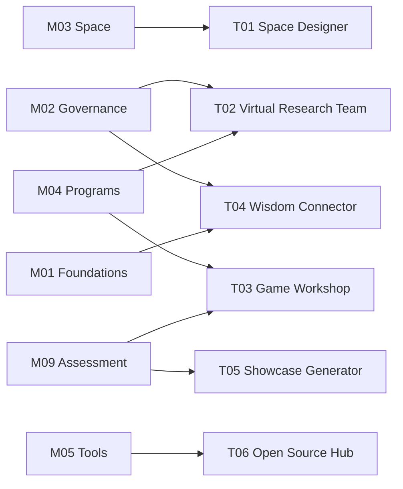

# Resources & Tools

**From Philosophy to Practice**

---

## Overview

The Resources & Tools library is OWL's **bridge from philosophy to practice**, transforming insights from the Knowledge Base into actionable platform tools.

<Callout type="info">
**Core Positioning**: The "execution engine" of the Knowledge Base -- transforming static methodologies into dynamic productivity. Each tool corresponds to one or more knowledge modules (Mxx) and represents the algorithmic encapsulation of knowledge.
</Callout>

---

## OWL Creative Toolbox

Six curated tools, corresponding to the homepage "OWL Creative Toolbox":

| ID | Tool Name | Core Function | Status |
|----|-----------|---------------|--------|
| **[T01](/docs/resources/tools/t01-space-designer)** | AI Space Designer | Intelligent layout generation, 3D visualization, Allen Curve analysis | Live |
| **[T02](/docs/resources/tools/t02-research-team)** | Virtual Research Team | Assemble cross-institutional research groups, collaborative inquiry into real research questions | Plan |
| **[T03](/docs/resources/tools/t03-game-workshop)** | Game Workshop | Design gamified curriculum activities, generate learning pathway maps | Plan |
| **[T04](/docs/resources/tools/t04-connector)** | Wisdom Connector | Discover OWL node networks, explore serendipitous interdisciplinary connections | Plan |
| **[T05](/docs/resources/tools/t05-showcase-generator)** | Showcase Generator | AI-generated project posters, research abstracts, presentation slides | Plan |
| **[T06](/docs/resources/tools/t06-opensource-hub)** | Open Source Hub | Curated open-source hardware, software, and curriculum resource navigation | Live |

---

## Featured Tools Quick Access

<Cards>
  <Card title="T01 AI Space Designer" href="/lab/floor-plan">
    Intelligently generate lab layouts
  </Card>
  <Card title="T06 Open Source Hub" href="/docs/resources/tools/t06-opensource-hub">
    Explore open-source resource treasures
  </Card>
</Cards>

---

## Additional Tools

Beyond the featured tools, additional tools support lab construction and operations:

| Tool Name | Core Function | Related Module | Status |
|-----------|---------------|----------------|--------|
| **[Smart Planning Wizard](/docs/resources/tools/planning-wizard)** | Quick estimation of construction and operating costs | M05 / M08 | Beta |
| **[Curriculum Design Companion](/docs/resources/tools/curriculum-designer)** | Generate PBL project outlines | M04 / M09 | Plan |
| **[Open Source Hardware Selector](/docs/resources/tools/hardware-selector)** | Interactive comparison and selection | M05 | Live |
| **[Safety Assessment Wizard](/docs/resources/tools/safety-assessor)** | Automated safety risk screening | M06 | Plan |
| **[Global Case Map](/docs/resources/tools/case-map)** | Visual browsing of global case studies | M02 | Plan |

<Cards>
  <Card title="Smart Planning Wizard" href="/lab">
    Quick construction cost estimation
  </Card>
  <Card title="Open Source Hardware Selector" href="/docs/core/05-tools/extend/opensource-hardware">
    Open-source hardware comparison
  </Card>
</Cards>

---

## Architecture Model

```text
+-------------------------------------------------------------+
|                OWL Knowledge and Tool System                  |
+-------------------------------------------------------------+
|                                                               |
|  +----------------------------------------------------------+|
|  |  Knowledge Layer (Knowledge Base)                          ||
|  |  M01 Foundations | M02 Governance | M03 Space | M04       ||
|  |  Programs | M05 Tools | ...                                ||
|  +----------------------------------------------------------+|
|                              |                                |
|                    Algorithmic Encapsulation                   |
|                    of Knowledge                               |
|                              |                                |
|  +----------------------------------------------------------+|
|  |  Tool Layer (Platform Tools) - OWL Creative Toolbox        ||
|  |                                                            ||
|  |  T01 Space Designer  T02 Virtual Research Team             ||
|  |  T03 Game Workshop   T04 Wisdom Connector                  ||
|  |  T05 Showcase Generator  T06 Open Source Hub               ||
|  +----------------------------------------------------------+|
|                                                               |
+-------------------------------------------------------------+
```

---

## Relationship Between Tools and Knowledge Modules

Each tool corresponds to one or more knowledge modules:



---

## Usage Principles

### Tools Are Starting Points, Not Endpoints

These tools provide **starting points**, not final answers.

- AI-generated plans require human judgment and adjustment
- Diagnostic results must be interpreted in context
- Tool recommendations cannot replace deep understanding of the philosophy

### Philosophy Takes Priority Over Tools

If tool recommendations conflict with your understanding of the philosophy, trust your understanding first.

Tools are implementations under current technological conditions; philosophy constitutes long-term principles.

### Iterative Use

These tools support iteration:

1. Generate initial plan
2. Implement and observe
3. Gather feedback
4. Re-input into tool for optimization

---

## Development Philosophy

How do we build these tools?

| Principle | Description | Practice |
|-----------|-------------|----------|
| **Web First** | No installation needed; browser-ready | Accessible even on low-spec machines |
| **Open Data** | Database in open JSON format | Allows community contributions |
| **Local Deploy** | Supports private deployment | Ensures school data security |
| **AI Augmented** | AI enhances rather than replaces | Human-machine collaborative design |

---

## Roadmap

| Phase | Goal |
|-------|------|
| **Phase 1** | T01 Space Designer and T06 Open Source Hub launched |
| **Phase 2** | Smart Planning Wizard Beta testing |
| **Phase 3** | T02-T05 Featured tools development |
| **Phase 4** | Full integration and cross-tool interoperability |

---

## Contributing

We welcome the following contributions:

| Method | Description |
|--------|-------------|
| **Submit Issues** | Report bugs or suggest features |
| **Contribute Code** | Fork the repository, submit Pull Requests |
| **Contribute Data** | Enrich equipment databases, case libraries, etc. |
| **Localization** | Help translate interface and documentation |

Please submit via [GitHub Issues](https://github.com/openwisdomlab/owlab/issues).

---

*The tools library is under continuous development. Contributions are welcome.*
