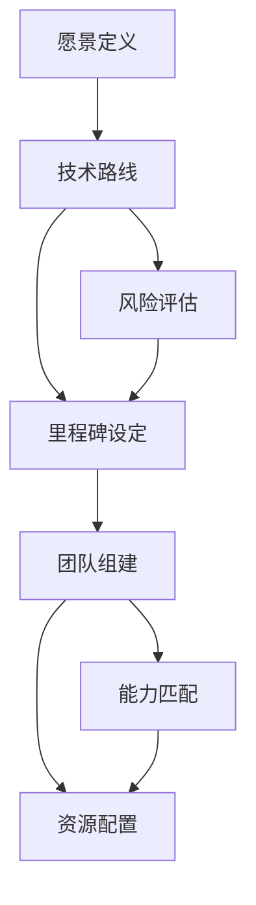

# 研究领导者手册

## 概述

**协同研究计划 (Coordinated Research Programs, CRPs)** 是一种介于传统学术研究和商业创业之间的研究组织形式。它们的规模和复杂度超出单一学术实验室的能力范围，但又不适合公司或创业公司的运作模式。这类项目包括 ARPA 式的研究计划、专注研究组织 (FROs)，以及各类协同创新项目。

本手册汇集了来自多个领域的智慧结晶——包括现任和前任 ARPA 项目经理、创业者、学术界人士，以及丰富的历史经验。其核心洞见对 OWL 实验室的研究性学习项目设计和导师能力发展具有重要参考价值。

**核心理念**：
1. **影响优于新颖性** — 做必要的新事，而非为新而新
2. **影响通过他人实现** — 改变他人的思维和行为是核心
3. **技术存于人心** — 人是技术延续的关键载体

---

## 1. 研究领导者的多重角色

协同研究计划的领导者需要身兼多职，这也是这项工作如此困难的原因之一。不同的角色大致对应项目的不同阶段：

```
┌─────────────────────────────────────────────────────────────────────┐
│                    研究领导者的角色图谱                               │
├─────────────────────────────────────────────────────────────────────┤
│                                                                      │
│  阶段          角色               核心任务                           │
│  ─────────    ──────────         ────────────                       │
│                                                                      │
│  探索期        探险家              领域映射、发现机会                  │
│              (Explorer)           建立人脉网络                        │
│                                                                      │
│  设计期        架构师              方案设计、资源规划                  │
│              (Architect)          技术路线制定                        │
│                                                                      │
│  执行期        指挥家              团队协调、进度管理                  │
│              (Conductor)          问题解决                            │
│                                                                      │
│  转化期        倡导者              技术转移、生态建设                  │
│              (Advocate)           利益相关方管理                      │
│                                                                      │
└─────────────────────────────────────────────────────────────────────┘
```

### 关键洞见

> 领导一个项目穿越各个阶段，几乎就像在做不同的工作。

各阶段并非严格线性，而是相互渗透：
- 在探索和领域映射时，就需要考虑技术转移
- 在执行过程中，持续关注谁将在项目结束后继续推进技术
- 始终思考未来的接棒者关心什么

---

## 2. 项目阶段与关键任务

### 2.1 探索与领域映射 (Exploration & Field Mapping)

这是项目的起点，需要回答关键问题：

| 维度 | 核心问题 | 方法 |
|------|----------|------|
| **知识地图** | 该领域已有什么知识？ | 文献综述、专家访谈 |
| **人员网络** | 谁在做相关工作？ | 会议参与、网络构建 |
| **空白识别** | 关键差距在哪里？ | 交叉分析、需求调研 |
| **资源盘点** | 可调动什么资源？ | 生态系统分析 |

**ARPA模式的启示**：

选择合适的项目经理（PM）是关键的第一步——即使他们最终不会管理这个项目：

```
┌──────────────────────────────────────────────────────────┐
│                项目经理选拔标准                            │
├──────────────────────────────────────────────────────────┤
│  ✓ 深厚的技术背景                                         │
│  ✓ 广泛的人脉网络                                         │
│  ✓ 愿景驱动的思维                                         │
│  ✓ 风险承担能力                                           │
│  ✓ 跨界沟通能力                                           │
│  ✓ 识别人才的眼光                                         │
└──────────────────────────────────────────────────────────┘
```

### 2.2 方案设计与团队组建

设计阶段需要平衡多个维度：



**"倒推工作法" (Working Backwards) 原则**：

不仅需要规划技术步骤，还需要规划人的步骤：
- 需要形成什么社区？
- 技术将如何被采用？
- 谁是关键的影响者和早期采用者？
- 什么障碍可能阻止采用？

### 2.3 执行与协调

执行阶段的核心是"指挥家"角色：

| 任务类型 | 具体内容 | 频率 |
|----------|----------|------|
| **进度跟踪** | 里程碑检查、风险预警 | 周/月 |
| **团队协调** | 跨组沟通、资源调配 | 持续 |
| **问题解决** | 技术障碍、人员冲突 | 按需 |
| **对外沟通** | 利益相关方更新 | 定期 |
| **方向调整** | 基于反馈迭代计划 | 按需 |

### 2.4 技术转移 (Tech Transition)

> 虽然技术转移发生在项目末期，但必须从最早的规划阶段就开始考虑。

**转移的多种形态**：
- 🔬 成为其他组织的活跃研究领域
- 🏭 被整合到不同产品中
- 🚀 孵化创业公司
- 🌐 成为开源项目
- 📚 形成新的研究领域

**核心原则**：

```
┌─────────────────────────────────────────────────────────────────────┐
│  "技术最终存于人的头脑中"                                             │
│                                                                      │
│  项目中参与技术开发的人越多，在项目结束后能够继续                       │
│  推进工作的人越多，技术成功延续的可能性就越大。                         │
│                                                                      │
│  最终，你需要放手那个多年来一直是你"孩子"的东西。                       │
└─────────────────────────────────────────────────────────────────────┘
```

---

## 3. 核心原则详解

### 3.1 影响优于新颖性 (Impact over Novelty)

这是最反直觉但最重要的原则：

> 做令人兴奋的、前所未有的新事固然诱人，但这不是协同研究领导者的角色。你的项目确实需要做新的事情，但应该做实现目标所需的**最少量**新事。

**实践含义**：

| 误区 | 正确做法 |
|------|----------|
| 追求技术突破本身 | 追求目标达成 |
| 全部自主研发 | 整合现有成果 |
| 追求学术发表 | 追求实际应用 |
| 创新越多越好 | 必要创新即可 |

### 3.2 影响通过他人实现 (Impact Happens Through Others)

> 协同研究计划的核心是改变他人的思维和行为。无论你创建的是数据集、工具还是演示，都需要许多其他人基于你的工作采取行动，才能产生真正的影响。

**利益相关方思维**：

```
┌─────────────────────────────────────────────────────────────────────┐
│                     影响力传递链                                      │
├─────────────────────────────────────────────────────────────────────┤
│                                                                      │
│   直接参与者         间接影响者          最终受益者                    │
│   ───────────       ────────────        ──────────                   │
│   研究团队     →    采用者社区     →    终端用户                       │
│   合作机构     →    政策制定者     →    公众                          │
│   资助方       →    媒体/传播者    →    后续研究者                     │
│                                                                      │
└─────────────────────────────────────────────────────────────────────┘
```

### 3.3 多元下注 (Portfolio Approach)

ARPA项目的常见特征是进行多元化投资：

- 对**解决问题的方法**进行多元下注
- 对**产生影响的途径**进行多元下注
  - 技术被大型组织采用？
  - 孵化创业公司？
  - 开启新的研究领域？

---

## 4. 在OWL实验室的应用

### 4.1 研究性学习项目设计

将协同研究原则应用于学生主导的研究性学习：

| CRP原则 | OWL应用 | 具体实践 |
|---------|---------|----------|
| 领域映射 | 项目前调研 | 引导学生系统探索问题空间 |
| 倒推工作 | 目标导向设计 | 从期望成果倒推学习路径 |
| 影响优先 | 真实问题解决 | 聚焦真实需求而非技术炫技 |
| 技术转移 | 成果传承 | 项目文档化、开源共享 |

### 4.2 研究导师能力发展

对应E0-E3能力等级的研究领导力维度：

```
┌─────────────────────────────────────────────────────────────────────┐
│                    研究领导力发展阶梯                                 │
├─────────────────────────────────────────────────────────────────────┤
│                                                                      │
│  E3 专家级                                                           │
│  ─────────                                                           │
│  • 能设计和领导跨组织协同研究项目                                      │
│  • 建立外部合作网络和资源通道                                          │
│  • 培养新一代研究导师                                                  │
│                                                                      │
│  E2 独立级                                                           │
│  ─────────                                                           │
│  • 独立带领研究性学习项目                                              │
│  • 指导学生进行系统性调研                                              │
│  • 协调多方资源推进项目                                                │
│                                                                      │
│  E1 胜任级                                                           │
│  ─────────                                                           │
│  • 协助带领研究性学习项目                                              │
│  • 能引导学生进行文献调研                                              │
│  • 理解项目管理基本原则                                                │
│                                                                      │
│  E0 入门级                                                           │
│  ─────────                                                           │
│  • 了解研究性学习的基本概念                                            │
│  • 能辅助学生完成简单调研任务                                          │
│  • 开始建立研究思维                                                    │
│                                                                      │
└─────────────────────────────────────────────────────────────────────┘
```

### 4.3 学生研究者培养路径

将CRP阶段框架转化为学生可操作的步骤：


**各阶段的能力培养重点**：

| 阶段 | 学生能力 | 导师角色 |
|------|----------|----------|
| 好奇心激发 | 发现问题、提出疑问 | 创设情境、引发思考 |
| 问题定义 | 聚焦可研究的问题 | 引导收敛、评估可行性 |
| 领域调研 | 信息检索、文献阅读 | 方法指导、资源推荐 |
| 方案设计 | 规划研究路径 | 审视方案、风险提示 |
| 实验探索 | 动手实践、数据收集 | 技术支持、过程监督 |
| 成果分享 | 表达、答辩、写作 | 反馈指导、机会创造 |
| 迭代改进 | 反思、优化 | 引导反思、深化理解 |

---

## 5. 实施建议

### 5.1 项目设计清单

启动研究性学习项目前的自检清单：

- [ ] **问题价值**：这个问题值得探究吗？有真实意义吗？
- [ ] **可行性**：在给定资源和时间内可完成吗？
- [ ] **学习目标**：学生能从中学到什么？
- [ ] **影响路径**：成果如何产生影响？
- [ ] **转移计划**：项目结束后成果如何延续？
- [ ] **利益相关方**：谁会关心这个项目？
- [ ] **风险评估**：主要风险是什么？如何应对？

### 5.2 导师能力提升路径

| 阶段 | 发展重点 | 学习资源 |
|------|----------|----------|
| **入门** | 理解研究性学习理念 | 本文档、M04课程设计 |
| **实践** | 协助带领项目 | 跟随E2+导师实践 |
| **独立** | 独立设计项目 | 同伴研讨、案例学习 |
| **精进** | 建立外部网络 | 行业交流、合作项目 |

---

## 常见问题

<details>
<summary>Q1: 研究性学习与PBL有什么区别？</summary>

研究性学习 (Inquiry-Based Learning) 更强调探究过程和科学方法，而PBL (Problem-Based Learning) 更强调问题解决。两者有重叠，研究性学习可以看作是PBL的一种形式，但更侧重：
- 提出可验证的假设
- 系统的数据收集和分析
- 得出基于证据的结论
- 成果的学术性表达

详见 [M04 研究性学习指南](/docs/core/04-programs/extend/pbl-design)。

</details>

<details>
<summary>Q2: 如何在有限时间内完成有意义的研究项目？</summary>

关键在于"影响优于新颖性"原则：
1. 选择范围适当的问题
2. 充分利用已有工具和方法
3. 聚焦核心问题，避免完美主义
4. 迭代推进，接受"足够好"的成果
5. 重视过程学习，而非仅关注结果

</details>

<details>
<summary>Q3: 学生缺乏研究经验怎么办？</summary>

这正是学习的机会！建议：
1. 从简单的调研任务开始
2. 提供结构化的脚手架
3. 师徒制配对学习
4. 小步快跑，快速迭代
5. 庆祝小胜利，建立信心

</details>

<details>
<summary>Q4: 如何评估研究性学习项目？</summary>

采用过程性评价与成果评价相结合：
- **过程性**：调研质量、问题演化、协作表现、反思深度
- **成果性**：报告质量、展示效果、创新程度、实际影响
- **元认知**：自我评价、同伴评价、导师反馈

详见 [M09 逐星轨](/docs/core/09-assessment)。

</details>

---

## 参考文献

1. Speculative Technologies (2025). *Research Leaders' Playbook*. [spec.tech/library](https://spec.tech/library/research-leaders-playbook) [E2] ✅
2. ARIA (2024). Coordinated Research Programs Methodology. [E2] ✅
3. Schön, D. (1983). *The Reflective Practitioner*. Basic Books. [E3] ✅
4. DARPA. *About DARPA*. [darpa.mil](https://www.darpa.mil/about) [E2] ✅
5. 教育部等七部门 (2025). 《关于加强中小学科技教育的意见》. [E2] ✅

**图例**: ✅ 已验证 | ⚠️ 待验证

---

## 延伸阅读

- [M04 研究性学习指南](/docs/core/04-programs/extend/pbl-design) — 研究性学习的教学设计方法
- [M07 能力模型](/docs/core/07-people/extend/competency-model) — E0-E3能力等级详解
- [M07 导师指南](/docs/core/07-people/extend/facilitator-guide) — 促进者角色与技能

---

## 更新记录

| 日期 | 更新内容 | 作者 | 状态 |
|------|----------|------|------|
| 2025-12-30 | 基于spec.tech Research Leaders' Playbook创建初稿 | AI | draft |

---

## 贡献指南

如需更新本文档:
1. 确保新增内容有证据支撑
2. 标注证据等级
3. 保持与OWL实践的关联性
4. 更新参考文献
5. 提交审核
