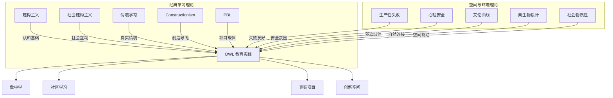

# 学习理论详解

## 概述

OWL 的教育实践植根于多个经典与前沿学习理论。本文档梳理这些理论的核心观点，分析其相互关系，并说明如何应用于 OWL 场景。

**经典理论框架**:
1. 建构主义 (Constructivism)
2. 社会建构主义 (Social Constructivism)
3. 情境学习 (Situated Learning)
4. Constructionism (做中学)
5. 项目制学习 (PBL)

**空间与环境理论**:
6. 生产性失败 (Productive Failure)
7. 心理安全理论 (Psychological Safety)
8. 艾伦曲线 (Allen Curve)
9. 亲生物设计 (Biophilic Design)
10. 社会物质性 (Sociomateriality)

---

## 1. 建构主义 (Constructivism)

### 1.1 核心观点

**代表人物**: Jean Piaget (1896-1980)

**核心主张** [E3]:
- 知识不是被动接收的，而是由学习者主动建构的
- 学习者通过与环境的互动来构建理解
- 认知发展经历不同阶段，每个阶段有其特点

**关键概念**:
| 概念 | 定义 | OWL 应用 |
|------|------|----------|
| 图式 (Schema) | 认知结构的基本单元 | 设计活动时考虑已有认知 |
| 同化 (Assimilation) | 将新信息纳入已有图式 | 从熟悉概念引入新知识 |
| 顺应 (Accommodation) | 修改已有图式以适应新信息 | 提供认知冲突的体验 |
| 平衡 (Equilibration) | 同化与顺应的动态平衡 | 设计"适度挑战"的任务 |

### 1.2 在 OWL 的应用

**设计原则**:
1. 让学习者动手操作，而非被动听讲
2. 设计引发认知冲突的活动
3. 尊重学习者的已有知识

**实践示例**:
- 电路项目：先让学习者预测灯泡会亮还是不亮，再动手验证
- 编程项目：先让学习者画出程序流程图，再编写代码

---

## 2. 社会建构主义 (Social Constructivism)

### 2.1 核心观点

**代表人物**: Lev Vygotsky (1896-1934)

**核心主张** [E3]:
- 学习是社会互动的结果
- 认知发展通过与更有能力的他人互动实现
- 语言和文化工具在学习中起关键作用

**关键概念**:
| 概念 | 定义 | OWL 应用 |
|------|------|----------|
| 最近发展区 (ZPD) | 独立能力与潜在能力之间的差距 | 任务难度设计 |
| 脚手架 (Scaffolding) | 提供渐退的支持 | 导师引导策略 |
| 更有能力的他人 (MKO) | 同伴或导师 | 同伴学习、导师制 |

### 2.2 在 OWL 的应用

**设计原则**:
1. 创造协作学习的机会
2. 设计在 ZPD 范围内的挑战
3. 训练导师提供有效脚手架

**ZPD 应用框架**:
```
┌─────────────────────────────────────────┐
│  太难 (挫败区)                           │
│  学习者即使有帮助也无法完成                │
├─────────────────────────────────────────┤
│  最近发展区 (ZPD) ← 最佳学习区           │
│  有脚手架支持可以完成                     │
├─────────────────────────────────────────┤
│  太易 (舒适区)                           │
│  学习者已经可以独立完成                   │
└─────────────────────────────────────────┘
```

---

## 3. 情境学习 (Situated Learning)

### 3.1 核心观点

**代表人物**: Jean Lave & Etienne Wenger

**核心主张** [E2]:
- 学习嵌入在活动、情境和文化中
- 知识不能脱离其产生的情境
- 学习是"合法的边缘性参与"过程

**关键概念**:
| 概念 | 定义 | OWL 应用 |
|------|------|----------|
| 实践社区 (CoP) | 共同从事某种实践的群体 | OWL 社区构建 |
| 合法边缘参与 | 新手从边缘开始逐渐融入 | 新成员引入流程 |
| 真实任务 | 在真实情境中的任务 | 项目设计 |

### 3.2 在 OWL 的应用

**设计原则**:
1. 创建真实的学习情境，而非模拟场景
2. 让新手从简单任务开始，逐步参与核心活动
3. 建设实践社区，促进经验传承

**参与路径**:
```
观察者 → 边缘参与者 → 活跃参与者 → 核心成员 → 导师
```

---

## 4. Constructionism (做中学)

### 4.1 核心观点

**代表人物**: Seymour Papert (1928-2016)

**核心主张** [E1]:
- 学习在创造可分享的人工制品时效果最佳
- "做"本身就是一种思考方式
- 技术可以作为思维工具

**与 Constructivism 的区别**:
| Constructivism | Constructionism |
|----------------|-----------------|
| 强调内在心理建构 | 强调外在制品创造 |
| 关注认知过程 | 关注创造过程 |
| 理论取向 | 实践取向 |

### 4.2 在 OWL 的应用

**设计原则**:
1. 每个学习活动都应产生可分享的成果
2. 成果形式多样：代码、模型、文档、表演...
3. 提供分享和展示的机会

**创造-分享循环**:
```
想法 → 创造 → 分享 → 反馈 → 反思 → 迭代
```

---

## 5. 项目制学习 (Project-Based Learning)

### 5.1 核心观点

**核心主张** [E2]:
- 以驱动性问题引导学习
- 学习者在探索真实问题中获得知识和技能
- 产出真实的作品或解决方案

**黄金标准 PBL 七要素** (Buck Institute):
1. 挑战性问题
2. 持续探究
3. 真实性
4. 学生声音与选择
5. 反思
6. 批评与修订
7. 公开展示

### 5.2 在 OWL 的应用

**项目设计框架**:
```
┌───────────────────────────────────────────┐
│  1. 驱动性问题                             │
│     "我们如何能..."                        │
├───────────────────────────────────────────┤
│  2. 探究过程                               │
│     研究 → 设计 → 原型 → 测试 → 迭代      │
├───────────────────────────────────────────┤
│  3. 成果产出                               │
│     真实的作品/解决方案                    │
├───────────────────────────────────────────┤
│  4. 公开展示                               │
│     向真实观众展示和解释                   │
└───────────────────────────────────────────┘
```

---

## Part II: 空间与环境理论

以下理论关注学习环境如何影响行为与认知，是 OWL 创新空间设计的理论基础。这些理论将物理空间视为"第三位老师"（The Third Teacher），强调环境对学习行为和心理状态的深刻影响。

---

## 6. 生产性失败 (Productive Failure)

### 6.1 理论背景

**代表人物**: Manu Kapur（新加坡国立教育学院/ETH Zurich）

**理论起源**: 生产性失败理论挑战了传统"先教后练"的教学范式，源于对数学学习中问题解决过程的深入研究。Kapur 教授通过大量实证研究发现，让学习者在接受正式指导前先行尝试解决复杂问题，即使失败，也能显著提升后续的学习效果。

### 6.2 核心观点

**核心主张** [E1]:
- 在接受正式指导之前，先让学习者尝试解决结构不良（Ill-structured）的复杂问题
- 即使以失败告终，也能显著激活学习者的先验知识
- 加深对概念结构的理解，为后续正式学习奠定基础
- 经历过生产性失败的学生在**概念迁移和深度理解**上表现更佳

**认知机制**:

生产性失败要求学习者经历"探索-受挫-反思-整合"的认知循环：

| 阶段 | 认知活动 | 空间需求 |
|------|----------|----------|
| 探索 | 激活先验知识，生成多种解决方案 | 低风险的实验区域 |
| 受挫 | 识别知识缺口，产生认知冲突 | 允许"混乱"的过程展示 |
| 反思 | 分析失败原因，比较不同方案 | 安静的深度思考空间 |
| 整合 | 将新知识与已有图式整合 | 协作讨论与导师指导区 |

**与直接教学法的对比** [E1]:

| 教学方法 | 短期测试表现 | 概念迁移能力 | 深度理解 |
|----------|--------------|--------------|----------|
| 直接教学法 | 较高 | 较低 | 表层 |
| 生产性失败 | 初期较低 | 显著较高 | 深层 |

### 6.3 对空间设计的启示

生产性失败理论对教育创新空间提出了特定要求：

**1. 低风险的探索环境**
- 空间必须降低失败的"昂贵感"
- 避免过于奢华的装修或过于精密的设备，防止学习者产生"不敢触碰"的心理压力
- 环境应具备一定的"粗糙感"或"工业感"，传递出"这里是实验室而非博物馆"的信号

**2. 过程的可视化**
- 传统教室倾向于清除草图、废弃模型和半成品，只展示最终完美作品
- 为支持生产性失败，空间必须提供充足的垂直表面（白板墙、软木板）和展示架
- 专门用于呈现思维过程和迭代痕迹，使"失败"成为集体学习的资源而非羞耻的来源

**3. 认知负荷的调节**
- 在经历认知挣扎（Productive Struggle）时，学习者需要极高的专注力
- 开放式空间的噪音和视觉干扰可能导致认知过载
- 空间设计必须提供从**高刺激协作区向低刺激独处区快速切换**的可能性

### 6.4 在 OWL 的应用

**设计原则**:
1. 创造允许"有意义失败"的物理和心理环境
2. 设置"过程展示廊"展示迭代痕迹和失败案例
3. 实施"失败仪式"（如失败追悼会、本周搞砸奖）重塑对失败的认知

**实践示例**:
- 项目开始时，先让学习者自主探索解决方案（Generation Phase）
- 在经历适度挫折后，再引入正式概念和专家指导（Consolidation Phase）
- 保留并展示探索阶段的所有草图和失败原型

---

## 7. 心理安全理论 (Psychological Safety)

### 7.1 理论背景

**代表人物**: Amy Edmondson（哈佛商学院教授）

**理论起源**: Edmondson 在 1999 年发表的开创性研究《团队中的心理安全与学习行为》中，发现医疗团队中报告错误较多的团队反而绩效更好。这一悖论揭示了心理安全感在组织学习中的关键作用。

### 7.2 核心观点

**核心定义** [E1]:
心理安全感是指团队成员共同持有的一种信念：**在这个团队中，承担人际风险是安全的**。

**核心主张** [E1]:
- 心理安全感是团队学习行为的**最重要预测因子**
- 包括：寻求反馈、讨论错误、尝试新方法等行为
- 在心理安全的环境中，个体确信不会因提问或犯错而受到人际关系的惩罚

**Google Aristotle 项目发现** [E2]:
Google 对 180 个团队的研究发现，心理安全感是高效团队的**第一要素**，比团队成员的个人能力更能预测团队绩效。

**关键概念**:
| 概念 | 定义 | 行为表现 |
|------|------|----------|
| 人际风险 | 可能导致尴尬或惩罚的行为 | 提问、承认错误、提出不同意见 |
| 学习行为 | 支持团队学习的行为 | 寻求帮助、实验、讨论失败 |
| 发声行为 | 主动表达想法和担忧 | 分享新想法、提出质疑 |

### 7.3 空间透明度的双刃剑效应

物理空间的透明度（Transparency）直接影响心理安全感：

**正面效应**:
- 玻璃墙和开放式中庭增加"行为的可见性"
- 促进观察学习和跨学科的偶遇
- 降低信息不对称，增强信任

**负面效应**:
- 过度暴露（Visual Exposure）产生"全景敞视"（Panopticon）效应
- 使学生感到被监视，引发防御性行为
- 抑制冒险意愿和创意表达

### 7.4 维护心理安全感的空间策略

**1. 提供"庇护所"（Refuge）**
- 带有高靠背的沙发
- 角落里的私密隔间
- 由光线明暗变化形成的心理分区
- 这种"可控的隐私"让学生在感到焦虑或挫败时有地方进行情绪调节

**2. 未完成美学**
- 空间装修不应过于完美
- 裸露的管线、胶合板家具、允许涂鸦的墙面
- 传达"这是一个过程中的空间"的心理暗示
- 降低学生对完美的焦虑，鼓励展示粗糙的早期想法

**3. 包容性设计**
- 考虑神经多样性学生（自闭症、ADHD）的需求
- 设置低感官刺激的"静修舱"
- 配备降噪耳机的区域
- 保障所有人都感到被包容和安全

### 7.5 在 OWL 的应用

**设计原则**:
1. 平衡开放与隐私，避免全景敞视效应
2. 创造允许脆弱表达的安全空间
3. 通过空间设计传递"失败是学习过程"的文化信号

**评估工具**:
- 团队心理安全感量表 (Team Psychological Safety Scale, TPSS)
- 神经心理安全感量表 (Neuroception of Psychological Safety Scale, NPSS)

**实践示例**:
- OWL 分享环节设置"无评判"规则
- 提供多种参与方式（口头分享、书面反馈、匿名提问）
- 在物理空间中设置"安全角落"供情绪调节使用

---

## 8. 艾伦曲线 (Allen Curve)

### 8.1 理论背景

**代表人物**: Thomas J. Allen（MIT 斯隆管理学院教授）

**理论起源**: 1970 年代，Allen 教授对 R&D 工程师的沟通模式进行了系统研究，发现了物理距离与沟通频率之间的关键关系。这一发现对办公空间设计和知识工作者协作产生了深远影响。

### 8.2 核心观点

**核心发现** [E1]:
工程师之间的沟通频率与他们办公桌之间的物理距离呈**指数级衰减关系**。

**关键数据** [E1]:
| 物理距离 | 定期沟通可能性 |
|----------|----------------|
| < 8 米 | 约 25% |
| 30 米 | 约 5% |
| > 50 米 | 几乎为零 |

**艾伦曲线的关键阈值**:
```
沟通概率
   ▲
   │ ●
   │  ●
   │    ●
   │      ●●●●●●●●●●●●●●
   └─────────────────────→ 距离（米）
       8m    30m
      临界点  断崖点
```

### 8.3 物理邻近 vs. 功能邻近

在数字化时代，虽然远程通讯工具普及，艾伦曲线依然有效。现代研究区分了两个关键概念：

| 概念 | 定义 | 效果 |
|------|------|------|
| **物理邻近** | 不同学科的人在同一层楼 | 不一定产生协作 |
| **功能邻近** | 他们的日常动线发生重叠 | 实现实际的协作互动 |

**关键洞察**: 真正促进跨学科协作的不是共享同一空间，而是**共享同一动线**。

### 8.4 碰撞点设计（Collision Points）

为促进跨学科协作，空间设计必须人为制造"碰撞点"：

**核心策略**:
- 将唯一的咖啡机、打印中心或通往出口的必经楼梯设置在建筑中心位置
- 强制不同部门的人员在此汇聚
- 这是打破学科壁垒（Silo Effect）最有效的空间手段之一

**艾伦聚合点 (The Allen Hub) 设计要素**:
1. 设置在连接不同学科楼层的核心节点
2. 整合咖啡、饮水、打印及收发快递功能
3. 配备非正式座位和站立讨论区
4. 保持足够的"停留吸引力"

### 8.5 在 OWL 的应用

**设计原则**:
1. 将共享资源（工具、材料）集中于核心动线
2. 创造"非正式节点"促进偶发性交流
3. 利用视觉渗透让不同项目组的活动相互可见

**实践示例**:
- OWL 材料区设置为必经之地，自然促进不同年龄段学习者的相遇
- 设置"临时停靠点"（Touchdown Points）配备高桌和电源
- 通过玻璃隔断让机械制作与编程调试相互可见

---

## 9. 亲生物设计 (Biophilic Design)

### 9.1 理论背景

**代表人物**: Stephen R. Kellert（耶鲁大学）、Edward O. Wilson

**理论起源**: "亲生物性"（Biophilia）一词由 Wilson 于 1984 年提出，指人类与其他生命形式之间天生的情感联结。Kellert 将这一概念发展为系统的建筑设计方法论。

### 9.2 核心观点

**核心定义** [E2]:
亲生物设计是一种基于证据的设计方法，通过将自然元素融入建筑环境，利用人类与自然的内在联系来提升福祉和认知表现。

**核心主张** [E2]:
- 人类进化史中 99% 的时间生活在自然环境中
- 与自然的接触对认知恢复和压力缓解有显著作用
- 建筑环境可以通过模拟自然元素获得类似效果

**14 项亲生物设计模式** (Terrapin Bright Green):

| 类别 | 设计模式 | 示例 |
|------|----------|------|
| 自然在空间中 | 视觉与自然的联结 | 窗外绿植、室内盆栽 |
| | 非视觉的自然联结 | 自然声音、气味、触感 |
| | 非规律的感官刺激 | 风声、水流声、光影变化 |
| | 热与气流变化 | 自然通风、温度微变化 |
| | 水的存在 | 喷泉、水景、水声 |
| | 动态与分散的光线 | 自然光的变化、光斑 |
| | 与自然系统的联结 | 季节变化的可感知性 |
| 自然类似 | 生物形态与图案 | 仿生曲线、分形图案 |
| | 材料与自然的联结 | 木材、石材、皮革 |
| | 复杂性与秩序 | 分形结构、黄金比例 |
| 空间中的自然 | 前景与退避 | 开阔视野与庇护空间 |
| | 神秘感 | 吸引探索的视觉线索 |
| | 风险/危险感 | 可控的刺激（如高度） |

### 9.3 科学效益

**研究证据** [E1]:

| 效益类型 | 研究发现 | 证据等级 |
|----------|----------|----------|
| 认知恢复 | 自然景观注视 40 秒可恢复持续注意力 | E1 |
| 压力缓解 | 室内植物降低皮质醇水平 15-20% | E1 |
| 创造力提升 | 自然元素的办公空间创意产出提高 15% | E2 |
| 学业表现 | 有自然采光的教室学生成绩提高 20-26% | E1 |
| 出勤率 | 亲生物设计的学校缺勤率降低 8-15% | E2 |

### 9.4 在教育空间中的应用

**关键策略**:

**1. 最大化自然采光（Daylighting）**
- 提升学生表现
- 降低能源成本
- 调节昼夜节律

**2. 引入活体植物**
- 改善空气质量
- 降低压力水平
- 增加空间的"生命感"

**3. 使用自然材料**
- 木材、石材、竹材
- 触感丰富的表面
- 温暖的视觉感受

**4. 提供自然视野**
- 望向户外绿植的窗户
- 室内绿化带
- 天窗和中庭

### 9.5 在 OWL 的应用

**设计原则**:
1. 优先选择有自然采光的空间
2. 在工作区域配置室内植物
3. 使用木质和自然材料的家具
4. 设置可望向自然的休息区

**实践示例**:
- OWL 阅读角设置大型落地植物
- 工作台使用实木桌面
- 在窗边设置"自然观察站"

---

## 10. 社会物质性 (Sociomateriality)

### 10.1 理论背景

**代表人物**: Tara Fenwick、Wanda Orlikowski

**理论起源**: 社会物质性理论源于科学技术研究（STS）和组织研究的交叉领域，挑战了将"社会"与"物质"分离考察的传统范式。Fenwick（2015）将这一视角系统应用于教育研究。

### 10.2 核心观点

**核心定义** [E2]:
社会物质性是指社会实践与物质实体（技术、空间、物品）之间**不可分割的纠缠关系**。在这一视角下，学习空间不是被动的背景，而是与人类行动者共同构成学习过程的能动参与者。

**核心主张** [E2]:
- 学习空间并非被动的容器，而是积极参与塑造学习过程的行动者
- 技术、家具、建筑布局与人类行为共同"表演"（perform）出学习活动
- 空间具有"可供性"（Affordances）——引发或限制特定行为的潜能
- 需要关注人-物-空间的"组装"（Assemblage）如何共同产生学习

**关键概念**:
| 概念 | 定义 | 教育启示 |
|------|------|----------|
| 纠缠 (Entanglement) | 人与物相互定义、不可分离 | 空间设计即教学设计 |
| 表演 (Performativity) | 意义通过实践中的互动产生 | 关注空间的实际使用 |
| 可供性 (Affordance) | 物品引发行为的潜能 | 设计引导而非规定 |
| 组装 (Assemblage) | 异质元素的暂时性连接 | 灵活可重组的环境 |

### 10.3 从"容器"到"生态系统"

社会物质性视角要求重新理解学习空间：

**传统观点（容器模型）**:
- 空间是中性的背景
- 学习在空间"中"发生
- 设计目标：容纳活动

**社会物质性观点（生态系统模型）**:
- 空间是主动的参与者
- 学习与空间共同"生成"
- 设计目标：促进涌现

**"空间"定义的扩展**:
1. **正式与非正式物理空间**: 教室、图书馆、走廊、户外区域
2. **虚拟与混合空间**: 在线社区、数字资源库、线上线下混合环境
3. **元宇宙前沿**: 物理与虚拟现实的终极融合

### 10.4 设计启示

**1. 边界消解**
社会物质性视角强调消解传统边界：
- 物理与数字的界限
- 正式与非正式的界限
- 个体与协作的界限
- 学校与社区的界限

**2. 关注"组装"而非"规划"**
- 设计灵活可重组的元素
- 允许使用者重新配置空间
- 观察并学习实际的使用模式

**3. 物品作为教学伙伴**
- 认识到技术工具塑造学习方式
- 家具配置影响社交互动
- 材料选择传递价值观

### 10.5 在 OWL 的应用

**设计原则**:
1. 将空间视为课程的一部分，而非背景
2. 设计支持多种"组装"可能的灵活环境
3. 持续观察和调整空间的实际使用方式

**实践示例**:
- 轮式家具生态：所有桌椅、储物柜带轮，允许用户在 1 分钟内重构空间
- 空间热力反馈：利用数据分析实际使用模式，据此迭代设计
- 定期"空间复盘"：反思空间如何影响了学习活动的发生

---

## 理论整合框架

### 经典理论与空间理论的关系



### 理论层次结构

| 层次 | 理论 | 核心问题 | 设计焦点 |
|------|------|----------|----------|
| **认知层** | 建构主义、生产性失败 | 学习者如何建构知识？ | 任务设计、认知挑战 |
| **社会层** | 社会建构主义、心理安全 | 社会互动如何促进学习？ | 协作机制、安全氛围 |
| **情境层** | 情境学习、艾伦曲线 | 情境如何影响学习？ | 真实任务、邻近设计 |
| **实践层** | Constructionism、PBL | 如何通过做来学？ | 项目设计、成果产出 |
| **环境层** | 亲生物设计、社会物质性 | 环境如何塑造学习？ | 空间设计、物质配置 |

---

## 常见问题

<details>
<summary>这些理论有冲突吗？</summary>

这些理论相互补充而非冲突：

**经典理论**:
- 建构主义提供认知基础
- 社会建构主义强调社会互动
- 情境学习强调真实情境
- Constructionism 强调创造实践
- PBL 提供项目载体

**空间理论**:
- 生产性失败指导如何设计允许失败的环境
- 心理安全理论帮助创造安全的学习氛围
- 艾伦曲线指导促进协作的空间布局
- 亲生物设计优化认知和情绪状态
- 社会物质性提供整合性的空间观

OWL 实践整合所有理论的精华，将学习理论与空间设计紧密结合。
</details>

<details>
<summary>如何选择应用哪个理论？</summary>

不需要"选择"，而是根据场景侧重：

**学习活动设计**:
- 设计任务难度 → 用 ZPD 和生产性失败
- 设计协作活动 → 用社会建构主义和心理安全
- 设计项目 → 用 PBL 和情境学习
- 强调动手创造 → 用 Constructionism

**空间环境设计**:
- 促进跨学科协作 → 用艾伦曲线
- 降低压力、提升专注 → 用亲生物设计
- 支持失败和迭代 → 用生产性失败和心理安全
- 整体空间规划 → 用社会物质性
</details>

<details>
<summary>空间设计真的能影响学习效果吗？</summary>

**实证研究支持** [E1-E2]:

是的，大量研究表明空间设计对学习有显著影响：

1. **灵活家具与参与度**: 可移动、可重组的家具显著增加学生的课堂参与度、自主性及合作频率
2. **自然采光与成绩**: 有自然采光的教室学生成绩提高 20-26%
3. **邻近性与协作**: 物理距离超过 30 米将导致沟通断崖式下跌
4. **植物与压力**: 室内植物降低皮质醇水平 15-20%
5. **心理安全与创新**: 心理安全感是团队创新行为的最重要预测因子

正如社会物质性理论所言：**空间不仅是学习的容器，更是学习过程中的主动参与者**。
</details>

<details>
<summary>如何在有限预算下应用这些理论？</summary>

**低成本高影响的实践**:

1. **生产性失败**: 设置"过程展示墙"（软木板/白板）展示迭代痕迹 - 成本极低
2. **心理安全**: 建立"失败分享会"文化 - 零成本
3. **艾伦曲线**: 将共享资源集中于核心动线 - 重新布局即可
4. **亲生物设计**: 添加室内植物、最大化利用自然光 - 低成本
5. **社会物质性**: 为现有家具添加脚轮实现灵活性 - 低成本

**核心原则**:
- 先改变"软件"（文化、仪式、规则）
- 再改变"硬件"（家具、布局、设备）
- 从小处着手，持续迭代
</details>

---

## 参考文献

### 经典学习理论

1. Piaget, J. (1952). *The Origins of Intelligence in Children*. International Universities Press. [E3] ⚠️
2. Vygotsky, L.S. (1978). *Mind in Society*. Harvard University Press. [E3] ⚠️
3. Lave, J. & Wenger, E. (1991). *Situated Learning: Legitimate Peripheral Participation*. Cambridge University Press. [E2] ⚠️
4. Papert, S. (1980). *Mindstorms: Children, Computers, and Powerful Ideas*. Basic Books. [E1] ⚠️
5. Krajcik, J.S. & Shin, N. (2014). Project-Based Learning. In *The Cambridge Handbook of the Learning Sciences*. [E2] ⚠️
6. Larmer, J., Mergendoller, J., & Boss, S. (2015). *Setting the Standard for Project Based Learning*. ASCD. [E1] ⚠️

### 空间与环境理论

7. Kapur, M. (2008). Productive Failure in Mathematical Problem Solving. *Cognition and Instruction*, 26(3), 379-424. [E1] ⚠️
8. Kapur, M. (2016). Examining Productive Failure, Productive Success, and Restudying Effects. *Journal of the Learning Sciences*, 25(1), 40-79. [E1] ⚠️
9. Edmondson, A. (1999). Psychological Safety and Learning Behavior in Work Teams. *Administrative Science Quarterly*, 44(2), 350-383. [E1] ⚠️
10. Edmondson, A. (2018). *The Fearless Organization: Creating Psychological Safety in the Workplace for Learning, Innovation, and Growth*. Wiley. [E2] ⚠️
11. Allen, T.J. (1977). *Managing the Flow of Technology*. MIT Press. [E1] ⚠️
12. Allen, T.J. & Henn, G.W. (2007). *The Organization and Architecture of Innovation*. Butterworth-Heinemann. [E2] ⚠️
13. Kellert, S.R., Heerwagen, J., & Mador, M. (2008). *Biophilic Design: The Theory, Science and Practice of Bringing Buildings to Life*. Wiley. [E2] ⚠️
14. Browning, W.D., Ryan, C.O., & Clancy, J.O. (2014). *14 Patterns of Biophilic Design*. Terrapin Bright Green. [E2] ⚠️
15. Fenwick, T. (2015). Sociomateriality and Learning: A Critical Approach. In *The SAGE Handbook of Learning* (pp. 83-93). SAGE. [E2] ⚠️
16. Orlikowski, W.J. (2007). Sociomaterial Practices: Exploring Technology at Work. *Organization Studies*, 28(9), 1435-1448. [E2] ⚠️

### 综合研究与实践指南

17. Fisher, K. (2005). Linking Pedagogy and Space. *Rubida Research*. [E2] ⚠️
18. Barrett, P., et al. (2015). The Impact of Classroom Design on Pupils' Learning. *Building and Environment*, 89, 118-133. [E1] ⚠️
19. Doorley, S. & Witthoft, S. (2012). *Make Space: How to Set the Stage for Creative Collaboration*. Wiley. [E2] ⚠️
20. Cummings, J.N. & Kiesler, S. (2007). Coordination Costs and Project Outcomes. *Research Policy*, 36(6), 957-976. [E2] ⚠️

> ⚠️ 文献待人工验证

---

## 更新记录

| 日期 | 更新内容 | 作者 | 状态 |
|------|----------|------|------|
| 2025-01 | 初稿创建（经典学习理论） | AI | draft |
| 2025-01 | 增加空间与环境理论（生产性失败、心理安全、艾伦曲线、亲生物设计、社会物质性） | AI | draft |
