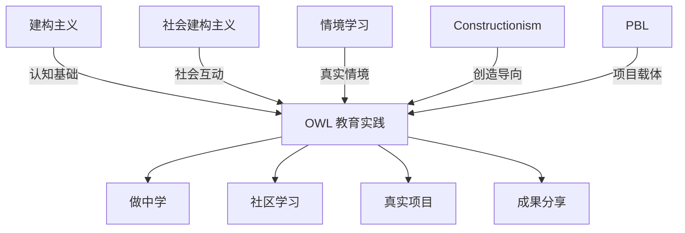

# 学习理论详解

## 概述

OWL 的教育实践植根于多个经典学习理论。本文档梳理这些理论的核心观点，分析其相互关系，并说明如何应用于 OWL 场景。

**核心理论框架**:
1. 建构主义 (Constructivism)
2. 社会建构主义 (Social Constructivism)
3. 情境学习 (Situated Learning)
4. Constructionism (做中学)
5. 项目制学习 (PBL)

---

## 1. 建构主义 (Constructivism)

### 1.1 核心观点

**代表人物**: Jean Piaget (1896-1980)

**核心主张** [E3]:
- 知识不是被动接收的，而是由学习者主动建构的
- 学习者通过与环境的互动来构建理解
- 认知发展经历不同阶段，每个阶段有其特点

**关键概念**:
| 概念 | 定义 | OWL 应用 |
|------|------|----------|
| 图式 (Schema) | 认知结构的基本单元 | 设计活动时考虑已有认知 |
| 同化 (Assimilation) | 将新信息纳入已有图式 | 从熟悉概念引入新知识 |
| 顺应 (Accommodation) | 修改已有图式以适应新信息 | 提供认知冲突的体验 |
| 平衡 (Equilibration) | 同化与顺应的动态平衡 | 设计"适度挑战"的任务 |

### 1.2 在 OWL 的应用

**设计原则**:
1. 让学习者动手操作，而非被动听讲
2. 设计引发认知冲突的活动
3. 尊重学习者的已有知识

**实践示例**:
- 电路项目：先让学习者预测灯泡会亮还是不亮，再动手验证
- 编程项目：先让学习者画出程序流程图，再编写代码

---

## 2. 社会建构主义 (Social Constructivism)

### 2.1 核心观点

**代表人物**: Lev Vygotsky (1896-1934)

**核心主张** [E3]:
- 学习是社会互动的结果
- 认知发展通过与更有能力的他人互动实现
- 语言和文化工具在学习中起关键作用

**关键概念**:
| 概念 | 定义 | OWL 应用 |
|------|------|----------|
| 最近发展区 (ZPD) | 独立能力与潜在能力之间的差距 | 任务难度设计 |
| 脚手架 (Scaffolding) | 提供渐退的支持 | 导师引导策略 |
| 更有能力的他人 (MKO) | 同伴或导师 | 同伴学习、导师制 |

### 2.2 在 OWL 的应用

**设计原则**:
1. 创造协作学习的机会
2. 设计在 ZPD 范围内的挑战
3. 训练导师提供有效脚手架

**ZPD 应用框架**:
```
┌─────────────────────────────────────────┐
│  太难 (挫败区)                           │
│  学习者即使有帮助也无法完成                │
├─────────────────────────────────────────┤
│  最近发展区 (ZPD) ← 最佳学习区           │
│  有脚手架支持可以完成                     │
├─────────────────────────────────────────┤
│  太易 (舒适区)                           │
│  学习者已经可以独立完成                   │
└─────────────────────────────────────────┘
```

---

## 3. 情境学习 (Situated Learning)

### 3.1 核心观点

**代表人物**: Jean Lave & Etienne Wenger

**核心主张** [E2]:
- 学习嵌入在活动、情境和文化中
- 知识不能脱离其产生的情境
- 学习是"合法的边缘性参与"过程

**关键概念**:
| 概念 | 定义 | OWL 应用 |
|------|------|----------|
| 实践社区 (CoP) | 共同从事某种实践的群体 | OWL 社区构建 |
| 合法边缘参与 | 新手从边缘开始逐渐融入 | 新成员引入流程 |
| 真实任务 | 在真实情境中的任务 | 项目设计 |

### 3.2 在 OWL 的应用

**设计原则**:
1. 创建真实的学习情境，而非模拟场景
2. 让新手从简单任务开始，逐步参与核心活动
3. 建设实践社区，促进经验传承

**参与路径**:
```
观察者 → 边缘参与者 → 活跃参与者 → 核心成员 → 导师
```

---

## 4. Constructionism (做中学)

### 4.1 核心观点

**代表人物**: Seymour Papert (1928-2016)

**核心主张** [E1]:
- 学习在创造可分享的人工制品时效果最佳
- "做"本身就是一种思考方式
- 技术可以作为思维工具

**与 Constructivism 的区别**:
| Constructivism | Constructionism |
|----------------|-----------------|
| 强调内在心理建构 | 强调外在制品创造 |
| 关注认知过程 | 关注创造过程 |
| 理论取向 | 实践取向 |

### 4.2 在 OWL 的应用

**设计原则**:
1. 每个学习活动都应产生可分享的成果
2. 成果形式多样：代码、模型、文档、表演...
3. 提供分享和展示的机会

**创造-分享循环**:
```
想法 → 创造 → 分享 → 反馈 → 反思 → 迭代
```

---

## 5. 项目制学习 (Project-Based Learning)

### 5.1 核心观点

**核心主张** [E2]:
- 以驱动性问题引导学习
- 学习者在探索真实问题中获得知识和技能
- 产出真实的作品或解决方案

**黄金标准 PBL 七要素** (Buck Institute):
1. 挑战性问题
2. 持续探究
3. 真实性
4. 学生声音与选择
5. 反思
6. 批评与修订
7. 公开展示

### 5.2 在 OWL 的应用

**项目设计框架**:
```
┌───────────────────────────────────────────┐
│  1. 驱动性问题                             │
│     "我们如何能..."                        │
├───────────────────────────────────────────┤
│  2. 探究过程                               │
│     研究 → 设计 → 原型 → 测试 → 迭代      │
├───────────────────────────────────────────┤
│  3. 成果产出                               │
│     真实的作品/解决方案                    │
├───────────────────────────────────────────┤
│  4. 公开展示                               │
│     向真实观众展示和解释                   │
└───────────────────────────────────────────┘
```

---

## 理论整合框架



---

## 常见问题

<details>
<summary>这些理论有冲突吗？</summary>

这些理论相互补充而非冲突：
- 建构主义提供认知基础
- 社会建构主义强调社会互动
- 情境学习强调真实情境
- Constructionism 强调创造实践
- PBL 提供项目载体

OWL 实践整合所有理论的精华。
</details>

<details>
<summary>如何选择应用哪个理论？</summary>

不需要"选择"，而是根据场景侧重：
- 设计任务难度 → 用 ZPD
- 设计协作活动 → 用社会建构主义
- 设计项目 → 用 PBL
- 强调动手创造 → 用 Constructionism
</details>

---

## 参考文献

1. Piaget, J. (1952). *The Origins of Intelligence in Children*. International Universities Press. [E3] ⚠️
2. Vygotsky, L.S. (1978). *Mind in Society*. Harvard University Press. [E3] ⚠️
3. Lave, J. & Wenger, E. (1991). *Situated Learning: Legitimate Peripheral Participation*. Cambridge University Press. [E2] ⚠️
4. Papert, S. (1980). *Mindstorms: Children, Computers, and Powerful Ideas*. Basic Books. [E1] ⚠️
5. Krajcik, J.S. & Shin, N. (2014). Project-Based Learning. In *The Cambridge Handbook of the Learning Sciences*. [E2] ⚠️
6. Larmer, J., Mergendoller, J., & Boss, S. (2015). *Setting the Standard for Project Based Learning*. ASCD. [E1] ⚠️

> ⚠️ 文献待人工验证

---

## 更新记录

| 日期 | 更新内容 | 作者 | 状态 |
|------|----------|------|------|
| 2025-01 | 初稿创建 | AI | draft |
