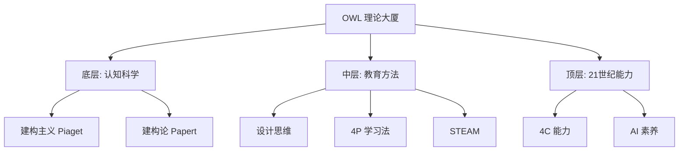

# M01 理念与理论基础

## 1. 摘要与核心定位
> **一句话定位**: OWL 存在的意义与理论根基。

教育不是灌输，而是点燃。本模块阐述了 OWL 的核心教育哲学：基于建构主义（Constructionism），通过**做中学（Learning by Doing）**，在**社区驱动**的环境中，培养适应未来的创新者。

**核心观点**:
1.  **建构主义**: 当学习者制造外在人工制品时，知识建构最为有效（Papert）。
2.  **4P 学习法**: 项目(Project)、热情(Passion)、同伴(Peers)、玩耍(Play)。
3.  **赋能非替代**: AI 时代，技术应增强而非替代人的思考。

---

## 2. 六大核心原则

| 原则 | 核心内涵 | 反对什么 |
|------|----------|----------|
| **做中学** | 实践是学习的核心 | 反对这种教育：只听不练，纸上谈兵 |
| **开放共享** | 知识应自由流通 (Open Source) | 反对这种教育：知识封闭，各自为战 |
| **社区驱动** | 学习是社会化过程 | 反对这种教育：孤岛式学习 |
| **失败友好** | 试错是创新的必经之路 | 反对这种教育：惩罚错误，追求标准答案 |
| **跨界整合** | 真实问题不分学科 (STEAM) | 反对这种教育：学科割裂，只见树木 |
| **赋能非替代**| 技术工具服务于主体性 | 反对这种教育：技术依赖，丧失思考 |

---

## 3. 使命与愿景

### 使命 (Mission)
**让每个人都能通过动手创造来学习和成长。**
*Democratize learning through making.*

### 愿景 (Vision)
构建一个开放、包容、创新的全球学习者社区网络，让创造力的火花在每一个角落绽放。

### 核心价值观 (Values)
1.  **行动优先**: 先动手，再完善。(Bias Toward Action)
2.  **极致开放**: 默认公开，除非必须保密。
3.  **拥抱不确定性**: 在混乱中寻找秩序与创新。

---

## 4. 理论框架 (Theoretical Framework)

OWL 的实践并非无源之水，而是建立在深厚的学习科学基础之上：

*深度解析请参阅扩展阅读：*
*   [学习理论详解](./extend/learning-theories): 神经教育学与建构主义的现代发展。
*   [4P 创造性学习](./extend/4p-creative-learning): MIT 媒体实验室的核心方法论。

---

## 5. MVS 最小可运行标准

作为 OWL 网络的成员节点，必须在文化层满足以下底线：

| 项目 | 要求 | 验证方法 |
|------|------|----------|
| **使命认同** | 签署《OWL 价值公约》 | 成员入职/入驻必修 |
| **动手实践** | 实践时间占比 ≥ 60% | 课程表/活动记录核查 |
| **开放共享** | 至少产出 1 个开源项目/年 | GitHub/知识库链接 |
| **失败宽容** | 设立"失败展示区"或分享会 | 物理空间或活动记录 |

---

## 6. 扩展阅读与深度理论

<ExtendCards cards={[
  {
    title: "学习理论详解",
    description: "建构主义、情境学习与神经教育学的深度解读。",
    href: "/docs/knowledge-base/01-foundations/extend/learning-theories",
    type: "extend",
    status: "completed"
  },
  {
    title: "4P 创造性学习",
    description: "MIT 媒体实验室核心：项目、热情、同伴、玩耍。",
    href: "/docs/knowledge-base/01-foundations/extend/4p-creative-learning",
    type: "extend",
    status: "planned"
  },
  {
    title: "AI 时代创客教育",
    description: "生成式 AI 如何重塑创造力的培养。",
    href: "/docs/knowledge-base/01-foundations/extend/ai-maker-education",
    type: "extend",
    status: "planned"
  },
  {
    title: "创客运动历史",
    description: "从车库 DIY 到全球创新的演变脉络。",
    href: "/docs/knowledge-base/01-foundations/extend/maker-movement",
    type: "extend",
    status: "completed"
  },
  {
    title: "STEAM 整合框架",
    description: "跨学科项目设计的方法论指南。",
    href: "/docs/knowledge-base/01-foundations/extend/steam-framework",
    type: "extend",
    status: "planned"
  },
  {
    title: "批判性思维培养",
    description: "如何在动手制作中训练逻辑与论证。",
    href: "/docs/knowledge-base/01-foundations/extend/critical-thinking",
    type: "extend",
    status: "completed"
  }
]} />

---

## 7. 参考文献

1. Papert, S. (1980). *Mindstorms: Children, Computers, and Powerful Ideas*.
2. Resnick, M. (2017). *Lifelong Kindergarten*.
3. Dewey, J. (1916). *Democracy and Education*.
4. 教育部《关于加强中小学科技教育的意见》(2025).
