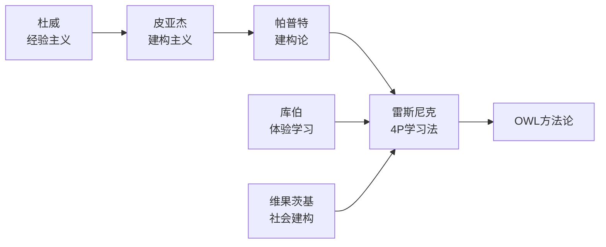
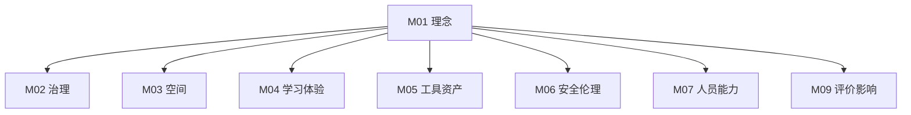

# M01 理念与理论基础

## 摘要与核心定位

> **一句话定位**: OWL 存在的意义与理论根基——教育不是灌输，而是点燃。

本模块阐述了 OWL 的核心教育哲学：基于建构主义（Constructionism），通过**做中学（Learning by Doing）**，在**社区驱动**的环境中，培养适应未来的创新者。我们相信，在人工智能时代，培养人类独特的创造力、协作能力和复杂问题解决能力比以往任何时候都更为紧迫。

**核心观点**:
1.  **建构主义 (Constructionism)**: 学习不是信息的被动接收，而是知识的主动建构。当学习者制造外在人工制品时，这种建构最为有效。
2.  **4P 学习法**: 创造性学习的螺旋上升路径由四个要素驱动：项目(Project)、热情(Passion)、同伴(Peers)、玩耍(Play)。
3.  **技术人文融合**: 技术不是目的，而是表达和创造的工具。我们主张"全人教育"，关注技术背后的伦理、美学和社会责任。

---

## 模块信息图

```
┌─────────────────────────────────────────────────────────────────────────────┐
│                      OWL 理念与理论基础架构                                   │
├─────────────────────────────────────────────────────────────────────────────┤
│                                                                               │
│  ┌─────────────────────────────────────────────────────────────────────────┐ │
│  │  使命: 让每个人都能通过动手创造来学习和成长                                │ │
│  │       (Democratize learning through making)                              │ │
│  └─────────────────────────────────────────────────────────────────────────┘ │
│                                    ↓                                          │
│  ┌─────────────────────────────────────────────────────────────────────────┐ │
│  │  三大核心价值观                                                           │ │
│  │  ┌──────────────┐  ┌──────────────┐  ┌──────────────┐                   │ │
│  │  │ 行动优先     │  │ 极致开放     │  │ 拥抱复杂     │                   │ │
│  │  │ Bias Toward  │  │ Radical      │  │ Embrace      │                   │ │
│  │  │ Action       │  │ Openness     │  │ Complexity   │                   │ │
│  │  └──────────────┘  └──────────────┘  └──────────────┘                   │ │
│  └─────────────────────────────────────────────────────────────────────────┘ │
│                                    ↓                                          │
│  ┌─────────────────────────────────────────────────────────────────────────┐ │
│  │  理论基石                                                                 │ │
│  │                                                                           │ │
│  │   皮亚杰           帕普特           雷斯尼克          库伯                │ │
│  │  (建构主义)  ──→  (建构论)   ──→  (4P学习法)  ──→  (体验学习)           │ │
│  │                                                                           │ │
│  │  ┌────────────────────────────────────────────────────────────────────┐  │ │
│  │  │                     4P 创造性学习框架                               │  │ │
│  │  │                                                                    │  │ │
│  │  │        Project ←──────────→ Passion                                │  │ │
│  │  │             ↑                   ↑                                  │  │ │
│  │  │             │    [学习者]       │                                  │  │ │
│  │  │             ↓                   ↓                                  │  │ │
│  │  │          Peers ←──────────→ Play                                   │  │ │
│  │  └────────────────────────────────────────────────────────────────────┘  │ │
│  └─────────────────────────────────────────────────────────────────────────┘ │
│                                    ↓                                          │
│  ┌─────────────────────────────────────────────────────────────────────────┐ │
│  │  AI 时代的新范式                                                          │ │
│  │  ┌───────────────────────┐  ┌───────────────────────┐                   │ │
│  │  │ 从"掌握工具"          │  │ AI 是副驾驶            │                   │ │
│  │  │ 到"与工具对话"        │  │ 不是代驾              │                   │ │
│  │  │                       │  │                       │                   │ │
│  │  │ • 意图表达            │  │ ✗ 直接生成提交        │                   │ │
│  │  │ • 判断审美            │  │ ✓ 头脑风暴辅助        │                   │ │
│  │  │ • 整合能力            │  │ ✓ 难点解释            │                   │ │
│  │  └───────────────────────┘  └───────────────────────┘                   │ │
│  └─────────────────────────────────────────────────────────────────────────┘ │
│                                    ↓                                          │
│  ┌─────────────────────────────────────────────────────────────────────────┐ │
│  │  MVS 底线要求                                                             │ │
│  │  做中学≥60% │ 每单元有作品 │ 默认开源 │ 失败庆祝 │ 社区连接              │ │
│  └─────────────────────────────────────────────────────────────────────────┘ │
└─────────────────────────────────────────────────────────────────────────────┘
```

---

## 1. 起源与使命：为什么是现在？

### 1.1 时代的挑战

我们正处于一个前所未有的变革时代。人工智能的崛起正在重新定义"知识"和"技能"的价值。传统的、基于标准答案和死记硬背的教育模式，越来越难以适应未来的需求。

| 挑战 | 表现 | 对教育的启示 |
|------|------|------------|
| **知识半衰期缩短** | 昨天掌握的技术，明天可能就过时 | 培养学习能力比传授知识更重要 |
| **复杂问题涌现** | 气候变化、资源短缺、社会不平等 | 需要跨学科思维和系统观 |
| **主体性危机** | 算法推荐、智能生成包围 | 保持独立思考和创造的主体性 |
| **技能鸿沟加深** | 自动化替代重复性劳动 | 培养人类独特的创造力与共情力 |
| **信息过载** | 知识获取成本趋零 | 辨别、整合、应用能力成为核心 |

### 1.2 OWL 的使命

> **让每个人都能通过动手创造来学习和成长 (Democratize learning through making)。**

我们建立 OWL 网络，不仅仅是为了教孩子编程或使用 3D 打印机，更是为了提供一个物理和智力的空间，让他们：
- 在**创造**中找回自信
- 在**协作**中学会共情
- 在**解决真实问题**中建立对世界的责任感
- 在**失败与迭代**中培养成长型心态

### 1.3 核心价值观

| 价值观 | 英文 | 核心内涵 | 实践体现 |
|--------|------|---------|---------|
| **行动优先** | Bias Toward Action | 此刻的行动胜过完美的计划 | 快速原型、敏捷迭代、在行动中思考 |
| **极致开放** | Radical Openness | 知识属于全人类 | 默认开源课程、工具、运营经验 |
| **拥抱复杂** | Embrace Complexity | 真实世界是混沌的 | 在复杂系统中寻找规律，培养系统思维 |
| **尊重多元** | Celebrate Diversity | 每个人都有独特价值 | 包容不同背景、能力、学习风格 |
| **终身学习** | Lifelong Learning | 学习不止于学校 | 导师也是学习者，社区共同成长 |

---

## 2. 理论基石：站在巨人的肩膀上

OWL 的教育哲学并非凭空臆造，而是根植于百年来进步教育运动和学习科学的深厚积淀。

### 2.1 思想脉络图



### 2.2 建构主义与建构论 (Constructivism & Constructionism)

#### 皮亚杰 (Jean Piaget) 的建构主义
认为儿童不是空瓶子等待被填满，而是在与环境的互动中**主动建构**自己的知识体系。学习是一个主动的、建构性的过程。

| 核心概念 | 含义 | 教育启示 |
|---------|------|---------|
| **图式 (Schema)** | 组织知识的心理结构 | 新知识必须与已有图式建立联系 |
| **同化 (Assimilation)** | 将新信息纳入已有图式 | 从学习者已知的开始 |
| **顺应 (Accommodation)** | 修改图式以适应新信息 | 认知冲突是学习的契机 |
| **平衡化 (Equilibration)** | 在失衡与平衡间螺旋上升 | 适度的挑战促进发展 |

#### 帕普特 (Seymour Papert) 的建构论
皮亚杰的学生，进一步提出了**建构论**。他认为：

> **当学习者有意识地构建一个可向他人展示的公共实体（Public Entity）时，知识建构的过程最为有效。**

| 建构论核心观点 | OWL 的体现 |
|--------------|-----------|
| 学习通过"造物"发生 | 所有学习都围绕项目展开 |
| "对象"即思考的载体 | 物理作品外化思维过程 |
| 低门槛高上限 (Low Floor, High Ceiling) | 简单入门，深度无限 |
| 宽墙壁 (Wide Walls) | 支持多元兴趣与路径 |

*在 OWL 的体现*:
- 我们不进行脱离情境的知识点教学
- 所有的学习都围绕"造物"展开——无论是写一段代码、做一个木工、还是设计一个社会实验
- "对象"即思考的载体（Object to think with）

### 2.3 4P 创造性学习法 (4P Creative Learning)

MIT 媒体实验室的米切尔·雷斯尼克 (Mitchel Resnick) 总结了培养终身创造力的四个要素：

| P | 英文 | 核心内涵 | 设计策略 |
|---|------|---------|---------|
| **项目** | Projects | 学习围绕有意义的项目展开 | 拒绝碎片化习题，以作品为导向 |
| **热情** | Passion | 通过自己在此刻关心的事情学习 | 在设计中"留白"，允许追随兴趣 |
| **同伴** | Peers | 学习是社会化的 | 分享、协作、反馈，从彼此身上学 |
| **玩耍** | Play | 实验性的心态 | 敢于冒险、不惧失败、不断尝试 |

#### 4P 的螺旋动力学

```
       ┌─────────────────────────────────────────┐
       │               创造性学习螺旋               │
       │                                          │
       │    热情激发项目 → 项目在同伴中迭代        │
       │         ↑                    ↓           │
       │         └── 玩耍心态贯穿始终 ──┘           │
       │                                          │
       │         第一圈 → 第二圈 → 第三圈...        │
       │         (每圈都在更高层次上整合 4P)        │
       └─────────────────────────────────────────┘
```

### 2.4 体验式学习圈 (Experiential Learning Cycle)

大卫·库伯 (David Kolb) 的模型解释了经验如何转化为知识：

| 阶段 | 内容 | OWL 实践 |
|------|------|---------|
| **1. 具体体验** | 动手做，直接接触 | 项目制作、实验操作 |
| **2. 反思观察** | 发生了什么？为什么失败？ | 每日站会、项目复盘 |
| **3. 抽象概括** | 形成理论或模型 | 知识点提炼、规律总结 |
| **4. 主动实验** | 将理论应用到下一次尝试 | 迭代优化、新项目启动 |

我们在课程设计中**强制引入"反思"环节**（如每日站会、项目复盘），就是为了闭合这个学习圈。

### 2.5 社会建构主义 (Social Constructivism)

维果茨基 (Vygotsky) 强调学习的社会性维度：

| 核心概念 | 含义 | OWL 应用 |
|---------|------|---------|
| **最近发展区 (ZPD)** | 独立能做与在帮助下能做之间的距离 | 差异化支架设计 |
| **中介工具** | 语言、符号、工具中介认知 | 编程语言、设计软件作为思维工具 |
| **社会互动** | 学习首先在社会层面发生 | 协作项目、同伴互评 |

---

## 3. 进步教育运动的传承

### 3.1 从杜威到创客运动

| 时代 | 代表人物/运动 | 核心主张 | OWL 的继承 |
|------|-------------|---------|-----------|
| 1900s | 杜威 (Dewey) | 从做中学 (Learning by Doing) | 项目制学习 |
| 1960s | 帕普特 (Papert) | 建构论与 LOGO | 编程作为思维训练 |
| 1970s | 弗莱雷 (Freire) | 批判性教育学 | 赋权与社会责任 |
| 2000s | 创客运动 (Maker Movement) | 民主化制造 | 开放实验室 |
| 2010s | 雷斯尼克 (Resnick) | 终身幼儿园 | 4P 创造性学习 |
| 2020s | AI 时代 | 人机协作 | AI 辅助创造 |

### 3.2 创客精神的六大支柱

| 支柱 | 含义 | 实践 |
|------|------|------|
| **制造 (Make)** | 亲手创造是人类本能 | 每个项目必有实物产出 |
| **分享 (Share)** | 知识在分享中倍增 | 开源文化、展示日 |
| **赠予 (Give)** | 慷慨是社区的黏合剂 | 导师志愿服务、资源共享 |
| **学习 (Learn)** | 终身学习的心态 | 失败是学习的必经之路 |
| **工具 (Tool)** | 善用工具放大能力 | 掌握数字制造工具 |
| **玩耍 (Play)** | 在玩中激发创意 | 非正式学习空间 |

---

## 4. AI 时代的创客教育：新范式

生成式 AI 的出现，并没有让"动手做"变得过时，反而赋予了它新的内涵。

### 4.1 从"掌握工具"到"与工具对话"

过去，学习者花费大量时间学习工具的操作（如复杂的 CAD 命令、繁琐的语法）。现在，AI 大幅降低了操作门槛。

| 能力维度 | 传统时代 | AI 时代 | 培养策略 |
|---------|---------|--------|---------|
| **意图表达** | 次要 | 核心 | 提示词工程、需求分析训练 |
| **工具操作** | 核心 | 辅助 | 基础操作仍需掌握 |
| **判断审美** | 重要 | 更重要 | 鉴赏能力、批判性评估 |
| **整合能力** | 次要 | 核心 | 跨领域整合、系统思维 |
| **伦理意识** | 边缘 | 核心 | AI 伦理、算法偏见觉察 |

### 4.2 赋能非替代原则

我们坚守一条红线：**AI 是副驾驶（Co-pilot），不是代驾。**

| ❌ 反对 | ✅ 鼓励 |
|--------|--------|
| 直接让 AI 生成论文或代码并提交 | 利用 AI 进行头脑风暴 |
| 完全依赖 AI 做决策 | 用 AI 解释难点代码 |
| 不标注 AI 生成内容 | AI 辅助优化设计方案 |
| 忽视 AI 输出的偏见与错误 | 批判性评估 AI 建议 |

### 4.3 人机协作的三种模式

| 模式 | 描述 | 适用场景 | 示例 |
|------|------|---------|------|
| **AI 作为助手** | AI 执行重复性任务 | 代码生成、图像处理 | Copilot 写样板代码 |
| **AI 作为缪斯** | AI 激发灵感与创意 | 构思阶段、创意探索 | DALL-E 生成概念草图 |
| **AI 作为对手** | AI 模拟挑战者 | 辩论、测试、压力测试 | 用 AI 模拟用户提问 |

### 4.4 AI 素养框架

在 OWL 的课程中，我们培养学生的 AI 素养包括：

| 维度 | 内容 | 评估标准 |
|------|------|---------|
| **理解** | AI 是什么，如何工作 | 能解释大语言模型的基本原理 |
| **使用** | 有效利用 AI 工具 | 能撰写高质量提示词 |
| **评估** | 批判性评估 AI 输出 | 能识别 AI 的错误和偏见 |
| **创造** | 与 AI 协作创新 | 能完成人机协作项目 |
| **伦理** | 负责任地使用 AI | 理解并遵守 AI 使用规范 |

---

## 5. 学习环境设计原则

### 5.1 低门槛、高上限、宽墙壁

| 原则 | 英文 | 含义 | 设计体现 |
|------|------|------|---------|
| **低门槛** | Low Floor | 易于入门 | 可视化编程、模板项目 |
| **高上限** | High Ceiling | 没有成长的天花板 | 专业级工具可选、竞赛挑战 |
| **宽墙壁** | Wide Walls | 支持多元兴趣与路径 | 跨学科项目、自由探索时间 |

### 5.2 失败友好环境

| 机制 | 目的 | 实践 |
|------|------|------|
| **失败墙** | 将失败从羞耻变为荣耀 | 展示失败作品与学习收获 |
| **快速迭代** | 降低失败成本 | 小步快跑，早期失败 |
| **安全空间** | 心理安全感 | 无评判的实验氛围 |
| **复盘文化** | 从失败中学习 | 系统化的反思流程 |

---

## 6. MVS 最小可运行标准

任何挂牌 OWL 的实验室，在理念层面必须满足以下底线：

| 维度 | MVS 标准 | 验证指标 | 验证方式 |
|------|---------|---------|---------|
| **做中学** | 实践时间占比 ≥ 60% | 课程安排中讲授时间不超过 40% | 课程表审核 |
| **成果导向** | 每个单元必有作品产出 | 项目展示日（Demo Day）举办 | 活动记录 |
| **开放共享** | 默认开源 | 每年至少发布 1 个开源项目 | 知识库检查 |
| **失败宽容** | 设立"失败庆祝"机制 | 有专门的"失败墙"或复盘分享会 | 现场核查 |
| **社区连接** | 拒绝孤岛 | 每年至少参与 1 次跨节点协作 | 活动记录 |
| **包容多元** | 欢迎所有人 | 无障碍设计、差异化支持 | 现场评估 |

---

## 7. 与其他模块的关系



M01 是所有模块的**思想源头**：
- **M01→M02**: 分布式治理体现开放与自治价值观
- **M01→M03**: 空间设计体现"低门槛高上限"原则
- **M01→M04**: 课程设计基于 4P 和建构论
- **M01→M05**: 工具选型体现"软件定义硬件"思想
- **M01→M06**: 安全设计体现"受控冒险"理念
- **M01→M07**: 人员能力框架基于终身学习价值观
- **M01→M09**: 评价体系体现"成长导向"原则

---

## 8. 扩展阅读与深度指南

核心模块概括了基本原理，具体的方法论和深度探讨请参阅扩展模块：

<ExtendCards cards={[
  {
    title: "学习理论详解",
    description: "深入了解皮亚杰、帕普特、杜威等大师的思想脉络与当代神经教育学实证。",
    href: "/docs/knowledge-base/01-foundations/extend/learning-theories",
    type: "extend",
    status: "completed"
  },
  {
    title: "4P 创造性学习",
    description: "MIT 媒体实验室核心方法论的实操指南：如何设计支持 4P 的环境。",
    href: "/docs/knowledge-base/01-foundations/extend/4p-creative-learning",
    type: "extend",
    status: "planned"
  },
  {
    title: "AI 时代创客教育",
    description: "生成式 AI 如何重塑创造力的培养：提示词工程与机器辅助创造。",
    href: "/docs/knowledge-base/01-foundations/extend/ai-maker-education",
    type: "extend",
    status: "planned"
  },
  {
    title: "批判性思维培养",
    description: "如何在动手制作中训练逻辑、论证与反思能力。",
    href: "/docs/knowledge-base/01-foundations/extend/critical-thinking",
    type: "extend",
    status: "completed"
  },
  {
    title: "STEAM 整合框架",
    description: "跨学科项目设计的方法论指南：如何打破学科壁垒。",
    href: "/docs/knowledge-base/01-foundations/extend/steam-framework",
    type: "extend",
    status: "planned"
  },
  {
    title: "创客运动历史",
    description: "从车库 DIY 到全球创新的演变脉络。",
    href: "/docs/knowledge-base/01-foundations/extend/maker-movement",
    type: "extend",
    status: "completed"
  },
  {
    title: "成长型心态培养",
    description: "Carol Dweck 的心态理论在创客教育中的应用。",
    href: "/docs/knowledge-base/01-foundations/extend/growth-mindset",
    type: "extend",
    status: "planned"
  },
  {
    title: "包容性设计原则",
    description: "如何让创客空间欢迎所有人：性别、能力、文化背景。",
    href: "/docs/knowledge-base/01-foundations/extend/inclusive-design",
    type: "extend",
    status: "planned"
  }
]} />

---

## 9. 参考文献

见 [evidence/refs.json](./evidence/refs.json)

**核心引用**:

| 来源 | 作品 | 贡献 | 证据等级 |
|------|------|------|---------|
| Papert, S. (1980) | *Mindstorms: Children, Computers, and Powerful Ideas* | 建构论的奠基之作 | E2 |
| Resnick, M. (2017) | *Lifelong Kindergarten* | 4P 学习法的完整阐述 | E2 |
| Dewey, J. (1916) | *Democracy and Education* | 进步主义教育的源头 | E2 |
| Blikstein, P. (2013) | *Digital Fabrication and 'Making' in Education* | 数字制造在教育中的应用 | E2 |
| Kolb, D. (1984) | *Experiential Learning* | 体验式学习理论 | E2 |
| Vygotsky, L. (1978) | *Mind in Society* | 社会建构主义 | E2 |
| Dweck, C. (2006) | *Mindset: The New Psychology of Success* | 成长型心态 | E2 |
| 教育部等七部门 (2025) | 《关于加强中小学科技教育的意见》 | 国内政策背景 | E1 |
