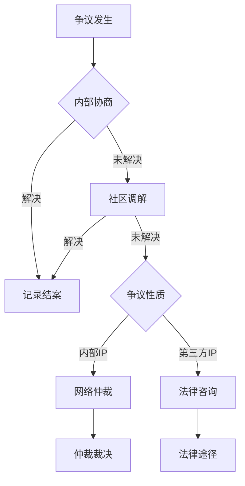

# 知识产权政策

## 概述

OWL 网络秉承"开放共享为默认，保护为例外"的理念，建立平衡创作者权益与知识共享的 IP 管理框架。我们相信知识的自由流动能够加速创新，同时也尊重创作者的合法权益。

**核心原则**:
1. **创作者所有**: 成果归创作者，过程开放共享
2. **分层管理**: 不同类型内容适用不同许可
3. **商业边界**: 商业使用不得冲突公共利益
4. **回馈网络**: 从网络获益者应回馈网络

---

## 1. 知识产权归属原则

### 1.1 Fab Charter 的智慧

OWL 借鉴 Fab Lab 宪章的 IP 条款设计：

> "发明的知识产权可以由发明者保护；但设计文档和流程应该保持开放，供他人学习使用。"

**解读**:
- **保护什么**: 最终的发明/产品/商业应用
- **开放什么**: 设计过程、学习文档、技术方法
- **平衡点**: 让创作者可以获益，同时知识可以流动

### 1.2 归属原则矩阵

| 创作场景 | 归属主体 | 网络权益 | 示例 |
|---------|---------|---------|------|
| **个人项目** | 100% 创作者 | 使用许可 | 成员的个人发明 |
| **课程学习成果** | 100% 学习者 | 展示许可 | 学习项目作品 |
| **社区协作项目** | 共同创作者 | 开放许可 | 社区共创项目 |
| **受托开发** | 委托方 | 无 | 外部委托项目 |
| **网络资助项目** | 创作者为主 | 开放许可 | 获得网络资金支持 |
| **网络官方内容** | OWL 网络 | N/A | 官方课程、标准 |

### 1.3 共同创作规则

当多人共同创作时：

```
共同创作 IP 归属流程:
┌─────────────────────────────────────────┐
│  1. 项目启动时                           │
│     ├── 明确各方贡献预期                 │
│     ├── 签署协作协议                     │
│     └── 约定 IP 分配方式                 │
├─────────────────────────────────────────┤
│  2. 项目进行中                           │
│     ├── 记录各方实际贡献                 │
│     ├── 及时沟通调整                     │
│     └── 新加入者签署协议                 │
├─────────────────────────────────────────┤
│  3. 项目完成时                           │
│     ├── 确认最终贡献比例                 │
│     ├── 明确各方权益                     │
│     └── 签署最终协议                     │
└─────────────────────────────────────────┘
```

**默认规则** (如无特别约定):
- 平等贡献 → 平等分享
- 主导贡献 → 主导权益
- 辅助贡献 → 署名权 + 合理使用权

---

## 2. 开放共享许可框架

### 2.1 知识共享层次

```
OWL 知识共享金字塔:
            ┌───────────────────┐
            │    商业化产品      │  可保护 IP
            │    (个人所有)      │  需遵守回馈条款
            ├───────────────────┤
            │    项目成果        │  开放共享
            │    (署名-相同)      │  过程开放供学习
            ├───────────────────┤
            │    课程内容        │  自由使用
            │    (署名-非商)      │  非商业可用
            ├───────────────────┤
            │    方法工具        │  完全开放
            │    (CC0/MIT)       │  无限制
            ├───────────────────┤
            │    基础知识        │  公共领域
            │    (Public Domain) │  人类共有
            └───────────────────┘
```

### 2.2 推荐许可协议

| 内容类型 | 推荐许可 | 说明 | 使用场景 |
|---------|---------|------|---------|
| **课程教材** | CC BY-NC-SA 4.0 | 署名-非商-相同方式 | 社区课程、教案 |
| **技术文档** | CC BY 4.0 | 署名即可 | 操作指南、技术说明 |
| **软件代码** | MIT / Apache 2.0 | 开源友好 | 工具软件、脚本 |
| **硬件设计** | CERN-OHL-S 2.0 | 开源硬件 | 产品设计、电路 |
| **项目成果** | 创作者选择 | 尊重意愿 | 个人项目 |
| **网络标准** | CC BY-SA 4.0 | 署名-相同方式 | 官方标准文件 |

### 2.3 许可协议速查

**Creative Commons 许可说明**:

| 许可 | 署名 | 非商业 | 相同方式 | 禁止演绎 | 适用 |
|------|:----:|:------:|:--------:|:--------:|------|
| CC0 | - | - | - | - | 完全放弃权利 |
| CC BY | ✓ | - | - | - | 最大自由度 |
| CC BY-SA | ✓ | - | ✓ | - | 开源精神 |
| CC BY-NC | ✓ | ✓ | - | - | 非商业使用 |
| CC BY-NC-SA | ✓ | ✓ | ✓ | - | 教育资源首选 |
| CC BY-ND | ✓ | - | - | ✓ | 保持完整性 |
| CC BY-NC-ND | ✓ | ✓ | - | ✓ | 最严格 |

**开源硬件许可**:

| 许可 | 特点 | 适用 |
|------|------|------|
| CERN-OHL-P | 宽松版 | 允许专有衍生 |
| CERN-OHL-W | 弱互惠 | 修改需开源 |
| CERN-OHL-S | 强互惠 | 衍生品需开源 |

---

## 3. 网络资源使用规则

### 3.1 使用社区设备的成果

| 成果类型 | 归属 | 社区权益 | 说明 |
|---------|------|---------|------|
| **学习作品** | 学习者 | 展示许可 | 可在社区展示 |
| **个人项目** | 创作者 | 无 | 完全自主 |
| **商业产品** | 创作者 | 回馈条款 | 需考虑回馈 |

### 3.2 使用社区资源的成果

| 资源类型 | 使用成果归属 | 附加条件 |
|---------|-------------|---------|
| **开放课程** | 学习者 | 遵守课程许可 |
| **社区模板** | 使用者 | 遵守模板许可 |
| **社区数据** | 使用者 | 遵守数据政策 |
| **导师指导** | 学习者 | 无 |

### 3.3 网络资助项目

获得 OWL 网络资金或重大资源支持的项目：

**开放要求**:
- 项目过程文档必须开放共享
- 核心成果至少采用 CC BY-NC-SA 或同等许可
- 在成果中标注 OWL 网络支持

**商业化规则**:
- 可以进行商业化
- 商业收益的一定比例（通常 5-15%）回馈网络
- 具体比例在资助协议中约定

---

## 4. 商业化路径与规则

### 4.1 商业化边界原则

```
商业化的红线:
┌─────────────────────────────────────────────────┐
│  ✓ 允许                                          │
│    ├── 个人项目自由商业化                        │
│    ├── 基于开放资源的衍生商业化                  │
│    ├── 提供付费服务（培训、咨询）                │
│    └── 销售自己的产品/设计                       │
├─────────────────────────────────────────────────┤
│  ✗ 禁止                                          │
│    ├── 商业使用冲突公共资源使用                  │
│    ├── 将社区公共资源据为私有                    │
│    ├── 剥削社区劳动而不回馈                      │
│    └── 以社区名义未经授权的商业行为              │
└─────────────────────────────────────────────────┘
```

### 4.2 商业化路径

**路径一: 个人创业**
- 基于在社区学到的技能创业
- 完全独立，无需向社区分成
- 鼓励在能力范围内回馈社区

**路径二: 项目孵化**
- 项目在社区诞生并发展
- 如使用社区重大资源，考虑回馈
- 可选择向社区开放核心技术

**路径三: 社区衍生**
- 商业产品基于社区开放资源
- 遵守原资源的许可条款
- SA 许可的衍生品需继续开放

**路径四: 合作项目**
- 与社区正式合作开发
- 签署商业化协议
- 收益按约定分配

### 4.3 回馈机制

| 回馈方式 | 说明 | 估算价值 |
|---------|------|---------|
| **知识回馈** | 分享经验、撰写文档 | 中 |
| **时间回馈** | 导师指导、活动支持 | 中 |
| **资源回馈** | 设备捐赠、材料支持 | 高 |
| **资金回馈** | 捐款、赞助 | 高 |
| **开源回馈** | 开源核心技术 | 高 |

---

## 5. 第三方知识产权

### 5.1 使用第三方资源

**使用前检查**:

```
第三方资源使用检查清单:
□ 确认资源的许可类型
□ 确认是否允许当前用途
□ 确认是否需要署名
□ 确认是否允许商业使用
□ 确认是否允许修改
□ 确认衍生品的许可要求
```

### 5.2 常见第三方资源处理

| 资源类型 | 教学使用 | 项目使用 | 商业使用 |
|---------|---------|---------|---------|
| 公共领域 | ✓ | ✓ | ✓ |
| CC BY | ✓ 署名 | ✓ 署名 | ✓ 署名 |
| CC BY-NC | ✓ 署名 | ✓ 署名 | ✗ |
| 版权保护 | ⚠️ 合理使用 | ✗ | ✗ |
| 专利保护 | ⚠️ 研究豁免 | ✗ 或 ✓ 许可 | ✗ 或 ✓ 许可 |

### 5.3 避免侵权

**禁止行为**:
- 使用盗版软件
- 未授权复制他人设计
- 假冒他人品牌
- 绕过技术保护措施
- 未经许可使用商标

**发现侵权时**:
1. 立即停止使用
2. 删除侵权内容
3. 向权利人道歉
4. 如有损失，协商赔偿

---

## 6. 知识产权争议解决

### 6.1 常见争议类型

| 争议类型 | 典型场景 | 解决难度 |
|---------|---------|---------|
| **归属争议** | 共创项目的贡献认定 | 中 |
| **使用争议** | 许可范围的理解分歧 | 低 |
| **侵权指控** | 被指控侵犯第三方IP | 高 |
| **商业争议** | 收益分配的分歧 | 高 |

### 6.2 解决流程



### 6.3 预防措施

**项目启动时**:
- 明确各方贡献和权益预期
- 签署协作协议
- 选择合适的许可协议

**过程中**:
- 记录贡献日志
- 及时沟通调整
- 保留证据

**项目结束时**:
- 确认最终权益分配
- 明确后续使用规则
- 归档相关文档

---

## 7. 实施指南

### 7.1 个人项目 IP 管理

```
个人项目 IP 管理建议:
┌─────────────────────────────────────────┐
│  1. 记录创作过程                         │
│     ├── 保留设计草图、版本记录           │
│     ├── 记录关键决策和时间点             │
│     └── 保存原始文件                     │
├─────────────────────────────────────────┤
│  2. 选择许可协议                         │
│     ├── 考虑后续使用意图                 │
│     ├── 平衡开放与保护                   │
│     └── 明确标注许可                     │
├─────────────────────────────────────────┤
│  3. 发布与维护                           │
│     ├── 清晰署名                         │
│     ├── 提供许可说明                     │
│     └── 监控使用情况                     │
└─────────────────────────────────────────┘
```

### 7.2 团队项目 IP 协议模板

**必备条款**:
1. 各方身份和联系方式
2. 项目描述和目标
3. 各方预期贡献
4. IP 归属约定
5. 商业化规则
6. 争议解决方式
7. 协议变更程序
8. 签署日期和签名

### 7.3 许可声明模板

**开放许可声明**:
```
本作品采用 [许可名称] 许可协议授权。
您可以自由：
- 分享 — 在任何媒介以任何形式复制、发行本作品
- 演绎 — 修改、转换或以本作品为基础进行创作
惟须遵守：
- [具体条件]

作者: [姓名]
创作日期: [日期]
许可详情: [链接]
```

---

## 常见问题

<details>
<summary>我在社区做的项目可以商业化吗？</summary>

可以。您的个人项目完全归您所有，可以自由商业化。
- 如果主要使用个人技能和材料，无需向社区分成
- 如果大量使用社区设备和资源，建议考虑回馈
- 如果基于社区开放资源，需遵守其许可条款
</details>

<details>
<summary>如何选择合适的开放许可？</summary>

选择建议：
- 希望最大传播 → CC BY 或 MIT
- 希望衍生也开放 → CC BY-SA 或 CERN-OHL-S
- 不希望商业使用 → CC BY-NC-SA
- 不希望被修改 → CC BY-ND
</details>

<details>
<summary>团队项目如何分配IP？</summary>

建议在项目开始时就明确：
1. 各人贡献类型和预期比例
2. 最终产品的 IP 归属
3. 商业化收益分配方式
4. 有争议时的解决方式

使用书面协议记录。
</details>

---

## 参考文献

1. MIT Fab Charter. *What is a Fab Lab?* [E1] ✅
2. Creative Commons. *About CC Licenses*. creativecommons.org [E1] ✅
3. Open Source Hardware Association. *Definition and Licenses*. oshwa.org [E2] ✅
4. CERN Open Hardware Licence. ohwr.org/cernohl [E2] ✅

---

## 更新记录

| 日期 | 更新内容 | 作者 | 状态 |
|------|----------|------|------|
| 2025-12 | 初稿创建 | AI | draft |
