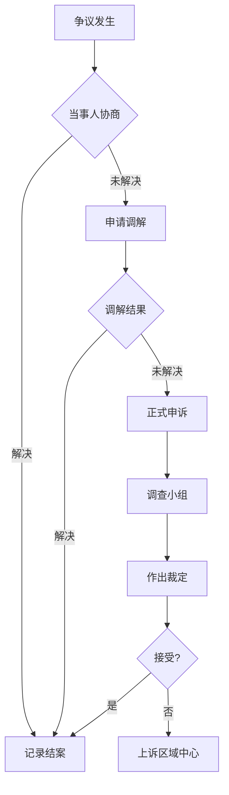

# 成员权责公约

## 概述

OWL 网络的成员公约是社区治理的基石。它明确每位成员的权利与义务，建立共同的行为准则，确保社区成为安全、包容、充满创造力的学习空间。本公约适用于所有 OWL 网络节点及其成员。

**核心理念**:
1. **权责对等**: 享有权利的同时承担相应义务
2. **相互尊重**: 尊重每个人的尊严、背景和贡献
3. **开放包容**: 欢迎多元背景，消除参与障碍
4. **共同成长**: 在帮助他人中实现自我成长

---

## 1. 成员类型与准入

### 1.1 成员分类

| 成员类型 | 定义 | 准入方式 | 主要权责 |
|---------|------|---------|---------|
| **体验成员** | 首次接触的访客 | 开放日参与 | 遵守安全规则、体验活动 |
| **正式成员** | 完成注册的学习者 | 申请+导引 | 使用资源、参与活动、贡献社区 |
| **导师成员** | 具备指导能力者 | 认证+培训 | 指导学习者、开发课程、维护设备 |
| **核心成员** | 深度参与运营者 | 推选+确认 | 参与治理、承担职责、代表节点 |
| **荣誉成员** | 杰出贡献者 | 社区表彰 | 荣誉身份、顾问角色 |

### 1.2 准入流程

```
成为正式成员的标准流程:
┌─────────────────────────────────────────┐
│  1. 提交申请                             │
│     ├── 填写基本信息                     │
│     ├── 说明参与动机                     │
│     └── 接受价值观问答                   │
├─────────────────────────────────────────┤
│  2. 新成员导引 (Onboarding)              │
│     ├── 参加迎新活动                     │
│     ├── 完成安全培训                     │
│     ├── 阅读并签署成员公约               │
│     └── 认识社区导师                     │
├─────────────────────────────────────────┤
│  3. 试用期 (1-3个月)                     │
│     ├── 参与基础活动                     │
│     ├── 获得初步技能认证                 │
│     └── 获得至少1名导师背书              │
├─────────────────────────────────────────┤
│  4. 正式确认                             │
│     ├── 通过试用期评估                   │
│     ├── 获得正式成员资格                 │
│     └── 解锁完整权限                     │
└─────────────────────────────────────────┘
```

### 1.3 未成年人特别规定

| 年龄段 | 参与方式 | 监护要求 | 特别保护 |
|-------|---------|---------|---------|
| <12岁 | 亲子同行 | 监护人全程陪同 | 高风险区域禁入 |
| 12-16岁 | 独立参与 | 监护人书面授权 | 中高风险需监督 |
| 16-18岁 | 独立参与 | 首次参与需授权 | 仅高风险需监督 |
| ≥18岁 | 完全独立 | 无需授权 | 标准规则 |

---

## 2. 成员权利

### 2.1 基本权利

**所有正式成员享有**:

| 权利类别 | 具体内容 |
|---------|---------|
| **使用权** | 使用节点开放时间内的公共空间与设备 |
| **学习权** | 参加公开课程、工作坊和学习活动 |
| **创作权** | 自主发起和开展个人/团队项目 |
| **知情权** | 了解节点运营状况、财务情况和决策过程 |
| **表达权** | 在社区中表达观点、提出建议和反馈 |
| **参与权** | 参与社区决策、投票和治理活动 |
| **发展权** | 获得技能认证、能力提升和成长路径 |

### 2.2 进阶权利

**根据贡献和资质获得**:

| 权利 | 获得条件 | 附带义务 |
|------|---------|---------|
| **高级设备使用权** | 完成相应技能认证 | 遵守操作规范、维护设备 |
| **课程开发权** | 导师资质认证 | 课程质量保证 |
| **导师指导权** | 导师培训合格 | 对学习者负责 |
| **治理投票权** | 核心成员资格 | 积极履行职责 |
| **对外代表权** | 授权委托 | 维护节点形象 |

### 2.3 权利保障机制

**当权利受到侵害时**:

1. **申诉渠道**: 可向安全主管或节点负责人申诉
2. **调查程序**: 7日内启动调查，14日内给出结论
3. **救济措施**: 恢复权利、赔偿损失、追究责任
4. **上诉机制**: 对处理不满可向区域协调中心上诉

---

## 3. 成员义务

### 3.1 基本义务

**所有成员必须**:

| 义务类别 | 具体要求 |
|---------|---------|
| **安全义务** | 遵守安全规则，不做危险行为，报告隐患 |
| **尊重义务** | 尊重他人，不歧视、不骚扰、不霸凌 |
| **诚信义务** | 诚实守信，不欺骗、不盗窃、不破坏 |
| **维护义务** | 爱护公共设施，维护环境整洁 |
| **共享义务** | 分享知识经验，帮助其他成员 |
| **合规义务** | 遵守法律法规和社区规则 |

### 3.2 特定义务

**导师成员额外义务**:
- 为学习者提供安全、有效的指导
- 持续提升自身专业能力
- 参与课程开发和知识共享
- 承担值班和安全监督职责

**核心成员额外义务**:
- 积极参与节点治理和决策
- 承担分配的运营职责
- 维护社区文化和价值观
- 培养和发展新成员

### 3.3 义务违反处理

| 违反程度 | 典型行为 | 处理措施 |
|---------|---------|---------|
| **轻微** | 首次迟到、轻微违规 | 口头提醒 |
| **一般** | 多次违规、影响他人 | 书面警告 |
| **严重** | 安全事故、骚扰行为 | 暂停资格(1-6月) |
| **极严重** | 违法犯罪、重大伤害 | 永久取消资格 |

---

## 4. 行为规范

### 4.1 核心行为准则

```
OWL 成员行为准则 (The OWL Code):
┌─────────────────────────────────────────────────────────┐
│                                                          │
│  🦉 O - Open (开放)                                      │
│     对新想法、新朋友、新挑战保持开放                       │
│                                                          │
│  🦉 W - Wise (智慧)                                      │
│     用智慧而非蛮力解决问题，安全第一                       │
│                                                          │
│  🦉 L - Learn (学习)                                     │
│     保持好奇心，享受学习，帮助他人学习                     │
│                                                          │
└─────────────────────────────────────────────────────────┘
```

### 4.2 具体行为规范

**鼓励的行为**:
- 主动帮助遇到困难的成员
- 分享自己的项目和经验
- 提出建设性的建议和反馈
- 保持工作区域整洁
- 认真对待安全培训
- 尊重不同的观点和背景

**禁止的行为**:
- 任何形式的歧视、骚扰、霸凌
- 未经授权使用他人作品或设备
- 危险行为或无视安全规则
- 破坏设备或公共设施
- 传播虚假信息或恶意言论
- 商业活动与社区活动冲突

### 4.3 沟通规范

**面对面沟通**:
- 使用尊重的语言和语气
- 积极倾听，不随意打断
- 给予建设性反馈
- 直接沟通，避免背后议论

**在线沟通**:
- 发言前先阅读上下文
- 避免全大写（视为吼叫）
- 不发送骚扰性私信
- 保护未成年人隐私
- 标注"剧透"和敏感内容

---

## 5. 社区文化准则

### 5.1 包容性原则

**我们欢迎所有人，无论**:
- 年龄、性别、性别认同
- 种族、民族、国籍
- 宗教信仰、政治观点
- 身体或心理能力
- 教育背景、社会经济地位
- 技术水平、经验程度

**包容性实践**:

| 维度 | 具体行动 |
|------|---------|
| **语言** | 使用中性语言，避免刻板印象 |
| **活动** | 设计无障碍活动，提供多种参与方式 |
| **空间** | 创建性别中立卫生间，无障碍设施 |
| **内容** | 展示多元化榜样和案例 |
| **支持** | 为弱势群体提供额外支持 |

### 5.2 心理安全

**创建心理安全环境**:

```
心理安全的表现:
┌─────────────────────────────────────────┐
│  ✓ 可以承认不知道，提问不被嘲笑         │
│  ✓ 可以犯错误，失败被视为学习机会       │
│  ✓ 可以表达不同意见，异议被尊重         │
│  ✓ 可以提出问题，报告隐患受到感谢       │
│  ✓ 可以做自己，真实而不用伪装           │
└─────────────────────────────────────────┘
```

**破坏心理安全的行为**:
- 公开批评或羞辱他人
- 嘲笑"愚蠢"的问题
- 指责犯错的人
- 压制不同意见
- 排斥特定群体

### 5.3 协作精神

**协作文化核心**:

| 价值观 | 体现方式 |
|-------|---------|
| **互助** | 帮助他人是荣誉而非负担 |
| **共创** | 团队成果大于个人成就 |
| **传承** | 经验丰富者有责任培养新人 |
| **感恩** | 认可和感谢他人的贡献 |
| **信任** | 假设善意，给予信任 |

---

## 6. 贡献与激励

### 6.1 贡献类型

| 贡献类型 | 示例 | 价值 |
|---------|------|------|
| **时间贡献** | 值班、活动支持 | ⭐ |
| **技能贡献** | 指导他人、设备维护 | ⭐⭐ |
| **知识贡献** | 课程开发、文档撰写 | ⭐⭐⭐ |
| **资源贡献** | 设备捐赠、资金支持 | ⭐⭐⭐ |
| **影响力贡献** | 社区推广、对外代表 | ⭐⭐ |

### 6.2 认可机制

**即时认可**:
- 公开感谢（会议、社区频道）
- 即时反馈（点赞、感谢卡）

**周期认可**:
- 月度贡献者表彰
- 季度社区之星
- 年度杰出贡献奖

**成就系统**:
```
成就徽章示例:
┌─────────────────────────────────────────┐
│  🌱 新芽      首次完成项目               │
│  🔧 巧手      获得3项技能认证             │
│  📚 导师      指导10名学习者              │
│  🌟 明星      获得100次感谢               │
│  🏆 传奇      持续贡献5年以上             │
└─────────────────────────────────────────┘
```

### 6.3 成长路径

```
成员成长阶梯:
Level 1: 体验者 → Level 2: 学习者 → Level 3: 创作者
                         ↓
Level 4: 导师 → Level 5: 核心成员 → Level 6: 节点领袖
```

---

## 7. 争议与申诉

### 7.1 争议处理流程



### 7.2 申诉渠道

| 渠道 | 适用情况 | 响应时间 |
|------|---------|---------|
| **当面沟通** | 即时小问题 | 即时 |
| **安全主管** | 安全相关问题 | 24小时 |
| **节点负责人** | 一般争议 | 3工作日 |
| **匿名反馈箱** | 敏感问题 | 7工作日 |
| **区域协调中心** | 上诉/跨节点 | 14工作日 |

### 7.3 保护原则

- **保密性**: 调查过程保密
- **非报复**: 禁止对申诉人打击报复
- **公正性**: 调查人员需回避利益冲突
- **时效性**: 在规定时间内完成处理

---

## 8. 公约的修订

### 8.1 修订权限

| 条款类型 | 修订权限 | 通过门槛 |
|---------|---------|---------|
| 核心原则 | 网络大会 | 2/3多数 |
| 基本权责 | 网络委员会 | 过半数 |
| 具体规范 | 节点全员 | 过半数 |
| 操作细则 | 管理团队 | 共识通过 |

### 8.2 修订流程

1. 提出修订建议
2. 公示征询意见（至少14天）
3. 整合反馈修改
4. 表决通过
5. 公布生效

---

## 常见问题

<details>
<summary>如果我看到违规行为应该怎么做？</summary>

1. 首先确保自身安全
2. 如果是安全问题，立即告知在场导师
3. 可以私下向安全主管或节点负责人报告
4. 可以使用匿名反馈渠道
5. 不鼓励当面对质，尤其是严重情况
</details>

<details>
<summary>如何处理成员之间的人际冲突？</summary>

1. 鼓励当事人直接沟通解决
2. 如需帮助，可请导师或社区主管协调
3. 复杂情况可申请正式调解
4. 保持开放心态，多数冲突源于误解
</details>

<details>
<summary>我可以在社区进行商业活动吗？</summary>

- 个人学习项目可以发展为商业项目
- 但商业活动不能影响社区公共资源使用
- 需要提前与节点负责人沟通
- 商业成果应考虑回馈社区
</details>

---

## 参考文献

1. MIT Fab Charter. fab.cba.mit.edu/about/charter/ [E1] ✅
2. Mozilla Community Participation Guidelines. mozilla.org/about/governance/policies/ [E2] ✅
3. Contributor Covenant. contributor-covenant.org [E2] ✅

---

## 更新记录

| 日期 | 更新内容 | 作者 | 状态 |
|------|----------|------|------|
| 2025-12 | 初稿创建 | AI | draft |
