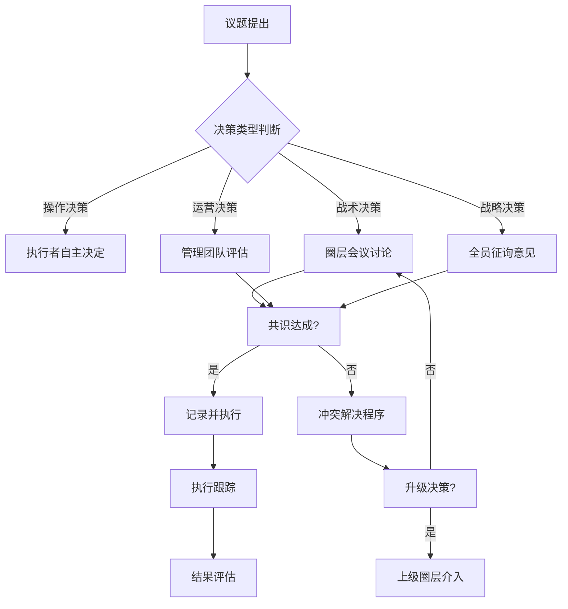

# 节点治理模型

## 概述

OWL 网络采用分布式治理架构，每个节点既是独立自治的实体，又是全球网络的有机组成部分。本文档提供节点治理的完整框架，帮助节点建立有效的内部治理机制，同时与网络整体保持协调一致。

**核心原则**:
1. **自治优先**: 节点在遵循核心标准的前提下拥有最大自治权
2. **标准统一**: 核心价值观、安全标准和知识共享规则网络统一
3. **灵活适应**: 治理模式可根据节点规模和场景灵活调整
4. **透明问责**: 决策过程公开，权责对等

---

## 1. 节点分级体系

### 1.1 节点类型定义

| 节点类型 | 代号 | 规模 | 典型场景 | 治理复杂度 |
|---------|------|------|----------|-----------|
| **种子节点** | OWL-S | 1-10人 | 家庭、小型社区 | 简单 |
| **成长节点** | OWL-G | 10-50人 | 学校、社区中心 | 中等 |
| **枢纽节点** | OWL-H | 50-200人 | 区域中心、科技馆 | 复杂 |
| **旗舰节点** | OWL-F | 200+人 | 大型机构、城市中心 | 高度复杂 |

### 1.2 分级标准

```
节点分级评估维度:
├── 规模维度
│   ├── 活跃成员数量
│   ├── 服务覆盖人群
│   └── 年活动场次
├── 能力维度
│   ├── 设备完备度
│   ├── 课程丰富度
│   └── 导师资质
├── 影响维度
│   ├── 社区渗透率
│   ├── 知识贡献量
│   └── 网络连接度
└── 稳定维度
    ├── 运营年限
    ├── 财务健康度
    └── 团队稳定性
```

### 1.3 各级节点治理要求

| 要求项 | 种子节点 | 成长节点 | 枢纽节点 | 旗舰节点 |
|-------|---------|---------|---------|---------|
| 核心团队 | 1-2人 | 3-5人 | 5-10人 | 10+人 |
| 治理文档 | 简单章程 | 完整章程 | 治理手册 | 治理体系 |
| 决策机制 | 协商一致 | 简单投票 | 分层授权 | 委员会制 |
| 财务管理 | 收支记录 | 预算管理 | 审计制度 | 财务委员会 |
| 报告周期 | 季度 | 月度 | 双周 | 周报 |

---

## 2. 自治机制设计

### 2.1 自治范围界定

**节点自治领域**:
- 日常运营安排
- 本地课程开发
- 活动策划执行
- 会员管理
- 本地合作伙伴
- 收费定价策略

**网络统一领域**:
- 核心价值观与使命
- 安全标准与底线
- 知识共享协议
- 品牌使用规范
- 数据保护政策
- 质量评估标准

### 2.2 Doocracy 原则应用

借鉴黑客空间的"谁做事谁负责"治理哲学：

```
Doocracy 在节点中的应用:
┌─────────────────────────────────────────┐
│           做事者获得决策权               │
├─────────────────────────────────────────┤
│  项目发起  →  发起人主导项目决策          │
│  设备维护  →  维护者决定使用规则          │
│  课程开发  →  开发者决定教学方式          │
│  活动策划  →  策划者决定活动细节          │
├─────────────────────────────────────────┤
│           贡献越多 → 话语权越大           │
│           权利 ←→ 责任 对等              │
└─────────────────────────────────────────┘
```

> **⚠️ Doocracy 的结构性风险警示**
>
> Doocracy 存在固有的"**时间特权陷阱**"：有更多闲暇时间的人（如退休者、无育儿责任者）可能自然累积更多话语权，而时间贫乏者（如双职工家长、护理者）被边缘化。这可能导致"**结构性寡头**"——名义上开放的治理实际被少数人主导。
>
> Jo Freeman 在《无结构的暴政》(The Tyranny of Structurelessness, 1972) 中指出，声称"无领导"或"扁平化"的组织往往产生隐性权力结构，且比显性结构更难问责。

**Doocracy 制衡机制**：

| 风险点 | 制衡措施 |
|-------|---------|
| 时间特权垄断 | **轮值制度**：关键决策角色设任期上限（如 6-12 月轮换） |
| 隐性权力积累 | **决策透明**：所有重大决定须留记录，可追溯、可质询 |
| 沉默多数被忽视 | **提案咨询期**：影响群体利益的决策须公示 ≥72 小时，主动征询反馈 |
| 新人难以进入 | **onboarding buddy**：为新成员分配导引人，降低参与门槛 |

**提案咨询期（Proposal Consultation Window）制度**：

对于影响群体利益的重大决策（如空间规则变更、设备淘汰、费用调整），即使由活跃行动者发起，也须遵循：

1. **公示**：在社群公共渠道发布提案摘要（≥72 小时窗口期）
2. **触达**：通过多渠道（如邮件、群公告）主动通知可能受影响的成员
3. **反馈**：设置明确的反馈渠道和截止时间
4. **回应**：发起人须公开回应收到的重大异议
5. **记录**：保留完整的提案—反馈—决定链条

### 2.3 圈层治理模型

采用 Holacracy 理念的圈层结构：

```
        ┌─────────────────────────────────┐
        │         战略圈 (Strategy)        │
        │    使命愿景、年度规划、重大决策    │
        └────────────────┬────────────────┘
                         │
    ┌────────────────────┼────────────────────┐
    ↓                    ↓                    ↓
┌─────────┐        ┌─────────┐        ┌─────────┐
│ 课程圈   │        │ 运营圈   │        │ 社区圈   │
│Programs │        │Operations│        │Community│
└────┬────┘        └────┬────┘        └────┬────┘
     │                  │                  │
┌────┴────┐        ┌────┴────┐        ┌────┴────┐
│项目小组 │        │设备小组 │        │活动小组 │
│Workshop │        │Equipment│        │ Events  │
└─────────┘        └─────────┘        └─────────┘
```

---

## 3. 决策流程设计

### 3.1 决策分类

| 决策类型 | 影响范围 | 决策主体 | 时效要求 | 示例 |
|---------|---------|---------|---------|------|
| **操作决策** | 个人/小组 | 执行者自主 | 即时 | 设备使用安排 |
| **战术决策** | 圈层 | 圈层会议 | 1-3天 | 活动方案调整 |
| **运营决策** | 节点 | 管理团队 | 1周 | 预算分配 |
| **战略决策** | 节点长期 | 全员/代表 | 2-4周 | 年度规划 |
| **网络决策** | 跨节点 | 网络委员会 | 1-3月 | 标准修订 |

### 3.2 决策流程



### 3.3 共识决策方法

**渐进式共识流程**:

1. **提案阶段**: 提出者完善提案，征询初步意见
2. **讨论阶段**: 开放讨论，收集反对意见和改进建议
3. **整合阶段**: 整合反馈，修改提案
4. **决策阶段**: 采用"同意制"而非"多数制"
   - 同意 = 可以接受，愿意支持
   - 反对 = 有重大顾虑，需要解决
   - 弃权 = 不参与决策

**同意制投票**:
```
通过条件: 无重大反对
┌─────────────────────────────────────┐
│  👍 同意: 支持提案执行                │
│  🤝 接受: 非最佳但可接受              │
│  🤔 保留: 有顾虑但不阻挡              │
│  ❌ 反对: 有重大问题需解决            │
│  ➖ 弃权: 不参与此决策                │
└─────────────────────────────────────┘
只要无 ❌ 即可通过
```

---

## 4. 角色与权责

### 4.1 核心角色定义

| 角色 | 职责 | 权限 | 任期 | 产生方式 |
|------|------|------|------|---------|
| **节点负责人** | 整体统筹、对外代表 | 战略决策、资源调配 | 2年 | 选举/任命 |
| **运营主管** | 日常运营管理 | 运营决策、团队管理 | 1年 | 任命 |
| **课程主管** | 课程体系建设 | 课程审核、导师管理 | 1年 | 任命 |
| **安全主管** | 安全合规管理 | 安全审核、应急处置 | 1年 | 任命 |
| **社区主管** | 社区关系维护 | 活动策划、对外合作 | 1年 | 任命 |

### 4.2 RACI 矩阵示例

| 事项 | 节点负责人 | 运营主管 | 课程主管 | 安全主管 | 普通成员 |
|------|-----------|---------|---------|---------|---------|
| 年度规划 | A | C | C | C | I |
| 预算编制 | A | R | C | C | I |
| 课程审核 | I | C | A/R | C | I |
| 安全检查 | I | C | I | A/R | I |
| 日常运营 | I | A/R | C | C | R |
| 活动执行 | I | A | C | C | R |

> R=执行 A=批准 C=咨询 I=通知

### 4.3 权责对等原则

```
权责金字塔:
        ┌───────────────┐
        │   重大决策权   │  ← 承担最终责任
        ├───────────────┤
        │   资源调配权   │  ← 对资源使用负责
        ├───────────────┤
        │   执行决定权   │  ← 对执行结果负责
        ├───────────────┤
        │   建议提案权   │  ← 对提案质量负责
        └───────────────┘

原则: 获得多大权力，就承担多大责任
```

---

## 5. 节点生命周期管理

### 5.1 生命周期阶段

```
节点生命周期:
┌─────────────────────────────────────────────────────────┐
│  筹备期    启动期    成长期    成熟期    转型/传承期     │
│  ────→    ────→    ────→    ────→    ────→           │
│                                                         │
│  3-6月    6-12月   1-3年    3年+     视情况            │
│                                                         │
│  规划      验证      扩展      稳定      升级/交接       │
│  组建      试运营    标准化    优化      变革/传承       │
└─────────────────────────────────────────────────────────┘
```

### 5.2 各阶段治理重点

| 阶段 | 治理重点 | 关键任务 | 风险提示 |
|------|---------|---------|---------|
| **筹备期** | 愿景对齐 | 核心团队组建、章程制定 | 理念分歧 |
| **启动期** | 流程建立 | 基础制度运行、快速迭代 | 资源不足 |
| **成长期** | 规范化 | 制度完善、团队扩充 | 管理跟不上 |
| **成熟期** | 优化创新 | 效率提升、文化传承 | 官僚化 |
| **转型期** | 变革管理 | 战略调整、组织重构 | 变革阻力 |

### 5.3 节点退出机制

**退出情形**:
- 主动退出: 节点决定终止运营
- 被动退出: 严重违反网络规则
- 转型退出: 转为其他类型组织

**退出流程**:
1. 提前 3 个月通知网络
2. 完成知识资产整理与移交
3. 会员安置方案
4. 品牌使用权收回
5. 正式退出与公告

---

## 6. 网络协调机制

### 6.1 纵向协调

```
网络治理层级:
┌─────────────────────────────────────┐
│           全球网络委员会              │  ← 战略、标准、仲裁
├─────────────────────────────────────┤
│           区域协调中心               │  ← 区域协调、资源整合
├─────────────────────────────────────┤
│           旗舰/枢纽节点              │  ← 区域引领、能力输出
├─────────────────────────────────────┤
│           成长/种子节点              │  ← 本地运营、社区服务
└─────────────────────────────────────┘
```

### 6.2 横向协作

| 协作类型 | 形式 | 频率 | 目的 |
|---------|------|------|------|
| **同城联盟** | 定期交流会 | 月度 | 资源共享、联合活动 |
| **主题社群** | 线上社群 | 持续 | 专业交流、经验分享 |
| **跨区项目** | 项目合作 | 按需 | 联合创新、能力互补 |
| **年度大会** | 线下峰会 | 年度 | 战略对齐、关系建设 |

### 6.3 争议解决

**三级解决机制**:

```
Level 1: 节点内部调解
    ↓ (未解决)
Level 2: 区域协调介入
    ↓ (未解决)
Level 3: 网络委员会仲裁
```

**仲裁原则**:
- 事实优先，证据说话
- 规则面前人人平等
- 保护弱势方利益
- 修复优先于惩罚

---

## 7. 治理文档体系

### 7.1 文档层级

| 层级 | 文档类型 | 制定主体 | 修改权限 | 示例 |
|------|---------|---------|---------|------|
| **宪章级** | 网络宪章 | 网络大会 | 2/3多数 | OWL 宪章 |
| **规则级** | 网络规则 | 网络委员会 | 委员会决议 | 安全标准 |
| **制度级** | 节点制度 | 节点全员 | 节点决议 | 节点章程 |
| **流程级** | 操作流程 | 管理团队 | 主管审批 | 活动SOP |
| **指南级** | 最佳实践 | 任何人 | 版本迭代 | 操作指南 |

### 7.2 节点必备文档

**种子节点** (最简配置):
- [ ] 节点简章 (1页)
- [ ] 安全须知
- [ ] 成员名单

**成长节点**:
- [ ] 节点章程
- [ ] 成员手册
- [ ] 安全制度
- [ ] 财务规范
- [ ] 活动流程

**枢纽/旗舰节点**:
- [ ] 完整治理手册
- [ ] 岗位职责说明
- [ ] 决策流程文档
- [ ] 风险管理制度
- [ ] 质量管理体系

---

## 常见问题

<details>
<summary>小型节点如何简化治理？</summary>

对于种子节点，建议：
1. 核心人员协商决策即可，无需复杂流程
2. 一页纸章程足够，随发展逐步完善
3. 关键是安全底线不能省，其他可灵活
4. 借助网络提供的模板，不必从零开始
</details>

<details>
<summary>如何处理核心成员分歧？</summary>

1. 先回归使命愿景，检视是否价值观分歧
2. 采用共识决策方法，充分讨论
3. 必要时引入第三方调解
4. 极端情况可考虑友好分裂
</details>

<details>
<summary>新节点负责人如何交接？</summary>

建议的交接流程：
1. 提前 2-3 个月确定继任者
2. 共同工作 1 个月，熟悉全面事务
3. 新任主导、前任辅助 1 个月
4. 正式交接，前任退居顾问
5. 交接文档存档
</details>

---

## 参考文献

1. Ostrom, E. (1990). *Governing the Commons*. Cambridge University Press. [E1] ✅
2. Robertson, B. (2015). *Holacracy: The New Management System*. Henry Holt. [E2] ✅
3. MIT Center for Bits and Atoms. *The Fab Charter*. [E1] ✅
4. Laloux, F. (2014). *Reinventing Organizations*. Nelson Parker. [E2] ⚠️

---

## 更新记录

| 日期 | 更新内容 | 作者 | 状态 |
|------|----------|------|------|
| 2025-12 | 初稿创建 | AI | draft |
