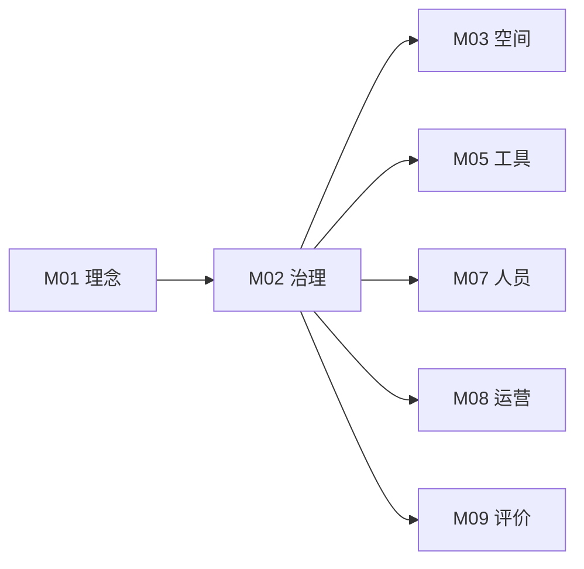

# M02 治理与网络

## 摘要与核心定位

> **一句话定位**: 在去中心化与高质量之间寻找平衡的治理艺术。

本模块阐述了 OWL 网络的组织形式与协作规则。我们建立一套**分布式治理**体系，通过明确的**分层架构**（总部-区域-节点）和**分类体系**（社区级-专业级-旗舰级），确保网络既有统一的质量底线（MVS），又有充分的本地化创新空间。

**核心观点**:
1.  **自治与协同**: 节点在遵守核心原则的前提下高度自治，同时通过网络协同共享资源。
2.  **分级分类**: 承认差异，为不同类型的实验室提供适合的发展路径和支持体系。
3.  **透明共治**: 决策透明，规则公开，鼓励社区成员参与治理规则的迭代。

---

## 模块信息图

```
┌─────────────────────────────────────────────────────────────────┐
│                    OWL 治理与网络架构                             │
├─────────────────────────────────────────────────────────────────┤
│                                                                   │
│  ┌─────────────────────────────────────────────────────────────┐ │
│  │  五大核心原则                                                 │ │
│  │  ┌─────────┐ ┌─────────┐ ┌─────────┐ ┌─────────┐ ┌─────────┐ │ │
│  │  │分布式网络│ │标准与灵活│ │共建共享 │ │透明可信 │ │持续进化 │ │ │
│  │  └─────────┘ └─────────┘ └─────────┘ └─────────┘ └─────────┘ │ │
│  └─────────────────────────────────────────────────────────────┘ │
│                                                                   │
│  ┌─────────────────────────────────────────────────────────────┐ │
│  │  三层网络架构                                                 │ │
│  │       ┌──────────────────────────┐                           │ │
│  │       │      OWL 总部            │   战略/标准/品牌/支持      │ │
│  │       └────────────┬─────────────┘                           │ │
│  │                    │                                          │ │
│  │       ┌────────────┼────────────┐                            │ │
│  │       ↓            ↓            ↓                            │ │
│  │   ┌──────┐    ┌──────┐    ┌──────┐    区域协调/本地支持      │ │
│  │   │区域A │    │区域B │    │区域C │                           │ │
│  │   └──┬───┘    └──┬───┘    └──┬───┘                           │ │
│  │      │           │           │                                │ │
│  │   节点群       节点群      节点群    日常运营/学习交付        │ │
│  └─────────────────────────────────────────────────────────────┘ │
│                                                                   │
│  ┌─────────────────────────────────────────────────────────────┐ │
│  │  实验室分类 × 分级                                            │ │
│  │                                                               │ │
│  │  类型: 核心Lab | 联合Lab | 社区Lab | 虚拟Lab | 移动Lab        │ │
│  │                                                               │ │
│  │  级别: 探索级(Lite) ──→ 专业级(Pro) ──→ 挑战级(Ultra)         │ │
│  │         ≥30m²            ≥100m²           ≥200m²              │ │
│  └─────────────────────────────────────────────────────────────┘ │
└─────────────────────────────────────────────────────────────────┘
```

---

## 1. 核心原则

核心原则贯穿于网络设计和运营的各个环节，是具体决策时指引方向的罗盘。

| 原则 | 核心内涵 | 实践体现 |
|------|---------|---------|
| **分布式网络** | 去中心化架构，节点自主协作 | 节点日常运营高度自主，总部提供支持而非管控 |
| **标准与灵活** | 底线统一，高度自治 | MVS不可协商；具体运营可本地化调整 |
| **共建共享** | 资源集体建设，共同分享 | 贡献积分体系，知识库共建 |
| **透明可信** | 决策过程和信息公开透明 | 重大决策征求意见，数据定期发布 |
| **持续进化** | 治理机制动态迭代 | 年度评估，规则版本化更新 |

---

## 2. 网络架构

OWL采用三层架构设计，每层都有明确的职责和权限。

### 2.1 总部（第一层）
- **角色**: 网络核心中枢，"中央厨房"
- **职责**: 战略方向、核心标准、品牌管理、共享资源开发
- **工作重心**: 标准制定、资源开发、跨节点协调、能力赋能

### 2.2 区域协调中心（第二层）
- **角色**: 连接总部和节点的中间层
- **职责**: 区域规划、节点支持、经验交流、向上反馈
- **特点**: 熟悉本地情况，进行标准本地化适配

### 2.3 节点群（第三层）
- **角色**: 网络的执行层，直接服务学习者
- **职责**: 日常运营、学习体验交付、社区建设
- **特点**: 在核心标准范围内灵活调整和创新

---

## 3. 实验室分类体系

### 3.1 按管理关系分类

| 类型 | 定位 | 运营方 | 特点 |
|------|------|-------|------|
| **核心实验室** | 旗舰店 | OWL直营 | 标准验证、方法论迭代、师资培训 |
| **联合实验室** | 合作共建 | 合作机构 | 资源互补、品牌共享 |
| **社区实验室** | 生态伙伴 | 独立运营 | 高度自治、网络资源共享 |
| **虚拟实验室** | 纯线上 | 多形态 | 打破地域限制 |
| **移动实验室** | 可移动 | 项目制 | 服务偏远地区 |

**联合实验室子类型**：区域联建、学校联建、高校联建、企业联建、国际合作

### 3.2 按能力分级

| 级别 | 代码 | 面积要求 | 学习体验能力 | 设备配置 |
|------|-----|---------|------------|---------|
| **探索级** | Lite | ≥30m² | 入门级体验 | 基础套件 |
| **专业级** | Pro | ≥100m² | 进阶项目 | 高阶套件 |
| **挑战级** | Ultra | ≥200m² | 高阶研究 | 专业仪器 |

---

## 4. 加盟准则与流程

### 4.1 准入条件

| 维度 | 要求 | 验证方式 |
|------|-----|---------|
| **理念认同** | 签署价值公约 | 面谈评估 |
| **开放承诺** | 参与知识共享 | 书面承诺 |
| **法人资格** | 合法运营主体 | 资质审核 |
| **负责人配置** | 至少1名全职/半全职负责人 | 人员面谈 |
| **基础培训** | 完成入网培训 | 培训认证 |
| **空间条件** | 符合Lite级最低标准 | 现场评估 |

### 4.2 申请流程

```
意向咨询 → 在线申请 → 资质审核 → 现场评估 → 入网培训 → 签署协议 → 品牌授权 → 正式运营
```

### 4.3 品牌授权层级

| 节点类型 | 授权范围 | 标识使用 |
|---------|---------|---------|
| 核心实验室 | 完整授权 | OWL主标识 |
| 联合实验室 | 联合品牌 | XX-OWL联合标识 |
| 社区实验室 | 社区标识 | OWL社区伙伴 |

---

## 5. 组织架构与角色

### 5.1 节点管理团队

| 角色 | 核心职责 |
|------|---------|
| **实验室负责人** | 整体运营、战略规划、对外合作 |
| **教研员** | 课程设计、技术支持、师资培训 |
| **社区经理** | 社区运营、会员服务、活动策划 |
| **运营助理** | 日常运营、行政支持 |

### 5.2 决策权责矩阵 (RACI)

| 决策事项 | 节点 | 区域 | 总部 |
|---------|-----|-----|-----|
| 日常运营 | R/A | I | I |
| 课程选用 | R/A | C | I |
| 品牌使用 | C | C | A |
| 新节点准入 | C | R | A |
| 网络标准制定 | C | C | R/A |

> R=执行 A=审批 C=咨询 I=知会

---

## 6. 退出机制

| 退出类型 | 触发条件 | 处理方式 |
|---------|---------|---------|
| **主动退出** | 节点自愿申请 | 提前3月通知，友好交接 |
| **考核未达标** | 年度评估不合格 | 3-6月整改期，仍不达标则降级或终止 |
| **严重违规** | 违反核心规则 | 立即终止授权 |

---

## 7. MVS 最小可运行标准

| 维度 | MVS要求 | 验证方式 |
|------|--------|---------|
| **法人资格** | 合法注册主体 | 资质证明 |
| **负责人** | 1人全职/半全职投入 | 人员面谈 |
| **理念认同** | 签署价值公约 | 签署记录 |
| **基础培训** | 主要人员完成入网培训 | 培训认证 |
| **品牌授权** | 签署正式授权协议 | 协议原件 |
| **年度报告** | 按时提交运营报告 | 报告记录 |

---

## 8. 与其他模块的关系



- **M01→M02**: 治理结构体现核心价值观
- **M02→M03**: 节点分级决定空间标准
- **M02→M05**: 节点分级决定设备配置
- **M02→M07**: 节点类型决定人员配置
- **M02→M08**: 治理框架支撑运营边界
- **M02→M09**: 节点评估落实治理规则

---

## 扩展阅读

<ExtendCards cards={[
  {
    title: "分布式创新网络模式",
    description: "Fab Lab、Makerspace、Living Lab 模式分析，以及 DAO 治理等前沿趋势",
    href: "/docs/knowledge-base/02-governance/extend/distributed-innovation",
    type: "extend",
    status: "completed"
  },
  {
    title: "节点准入标准",
    description: "详细的节点评估清单和准入流程",
    href: "/docs/knowledge-base/02-governance/extend/node-admission",
    type: "extend",
    status: "planned"
  },
  {
    title: "品牌授权指南",
    description: "OWL 品牌使用规范和授权协议模板",
    href: "/docs/knowledge-base/02-governance/extend/brand-licensing",
    type: "extend",
    status: "planned"
  },
  {
    title: "学校联建指南",
    description: "与中小学、集团校合作建设创客空间的完整指南",
    href: "/docs/knowledge-base/02-governance/extend/school-partnership",
    type: "extend",
    status: "planned"
  },
  {
    title: "高校衔接机制",
    description: "高中-大学创新人才培养衔接与联合项目",
    href: "/docs/knowledge-base/02-governance/extend/university-connection",
    type: "extend",
    status: "planned"
  },
  {
    title: "节点治理模型",
    description: "OWL 网络节点的分级治理架构、自治机制与决策流程",
    href: "/docs/knowledge-base/02-governance/extend/node-governance-model",
    type: "extend",
    status: "draft"
  }
]} />

---

## 参考文献

见 [evidence/refs.json](./evidence/refs.json)

**核心引用**:
- Ostrom, E. (1990). *Governing the Commons*. Cambridge University Press. [E2]
- Raymond, E.S. (1999). *The Cathedral and the Bazaar*. O'Reilly Media. [E1]
- Powell, W.W. (1990). "Neither Market nor Hierarchy: Network Forms of Organization". [E2]
- 教育部等七部门 (2025). 《关于加强中小学科技教育的意见》. [E1]
