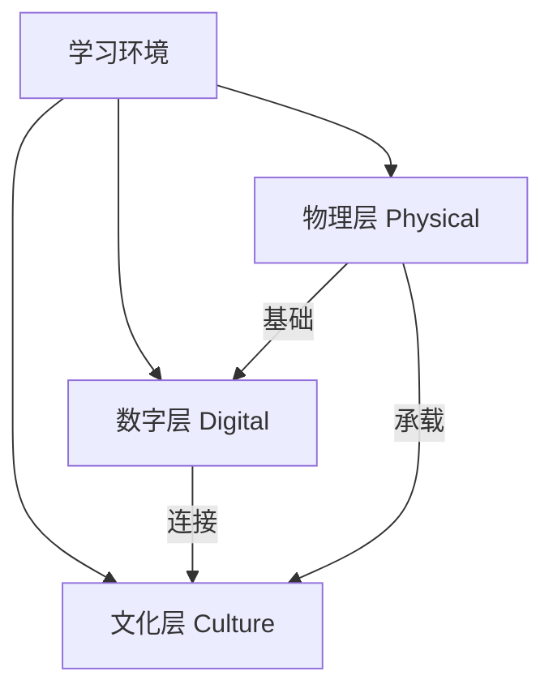

# M03 空间与环境

## 1. 摘要与核心定位
> **一句话定位**: 创造激发创意、支持创造、包容多元的学习环境。

空间不仅是容纳活动的容器，更是塑造行为的工具。本模块定义了 OWL 实验室的空间建设标准，主张通过"物理-数字-文化"三层模型，构建既满足安全底线，又能激发创新精神的场域。

**核心观点**:
1.  **情境即内容**: 空间的布局、开放度和混乱度直接传递教育价值观。
2.  **可塑性优先**: 好的实验室应允许用户"破解"和重组，而非被过度设计固定。
3.  **三层融合**: 物理层（硬）、数字层（软）、文化层（魂）缺一不可。

---

## 2. 核心原则

| 原则 | 内涵 | 设计体现 |
|------|------|----------|
| **学习可见** | 让过程可见，激发好奇 | 透明工作区、作品展示墙、玻璃隔断 |
| **灵活可变** | 支持快速重组 | 轮子上的家具、模块化电源、移动白板 |
| **安全包容** | 安全底线 + 多元包容 | 无障碍设计、清晰的安全标识、容错区 |
| **低门槛高上限** | 易入门，可深耕 | 开放材料自助区 vs 专业设备预约区 |
| **创新友好** | 激发创意，容错试错 | "草稿墙"、未完成的原型展示、非正式交流角 |

---

## 3. 空间设计三层模型

OWLab 采用三层模型来定义完整的学习环境：

1.  **物理层 (Physical)**: 空间布局、家具、光照、通风。基础设施必须满足人体工程学和安全规范。
    *   *详见扩展模块*: [物理空间设计](./extend/physical-design)
2.  **数字层 (Digital)**: 网络、协作软件、物联网设备。打破物理边界，支持混合学习。
    *   *详见扩展模块*: [数字环境标准](./extend/digital-environment)
3.  **文化层 (Culture)**: 视觉识别、仪式感、社区规则。空间的灵魂，决定了用户如何互动。
    *   *详见扩展模块*: [文化氛围营造](./extend/culture-atmosphere)

---

## 4. MVS 最小可运行标准 (Minimum Viable Standard)

任何挂牌 OWL 的实体实验室必须满足以下底线：

| 项目 | 标准节点 (Standard) | 说明 |
|------|----------|------|
| **面积** | ≥30m² | 保证最基本的协作半径 |
| **功能区** | 3个核心区 | 创作区/展示区/讨论区 |
| **消防** | ✅ 通过验收 | 配备灭火器、烟感、畅通逃生通道 |
| **无障碍** | 基础达标 | 入口无台阶或有坡道 |
| **网络** | ≥100Mbps | 全覆盖 WiFi |
| **环境** | 通风/照明达标 | 换气≥4次/h，桌面照度≥300lux |

> **级别说明**:
> *   **Lite (社区点)**: ≥30m²，侧重灵活普及。
> *   **Pro (标准层)**: ≥100m²，功能完备，含专业区。
> *   **Ultra (旗舰层)**: ≥200m²，含科研级设备与孵化空间。

---

## 5. 核心功能区配置

| 功能区 | 目的 | Lite占比 | Pro占比 | 关键配置 |
|--------|------|----------|---------|----------|
| **创作区** | 动手制作 | 40% | 35% | 高度可调桌、电源吊塔、耐磨防滑地胶 |
| **展示区** | 成果展示 | 15% | 15% | 轨道射灯、透明展示柜、作品标签卡 |
| **讨论区** | 交流协作 | 20% | 15% | 移动白板、可堆叠椅、大屏显示器 |
| **储物区** | 物资存放 | 15% | 15% | 零件盒墙、半成品暂存架(Project Bin) |
| **缓冲区** | 过渡休息 | 10% | 10% | 饮水机、沙发、阅读角 |

---

## 6. 扩展阅读与深度指南

核心层仅定义原则与标准，具体设计方法与深度理论请查阅扩展模块：

<ExtendCards cards={[
  {
    title: "d.school 空间设计语法",
    description: "场所、属性、行动、态度——斯坦福经典的四维度设计框架。",
    href: "/docs/knowledge-base/03-space/extend/dschool-space-syntax",
    type: "extend",
    status: "published"
  },
  {
    title: "环境心理学应用",
    description: "色彩、光线、层高如何潜移默化影响创造力。",
    href: "/docs/knowledge-base/03-space/extend/environmental-psychology",
    type: "extend",
    status: "published"
  },
  {
    title: "数字环境标准",
    description: "带宽、工具链与智能化设备的选型指南。",
    href: "/docs/knowledge-base/03-space/extend/digital-environment",
    type: "extend",
    status: "published"
  },
  {
    title: "文化氛围营造",
    description: "视觉识别(VI)与社区仪式感的空间表达。",
    href: "/docs/knowledge-base/03-space/extend/culture-atmosphere",
    type: "extend",
    status: "published"
  },
  {
    title: "无障碍设计指南",
    description: "全龄友好与特殊需求人群的包容性设计。",
    href: "/docs/knowledge-base/03-space/extend/accessibility",
    type: "extend",
    status: "published"
  },
  {
    title: "选址与装修预算",
    description: "选址评估模型与典型装修成本分解。",
    href: "/docs/knowledge-base/03-space/extend/site-selection",
    type: "extend",
    status: "planned"
  }
]} />

---

## 7. 参考文献

详见 [evidence/refs.json](./evidence/refs.json)。核心引用：
1. Doorley, S., & Witthoft, S. (2012). *Make Space*. Wiley.
2. GB 50099-2011 《中小学校设计规范》
3. GB 50763-2012 《无障碍设计规范》
