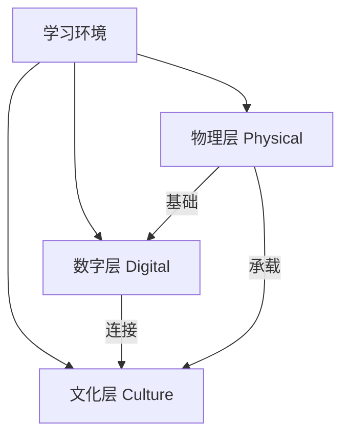
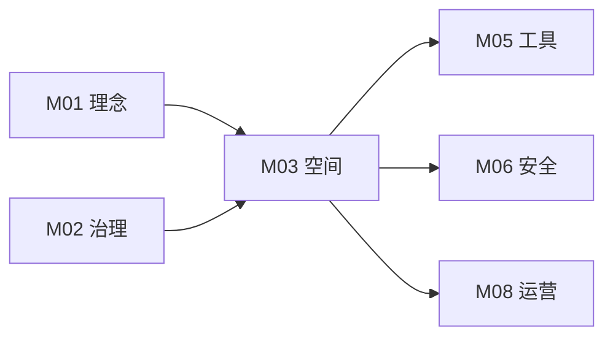

# M03 空间与环境

## 摘要与核心定位

> **一句话定位**: 创造激发创意、支持创造、包容多元的学习环境——空间即工具，情境即内容。

空间不仅是容纳活动的容器，更是塑造行为的工具。本模块定义了 OWL 实验室的空间建设标准，主张通过"物理-数字-文化"三层模型，构建既满足安全底线，又能激发创新精神的场域。研究表明，环境设计能显著影响创造力、协作意愿和学习效果。

**核心观点**:
1.  **情境即内容**: 空间的布局、开放度和混乱度直接传递教育价值观。一个整洁到极致的空间可能暗示"不要动手"。
2.  **可塑性优先**: 好的实验室应允许用户"破解"和重组，而非被过度设计固定。
3.  **三层融合**: 物理层（硬）、数字层（软）、文化层（魂）缺一不可。

---

## 模块信息图

```
┌─────────────────────────────────────────────────────────────────────────────┐
│                        OWL 空间与环境架构                                     │
├─────────────────────────────────────────────────────────────────────────────┤
│                                                                               │
│  ┌─────────────────────────────────────────────────────────────────────────┐ │
│  │  空间设计五大原则                                                         │ │
│  │  ┌─────────┐ ┌─────────┐ ┌─────────┐ ┌─────────┐ ┌─────────┐           │ │
│  │  │学习可见 │ │灵活可变 │ │安全包容 │ │低门槛   │ │创新友好 │           │ │
│  │  │         │ │         │ │         │ │高上限   │ │         │           │ │
│  │  └─────────┘ └─────────┘ └─────────┘ └─────────┘ └─────────┘           │ │
│  └─────────────────────────────────────────────────────────────────────────┘ │
│                                    ↓                                          │
│  ┌─────────────────────────────────────────────────────────────────────────┐ │
│  │  三层空间模型                                                             │ │
│  │                                                                           │ │
│  │   ┌─────────────────────────────────────────────────────────────────┐   │ │
│  │   │                    文化层 (Culture)                             │   │ │
│  │   │     视觉识别 │ 社区规则 │ 仪式感 │ 氛围营造                     │   │ │
│  │   └─────────────────────────────────────────────────────────────────┘   │ │
│  │   ┌─────────────────────────────────────────────────────────────────┐   │ │
│  │   │                    数字层 (Digital)                             │   │ │
│  │   │     网络设施 │ 协作软件 │ IoT设备 │ 混合学习                    │   │ │
│  │   └─────────────────────────────────────────────────────────────────┘   │ │
│  │   ┌─────────────────────────────────────────────────────────────────┐   │ │
│  │   │                    物理层 (Physical)                            │   │ │
│  │   │     空间布局 │ 家具设备 │ 光照通风 │ 消防安全                   │   │ │
│  │   └─────────────────────────────────────────────────────────────────┘   │ │
│  └─────────────────────────────────────────────────────────────────────────┘ │
│                                    ↓                                          │
│  ┌─────────────────────────────────────────────────────────────────────────┐ │
│  │  分级空间标准                                                             │ │
│  │                                                                           │ │
│  │   Lite (探索级)        Pro (专业级)         Ultra (挑战级)               │ │
│  │   ≥30m²                ≥100m²               ≥200m²                       │ │
│  │   3个核心区            5个功能区            7+功能区                      │ │
│  │   基础设备             专业设备             科研级设备                    │ │
│  └─────────────────────────────────────────────────────────────────────────┘ │
│                                    ↓                                          │
│  ┌─────────────────────────────────────────────────────────────────────────┐ │
│  │  五大功能区                                                               │ │
│  │  ┌──────┐ ┌──────┐ ┌──────┐ ┌──────┐ ┌──────┐                          │ │
│  │  │创作区│ │展示区│ │讨论区│ │储物区│ │缓冲区│                          │ │
│  │  │ 35%  │ │ 15%  │ │ 20%  │ │ 15%  │ │ 15%  │                          │ │
│  │  └──────┘ └──────┘ └──────┘ └──────┘ └──────┘                          │ │
│  └─────────────────────────────────────────────────────────────────────────┘ │
└─────────────────────────────────────────────────────────────────────────────┘
```

---

## 1. 核心原则

空间设计是价值观的物化表达。我们的五大原则贯穿于每一个设计决策。

| 原则 | 内涵 | 设计体现 | 验证标准 |
|------|------|----------|---------|
| **学习可见** | 让过程可见，激发好奇 | 透明工作区、作品展示墙、玻璃隔断 | 访客能看到正在进行的活动 |
| **灵活可变** | 支持快速重组 | 轮子上的家具、模块化电源、移动白板 | 30分钟内可完成布局重组 |
| **安全包容** | 安全底线 + 多元包容 | 无障碍设计、清晰的安全标识、容错区 | 通过安全评估和无障碍测试 |
| **低门槛高上限** | 易入门，可深耕 | 开放材料自助区 vs 专业设备预约区 | 新手5分钟内可开始创作 |
| **创新友好** | 激发创意，容错试错 | "草稿墙"、未完成的原型展示、非正式交流角 | 随处可见进行中的作品 |

---

## 2. 空间设计三层模型

OWLab 采用三层模型来定义完整的学习环境：



### 2.1 物理层 (Physical Layer)

空间布局、家具、光照、通风。基础设施必须满足人体工程学和安全规范。

#### 环境心理学要素

| 要素 | 影响 | 设计建议 | 参考标准 |
|------|------|---------|---------|
| **层高** | 高层高促进发散思维 | 主创作区≥3.5m | 神经建筑学研究 |
| **光照** | 自然光提升情绪与创造力 | 采光系数≥2%，工作面≥500lux | GB 50034 |
| **色彩** | 影响情绪与专注度 | 活动区暖色调，精细区冷色调 | 色彩心理学 |
| **声学** | 噪音影响认知负荷 | 背景噪音≤45dB，隔音分区 | GB 50118 |
| **温湿度** | 影响舒适度与效率 | 20-26°C，40-60% RH | GB 50189 |

#### 人体工程学

| 项目 | 标准 | 说明 |
|------|------|------|
| **工作台高度** | 72-76cm (坐) / 90-110cm (站) | 可调节优先 |
| **通道宽度** | 主通道≥1.5m，次通道≥0.9m | 满足轮椅通行 |
| **工位间距** | ≥1.2m | 保证安全操作空间 |
| **电源高度** | 台面上方30cm 或 吊塔 | 避免地面走线 |

### 2.2 数字层 (Digital Layer)

网络、协作软件、物联网设备。打破物理边界，支持混合学习。

| 基础设施 | 标准 | 说明 |
|---------|------|------|
| **网络带宽** | ≥100Mbps (Lite) / ≥1Gbps (Pro) | 全覆盖 WiFi 6 |
| **网络分区** | 访客网络 / 设备网络隔离 | 安全隔离 (见 M06) |
| **协作屏幕** | 每讨论区≥1块大屏 (≥55") | 支持无线投屏 |
| **IoT 设备** | 环境监测传感器 | 温湿度、CO2、噪音 |
| **云服务** | 文件同步、项目管理 | 支持本地私有部署 |

### 2.3 文化层 (Culture Layer)

视觉识别、仪式感、社区规则。空间的灵魂，决定了用户如何互动。

| 文化元素 | 作用 | 实践方式 |
|---------|------|---------|
| **视觉识别** | 品牌认同与归属感 | OWL 标识、色彩系统、统一标牌 |
| **社区规则** | 行为规范与价值传递 | 公约上墙、新人仪式、荣誉展示 |
| **仪式感** | 强化社区认同 | 开门/闭门仪式、项目发布会 |
| **故事墙** | 传承与激励 | 历史照片、里程碑事件、校友故事 |
| **开放实验** | 传递探索精神 | 进行中的项目可见、半成品展示 |

---

## 3. 分级空间标准

不同规模和定位的节点，有不同的空间配置标准。

### 3.1 分级概览

| 级别 | 代码 | 面积 | 定位 | 核心能力 | 典型场景 |
|------|-----|------|------|---------|---------|
| **探索级** | Lite | ≥30m² | 入门体验 | 3D打印 + 基础手工 | 教室角、社区图书室 |
| **专业级** | Pro | ≥100m² | 进阶项目 | + 激光切割 + 电子 | 学校创客教室 |
| **挑战级** | Ultra | ≥200m² | 高阶研究 | + CNC + 精密测量 | 区域创新中心 |

### 3.2 MVS 最小可运行标准

任何挂牌 OWL 的实体实验室必须满足以下底线：

| 项目 | Lite | Pro | Ultra | 验证方式 |
|------|------|-----|-------|---------|
| **面积** | ≥30m² | ≥100m² | ≥200m² | 现场测量 |
| **功能区** | 3个核心区 | 5个功能区 | 7+功能区 | 布局图审核 |
| **消防** | ✅ 通过验收 | ✅ 通过验收 | ✅ 通过验收 | 消防证明 |
| **无障碍** | 基础达标 | 全面达标 | 示范级 | 无障碍评估 |
| **网络** | ≥100Mbps | ≥500Mbps | ≥1Gbps | 速度测试 |
| **通风** | 换气≥4次/h | ≥6次/h | ≥8次/h | 环境监测 |
| **照度** | 工作面≥300lux | ≥500lux | ≥750lux | 照度计测量 |

---

## 4. 核心功能区配置

### 4.1 功能区概览

| 功能区 | 目的 | Lite占比 | Pro占比 | 关键配置 |
|--------|------|----------|---------|----------|
| **创作区** | 动手制作 | 40% | 35% | 高度可调桌、电源吊塔、耐磨地胶 |
| **展示区** | 成果展示 | 15% | 15% | 轨道射灯、透明展示柜、作品标签卡 |
| **讨论区** | 交流协作 | 20% | 15% | 移动白板、可堆叠椅、大屏显示器 |
| **储物区** | 物资存放 | 15% | 15% | 零件盒墙、半成品暂存架(Project Bin) |
| **缓冲区** | 过渡休息 | 10% | 10% | 饮水机、沙发、阅读角 |
| **专业区** | 进阶制作 | - | 10% | 激光房、电子台、木工区 (Pro+) |

### 4.2 创作区详细设计

创作区是实验室的心脏，需要特别关注。

| 子区域 | 功能 | 配置要求 | 安全等级 |
|--------|------|---------|---------|
| **开放工作台** | 通用制作 | 大桌面、工具架、照明 | G (绿色) |
| **电子工作台** | 电路制作 | 防静电垫、焊台、示波器 | Y (黄色) |
| **3D打印区** | 增材制造 | 打印机群、通风、材料架 | G (绿色) |
| **激光切割房** | 减材制造 | 独立房间、排风、灭火器 | R (红色) |
| **手工区** | 传统工艺 | 工作台、台钳、手工具 | Y (黄色) |
| **木工区** | 木材加工 | 粉尘隔离、吸尘系统 | R (红色) |

### 4.3 展示区设计

展示区承载着"让学习可见"的使命。

| 展示类型 | 目的 | 设计要点 |
|---------|------|---------|
| **作品展示柜** | 展示完成作品 | 透明材质、射灯照明、防尘 |
| **过程墙** | 展示制作过程 | 软木板/磁性板、便于更换 |
| **失败墙** | 展示失败与学习 | 附"尸检报告"卡片 |
| **数字展示屏** | 动态内容展示 | 视频循环、实时数据 |
| **荣誉墙** | 表彰与激励 | 奖项、证书、媒体报道 |

### 4.4 讨论区设计

支持各种规模的交流与协作。

| 类型 | 容量 | 配置 | 场景 |
|------|------|------|------|
| **头脑风暴区** | 6-8人 | 白板墙、便签、马克笔 | 创意发想、设计思维 |
| **项目讨论区** | 4-6人 | 显示屏、小桌椅 | 团队会议、代码评审 |
| **静音舱** | 1-2人 | 隔音、充电 | 专注工作、视频通话 |
| **阶梯座** | 15-30人 | 投影、麦克风 | 分享会、小型演讲 |

---

## 5. d.school 空间设计语法

斯坦福 d.school 提出了空间设计的四个维度，OWL 在此基础上进行了本地化适配。

### 5.1 四维度框架

| 维度 | 英文 | 含义 | OWL 应用 |
|------|------|------|---------|
| **场所** | Space | 物理空间的布局与分区 | 功能区配置、动线设计 |
| **属性** | Properties | 空间的可见特征 | 材质、色彩、光线、温度 |
| **行动** | Actions | 空间支持的活动类型 | 制作、展示、讨论、休息 |
| **态度** | Attitudes | 空间传递的价值观 | 开放、实验、协作、包容 |

### 5.2 空间编排原则

| 原则 | 说明 | 实践 |
|------|------|------|
| **动静分离** | 噪音活动与安静活动分开 | 木工区远离讨论区 |
| **洁脏分离** | 粉尘区与精细区分开 | 物理隔断或正压设计 |
| **公私分离** | 公共区与私密区梯度过渡 | 入口→开放区→半私密→私密 |
| **流线清晰** | 主要路径不交叉 | 消防通道始终畅通 |

---

## 6. 特殊空间类型

### 6.1 虚拟实验室

打破物理边界的纯线上空间。

| 要素 | 说明 |
|------|------|
| **协作平台** | 虚拟白板 (Miro/FigJam)、3D 协作 (Spatial) |
| **直播设备** | 多机位、实物展台、清晰音频 |
| **远程制造** | 远程 3D 打印服务、材料邮寄 |
| **社区空间** | Discord/Slack 频道、定期线上活动 |

### 6.2 移动实验室

可运输的便携式空间。

| 类型 | 载体 | 适用场景 | 配置 |
|------|------|---------|------|
| **车载型** | 改装大巴/厢车 | 学校巡回、社区服务 | 基础制造设备 |
| **箱装型** | 标准集装箱 | 临时活动、灾后支援 | 模块化布局 |
| **背包型** | 大型行李箱 | 偏远地区、入校服务 | 便携工具套件 |

### 6.3 户外创客空间

与自然结合的开放空间。

| 区域 | 功能 | 设计要点 |
|------|------|---------|
| **自然观察区** | 生态探索 | 放大镜、采集工具、观察日记 |
| **建造区** | 大型制作 | 遮阳/雨棚、电源接入 |
| **种植区** | 农业科技 | 自动灌溉、传感器监测 |
| **活动草坪** | 集体活动 | 平整、排水、供电接口 |

---

## 7. 家具与设施选型

### 7.1 家具选型原则

| 原则 | 说明 | 示例 |
|------|------|------|
| **移动优先** | 便于重组空间 | 轮子桌椅、折叠家具 |
| **耐用优先** | 经得起高频使用 | 工业级材质 |
| **可维修** | 零件可更换 | 模块化设计 |
| **开源友好** | 支持 DIY 改造 | OpenDesk 等开源家具 |

### 7.2 核心家具清单

| 家具 | Lite | Pro | Ultra | 规格建议 |
|------|------|-----|-------|---------|
| **工作桌** | 4张 | 10张 | 20张 | 1.8m×0.9m，高度可调 |
| **工作椅** | 10把 | 30把 | 60把 | 升降旋转，带滚轮 |
| **储物柜** | 2组 | 6组 | 12组 | 透明门，带锁 |
| **移动白板** | 2块 | 4块 | 8块 | 双面磁性 |
| **展示架** | 2个 | 4个 | 8个 | 可调节层板 |

### 7.3 电气设施

| 设施 | 标准 | 说明 |
|------|------|------|
| **电源吊塔** | 每工位1组 | 含电源、网口、USB |
| **地插/地台** | 按需配置 | 灵活布局区域 |
| **专用回路** | 大功率设备 | 激光机、CNC 独立供电 |
| **UPS** | 关键设备 | 3D打印机、服务器 |
| **应急照明** | 全覆盖 | 满足消防要求 |

---

## 8. 安全与合规

空间设计必须内置安全考量，详见 M06 安全模块。

### 8.1 消防安全

| 项目 | 标准 | 验证 |
|------|------|------|
| **灭火器** | 每50m²≥2具 (4kg干粉) | 定期检查记录 |
| **烟感** | 全覆盖 | 联网报警系统 |
| **逃生通道** | 宽度≥1.4m，无障碍物 | 定期演练 |
| **应急照明** | 断电后≥30分钟 | 月度测试 |
| **防火分区** | 激光房、木工区独立 | 消防验收 |

### 8.2 无障碍设计

| 项目 | Lite | Pro/Ultra | 说明 |
|------|------|-----------|------|
| **入口坡道** | 必须 | 必须 | 坡度≤1:12 |
| **通道宽度** | ≥0.9m | ≥1.2m | 轮椅可通行 |
| **无障碍卫生间** | 就近可达 | 室内配置 | 符合GB 50763 |
| **高度可调设备** | 部分 | 全部 | 工作台、电脑台 |
| **视觉/听觉辅助** | 基础 | 完善 | 警示灯、振动提醒 |

---

## 9. 与其他模块的关系



- **M01→M03**: 空间设计体现"低门槛高上限"等核心理念
- **M02→M03**: 节点分级决定空间标准
- **M03→M05**: 空间布局决定设备摆放
- **M03→M06**: 空间设计内置安全考量
- **M03→M08**: 空间影响运营效率

---

## 10. 扩展阅读与深度指南

核心层仅定义原则与标准，具体设计方法与深度理论请查阅扩展模块：

<ExtendCards cards={[
  {
    title: "d.school 空间设计语法",
    description: "场所、属性、行动、态度——斯坦福经典的四维度设计框架。",
    href: "/docs/knowledge-base/03-space/extend/dschool-space-syntax",
    type: "extend",
    status: "published"
  },
  {
    title: "环境心理学应用",
    description: "色彩、光线、层高如何潜移默化影响创造力。",
    href: "/docs/knowledge-base/03-space/extend/environmental-psychology",
    type: "extend",
    status: "published"
  },
  {
    title: "数字环境标准",
    description: "带宽、工具链与智能化设备的选型指南。",
    href: "/docs/knowledge-base/03-space/extend/digital-environment",
    type: "extend",
    status: "published"
  },
  {
    title: "文化氛围营造",
    description: "视觉识别(VI)与社区仪式感的空间表达。",
    href: "/docs/knowledge-base/03-space/extend/culture-atmosphere",
    type: "extend",
    status: "published"
  },
  {
    title: "无障碍设计指南",
    description: "全龄友好与特殊需求人群的包容性设计。",
    href: "/docs/knowledge-base/03-space/extend/accessibility",
    type: "extend",
    status: "published"
  },
  {
    title: "选址与装修预算",
    description: "选址评估模型与典型装修成本分解。",
    href: "/docs/knowledge-base/03-space/extend/site-selection",
    type: "extend",
    status: "planned"
  },
  {
    title: "家具与设施清单",
    description: "详细的采购清单与供应商推荐。",
    href: "/docs/knowledge-base/03-space/extend/furniture-catalog",
    type: "extend",
    status: "planned"
  },
  {
    title: "智能空间系统",
    description: "IoT 环境监测与智能控制系统设计。",
    href: "/docs/knowledge-base/03-space/extend/smart-space",
    type: "extend",
    status: "planned"
  }
]} />

---

## 11. 参考文献

见 [evidence/refs.json](./evidence/refs.json)

**核心引用**:

| 来源 | 作品 | 贡献 | 证据等级 |
|------|------|------|---------|
| Doorley, S., & Witthoft, S. (2012) | *Make Space* | 空间设计语法与方法论 | E2 |
| GB 50099-2011 | 《中小学校设计规范》 | 国家建筑标准 | E1 |
| GB 50763-2012 | 《无障碍设计规范》 | 无障碍设计标准 | E1 |
| GB 50034-2013 | 《建筑照明设计标准》 | 照明设计标准 | E1 |
| Fab Foundation (2024) | *Fab Lab Standards* | Fab Lab 国际标准 | E2 |
| Augustin, S. (2009) | *Place Advantage* | 环境心理学应用 | E2 |
| 教育部等七部门 (2025) | 《关于加强中小学科技教育的意见》 | 国内政策背景 | E1 |
