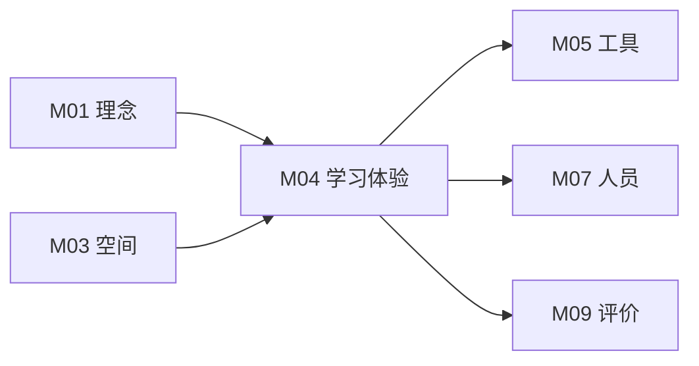

# M04 学习体验与项目

## 摘要与核心定位

> **一句话定位**: 从"教"到"学"的设计范式转移——不设计课程，设计学习旅程。

本模块提供了 OWL 学习体验设计（LXD）的核心框架。我们不设计单一的"课程"（Course），而是设计一段完整的"学习旅程"（Learning Journey）。通过**三种核心探究方法（CBL/PBL/RBL）**，结合**分龄设计策略**，帮助学习者在解决真实问题的过程中建构知识。

**核心观点**:
1.  **体验优先 (Experience First)**: 关注学习者在每个触点的情绪与认知状态，而非仅仅是知识点的排列。
2.  **方法多元 (Methodology Mix)**: 根据目标选择 CBL（挑战）、PBL（问题）或 RBL（研究），拒绝"一种模式通吃"。
3.  **真实评估 (Authentic Assessment)**: 评价为了促进学习，而非筛选人才。关注过程性数据与作品集。

---

## 模块信息图

```
┌─────────────────────────────────────────────────────────────────────────────┐
│                      OWL 学习体验与项目架构                                   │
├─────────────────────────────────────────────────────────────────────────────┤
│                                                                               │
│  ┌─────────────────────────────────────────────────────────────────────────┐ │
│  │  学习体验设计 (LXD) 核心框架                                              │ │
│  │                                                                           │ │
│  │   传统教学设计 (ID)              学习体验设计 (LXD)                       │ │
│  │   ───────────────────────        ───────────────────────                 │ │
│  │   关注: 知识传输效率              关注: 意义与体验                        │ │
│  │   起点: 教学目标                  起点: 学习者需求                        │ │
│  │   核心: 内容组织                  核心: 情感与认知                        │ │
│  └─────────────────────────────────────────────────────────────────────────┘ │
│                                    ↓                                          │
│  ┌─────────────────────────────────────────────────────────────────────────┐ │
│  │  英雄之旅模型                                                             │ │
│  │                                                                           │ │
│  │      ┌──────────┐     ┌──────────┐     ┌──────────┐     ┌──────────┐    │ │
│  │      │  召唤    │ ──→ │  启程    │ ──→ │  试炼    │ ──→ │  归来    │    │ │
│  │      │  Call    │     │ Departure│     │  Trials  │     │  Return  │    │ │
│  │      │          │     │          │     │          │     │          │    │ │
│  │      │ 引入挑战 │     │ 组建团队 │     │ 失败迭代 │     │ 展示反馈 │    │ │
│  │      └──────────┘     └──────────┘     └──────────┘     └──────────┘    │ │
│  └─────────────────────────────────────────────────────────────────────────┘ │
│                                    ↓                                          │
│  ┌─────────────────────────────────────────────────────────────────────────┐ │
│  │  三种核心探究方法                                                         │ │
│  │                                                                           │ │
│  │   ┌─────────────────┐  ┌─────────────────┐  ┌─────────────────┐         │ │
│  │   │ CBL 挑战学习    │  │ PBL 问题学习    │  │ RBL 研究学习    │         │ │
│  │   │                 │  │                 │  │                 │         │ │
│  │   │ 起点: 大议题    │  │ 起点: 真实问题  │  │ 起点: 好奇困惑  │         │ │
│  │   │ 驱动: 改变世界  │  │ 驱动: 解决问题  │  │ 驱动: 探求真理  │         │ │
│  │   │ 产出: 行动方案  │  │ 产出: 原型产品  │  │ 产出: 研究报告  │         │ │
│  │   └─────────────────┘  └─────────────────┘  └─────────────────┘         │ │
│  └─────────────────────────────────────────────────────────────────────────┘ │
│                                    ↓                                          │
│  ┌─────────────────────────────────────────────────────────────────────────┐ │
│  │  年龄分层设计                                                             │ │
│  │                                                                           │ │
│  │   6-9岁 启蒙期        10-13岁 构建期       14-18岁 应用期                │ │
│  │   ──────────────      ──────────────       ──────────────                │ │
│  │   高实物感            引入规范             真实挑战                       │ │
│  │   短反馈              小组协作             专业工具                       │ │
│  │   故事化              适度竞争             长周期                         │ │
│  └─────────────────────────────────────────────────────────────────────────┘ │
│                                    ↓                                          │
│  ┌─────────────────────────────────────────────────────────────────────────┐ │
│  │  STEAM + AI 整合                                                          │ │
│  │  S(科学原理) + T(技术手段) + E(工程路径) + A(人文视角) + M(量化工具)      │ │
│  │  AI 角色: 助教 │ 缪斯 │ 对手                                              │ │
│  └─────────────────────────────────────────────────────────────────────────┘ │
└─────────────────────────────────────────────────────────────────────────────┘
```

---

## 1. 学习体验设计 (LXD) 框架

传统的教学设计 (ID) 关注如何高效地传输信息，而学习体验设计 (LXD) 关注如何创造有意义的体验。

### 1.1 从 ID 到 LXD 的转变

| 维度 | 教学设计 (ID) | 学习体验设计 (LXD) |
|------|--------------|-------------------|
| **核心关注** | 知识传输效率 | 意义建构与体验 |
| **起点** | 教学目标 | 学习者需求与动机 |
| **视角** | 教师中心 | 学习者中心 |
| **评估** | 知识掌握度 | 能力成长与情感变化 |
| **隐喻** | 工厂流水线 | 探险旅程 |

### 1.2 英雄之旅模型

我们将一个项目视为一次"英雄之旅"（Hero's Journey）：

| 阶段 | 英文 | 核心任务 | 导师角色 | 学习者状态 |
|------|------|---------|---------|-----------|
| **召唤** | Call to Adventure | 引入无法抗拒的挑战 | 激发者 | 好奇、兴奋 |
| **启程** | Departure | 跨越门槛，进入未知 | 组织者 | 紧张、期待 |
| **试炼** | Trials | 遭遇失败，学习技能 | 支持者 | 挫折、成长 |
| **归来** | Return | 展示成果，获得反馈 | 见证者 | 自豪、反思 |

#### 英雄之旅示例

```
项目: "让盲人'看见'博物馆"

召唤: 参观博物馆，采访盲人朋友，发现问题
     └→ 问题: 盲人无法感知视觉艺术，如何帮助他们？

启程: 组建团队，分析需求，制定计划
     └→ 角色分工: 用户研究、技术方案、原型制作

试炼: 失败的第一版 → 用户测试 → 迭代改进
     └→ v1.0 触觉模型太粗糙 → v2.0 增加语音导览 → v3.0 结合3D打印

归来: 在博物馆进行展示，获得反馈，反思学习
     └→ 产出: 可触摸艺术品复制品 + 语音导览APP
```

### 1.3 LXD 设计画布

在设计任何项目时，导师应回答以下核心问题：

| 问题 | 内容 | 工具/方法 |
|------|------|---------|
| **Who** | 学习者是谁？前概念和兴趣点？ | 学习者画像、前测 |
| **Why** | 为什么这个问题值得解决？ | 真实情境、社会联系 |
| **How** | 通过什么活动达成目标？ | 活动序列、支架设计 |
| **What** | 最终产出是什么？如何证明学习发生？ | 成果定义、评价量规 |
| **When** | 时间如何分配？关键里程碑？ | 项目时间线 |
| **Where** | 在什么空间进行？需要什么资源？ | 空间需求、材料清单 |

---

## 2. 三种核心探究方法 (Pedagogies)

OWL 不仅限于 PBL，而是主张根据情境选择最适合的探究模式。

### 2.1 方法概览

| 模式 | 全称 | 起点 | 核心驱动 | 适用场景 | 产出示例 |
|-----|-----|------|---------|---------|---------|
| **CBL** | 基于挑战的学习 | 全球性大议题 | "我们要改变..." | 社区服务、可持续发展 | 节水装置、社区花园 |
| **PBL** | 基于问题的学习 | 真实情境问题 | "如何解决..." | 工程设计、产品开发 | 智能小车、自动喂食器 |
| **RBL** | 基于研究的学习 | 好奇与困惑 | "为什么/如何..." | 科学探究、现象解释 | 实验报告、社会调查 |

### 2.2 CBL：基于挑战的学习

培养社会责任感与行动力。

| 阶段 | 英文 | 任务 | 工具 |
|------|------|------|------|
| **参与** | Engage | 从大概念聚焦到核心问题 | 概念地图、问题漏斗 |
| **调查** | Investigate | 收集信息，分析根因 | 访谈、文献、数据分析 |
| **行动** | Act | 设计并实施解决方案 | 原型制作、社区行动 |

**关键设计点**:
- 从宏大议题（如气候变化）聚焦到本地具体问题（如学校食堂食物浪费）
- 强调"行动"不仅是设计，而是真正的社会参与
- 评估关注社会影响而非仅仅是学术产出

### 2.3 PBL：基于问题的学习

培养工程思维与问题解决能力。

| 阶段 | 任务 | 产出 |
|------|------|------|
| **定义问题** | 明确需求，分析约束 | 问题陈述、需求列表 |
| **拆解需求** | 功能分解，技术预研 | 功能结构图、技术方案 |
| **方案构思** | 头脑风暴，筛选方案 | 草图、概念模型 |
| **原型制作** | 快速搭建，验证假设 | 工作原型 |
| **测试优化** | 用户测试，迭代改进 | 改进版本 |

**关键设计点**:
- 问题必须是良构或劣构的真实问题，而非有标准答案的习题
- 强调迭代：失败是流程的一部分
- 评估关注解决方案的有效性和设计过程

### 2.4 RBL：基于研究的学习

培养科学精神与严谨思维。

| 阶段 | 任务 | 产出 |
|------|------|------|
| **提出假设** | 基于观察提出可验证假设 | 研究问题、假设陈述 |
| **设计实验** | 控制变量，设计方法 | 实验方案 |
| **数据收集** | 执行实验，记录数据 | 原始数据、实验日志 |
| **论证分析** | 数据分析，逻辑论证 | 分析结果、论证链 |
| **结论发布** | 撰写报告，同行评议 | 研究报告、演示文稿 |

**关键设计点**:
- 强调证据和逻辑链条，培养批判性思维
- 引入同行评议机制
- 评估关注研究方法的严谨性和结论的可靠性

---

## 3. 年龄分层设计策略

不同年龄段的学习者认知发展水平不同，设计必须适配。

### 3.1 设计原则矩阵

| 维度 | 6-9岁 启蒙探索期 | 10-13岁 技能构建期 | 14-18岁 创新应用期 |
|------|----------------|-------------------|-------------------|
| **认知阶段** | 具体运算 | 形式运算萌芽 | 形式运算成熟 |
| **注意力** | 10-15分钟 | 20-30分钟 | 45-60分钟 |
| **抽象能力** | 低，需具象 | 中，可引入概念 | 高，可抽象思考 |
| **社会性** | 以自我为中心 | 渴望同伴认同 | 关注社会价值 |
| **动机来源** | 即时反馈、趣味 | 成就感、竞争 | 内在意义、自我实现 |

### 3.2 启蒙探索期 (6-9岁)

| 设计策略 | 说明 | 示例 |
|---------|------|------|
| **高实物感** | 多用可触摸材料 | 乐高、纸板、黏土 |
| **短反馈** | 5-10分钟必有正向反馈 | 灯亮了、车动了 |
| **故事化** | 用绘本或故事包裹任务 | "帮助小企鹅回家" |
| **低文字** | 减少阅读量，多用图示 | 图形化编程 |
| **高支架** | 提供充分指导 | 分步指令卡 |

### 3.3 技能构建期 (10-13岁)

| 设计策略 | 说明 | 示例 |
|---------|------|------|
| **引入规范** | 强调代码规范、安全操作 | 代码注释、工具安全证 |
| **小组协作** | 设计多人分工任务 | 结对编程、角色分工 |
| **适度竞争** | 竞赛机制激发动力 | 相扑机器人、创意马拉松 |
| **渐退支架** | 逐步减少指导 | 从模板到自由设计 |
| **反思习惯** | 培养复盘能力 | 项目日志、每周反思 |

### 3.4 创新应用期 (14-18岁)

| 设计策略 | 说明 | 示例 |
|---------|------|------|
| **真实挑战** | 直接引入真实问题 | 社区痛点、企业需求 |
| **专业工具** | 使用工业级标准工具 | Python, Fusion 360, Git |
| **长周期** | 允许跨学期大型项目 | 完整的迭代周期 |
| **自主管理** | 学生主导项目管理 | Scrum、看板 |
| **外部导师** | 引入行业专家 | 远程指导、工作坊 |

---

## 4. 项目类型与时长

### 4.1 项目分类

| 类型 | 时长 | 目标 | 适用场景 |
|------|------|------|---------|
| **技能构建器** | 1-4课时 | 掌握单一技能 | 热身、补充知识点 |
| **微项目** | 1-2周 | 完成简单作品 | 体验完整流程 |
| **标准项目** | 4-8周 | 解决真实问题 | 核心课程 |
| **大项目** | 1学期+ | 深度研究或复杂系统 | 选修、竞赛 |

### 4.2 项目节奏设计

| 阶段 | 占比 | 关键活动 | 情绪曲线 |
|------|------|---------|---------|
| **启动期** | 15% | 问题引入、团队组建 | 兴奋、好奇 |
| **探索期** | 25% | 调研、方案构思 | 迷茫、探索 |
| **制作期** | 40% | 原型制作、迭代测试 | 焦虑→成就 |
| **收尾期** | 20% | 优化、展示、反思 | 自豪、满足 |

---

## 5. STEAM 整合框架

真正的 STEAM 不是 S+T+E+A+M 的拼盘，而是融合。

### 5.1 学科角色

| 学科 | 角色 | 在项目中的体现 |
|------|------|---------------|
| **科学 (S)** | 提供原理支撑 | 理解现象背后的规律 |
| **技术 (T)** | 提供实现手段 | 工具、软件、硬件 |
| **工程 (E)** | 提供解决路径 | 设计流程、约束平衡 |
| **艺术 (A)** | 提供人文视角 | 美学表达、用户体验 |
| **数学 (M)** | 提供量化工具 | 测量、建模、优化 |

### 5.2 整合层次

| 层次 | 描述 | 示例 |
|------|------|------|
| **多学科** | 各学科独立教授，主题相关 | 科学课讲物理，美术课画机器人 |
| **跨学科** | 学科间有明确连接 | 用物理原理指导工程设计 |
| **超学科** | 学科界限消融，问题驱动 | 解决真实问题时自然调用各学科知识 |

OWL 追求**超学科**整合：从问题出发，让学科服务于解决问题。

---

## 6. AI 赋能课程

在课程中，AI 扮演多种角色。

### 6.1 AI 的三种角色

| 角色 | 描述 | 应用场景 | 示例 |
|------|------|---------|------|
| **助教** | 为学生提供个性化答疑 | 编程调试、知识解释 | "为什么这段代码报错？" |
| **缪斯** | 在构思阶段提供灵感 | 创意发想、方案探索 | "给我10个智能花盆的创意" |
| **对手** | 模拟挑战者 | 辩论、测试、评审 | "作为用户，我觉得这个设计..." |

### 6.2 AI 使用规范

| ✅ 鼓励使用 | ❌ 禁止使用 |
|------------|------------|
| 头脑风暴、创意激发 | 直接生成最终作品 |
| 解释难点、调试代码 | 代写论文、代做作业 |
| 用户模拟、方案评估 | 不标注 AI 生成内容 |
| 信息检索、知识查询 | 完全依赖 AI 做决策 |

### 6.3 提示词工程教学

将"如何与 AI 对话"作为核心技能教授：

| 技能 | 内容 | 练习 |
|------|------|------|
| **清晰表达** | 准确描述需求和约束 | 改写模糊提示词 |
| **上下文设定** | 提供足够背景信息 | 角色扮演提示词 |
| **迭代优化** | 根据反馈改进提示 | 多轮对话练习 |
| **批判评估** | 识别 AI 输出的问题 | 错误识别练习 |

---

## 7. 评价与反馈

详见 M09 评价模块，此处概述核心原则。

### 7.1 评价原则

| 原则 | 说明 |
|------|------|
| **评价即学习** | 评价过程本身就是学习机会 |
| **过程重于结果** | 关注学习过程，而非仅仅是最终作品 |
| **多元证据** | 作品、过程记录、同伴反馈、自我反思 |
| **成长导向** | 比较"现在的我"与"过去的我" |

### 7.2 评价工具

| 工具 | 用途 | 时机 |
|------|------|------|
| **项目量规** | 评估作品质量 | 项目结束 |
| **过程档案袋** | 记录学习过程 | 持续收集 |
| **同伴互评** | 多角度反馈 | 阶段性 |
| **反思日志** | 元认知培养 | 每日/每周 |
| **展示评审** | 公开展示获取反馈 | 项目结束 |

---

## 8. MVS 最小可运行标准

任何 OWL 课程/项目必须满足：

| 维度 | MVS 标准 | 验证方式 |
|------|---------|---------|
| **真实情境** | 问题来源于真实世界 | 教案审核 |
| **做中学** | 实践时间 ≥ 60% | 课程表 |
| **作品产出** | 每个单元必有产出 | 作品记录 |
| **反思环节** | 内置反思活动 | 活动设计 |
| **差异化** | 提供多层次挑战 | 教案审核 |
| **安全保障** | 符合 M06 安全标准 | 安全检查 |

---

## 9. 与其他模块的关系



- **M01→M04**: 课程设计基于 4P 学习法和建构论
- **M03→M04**: 空间设计支撑学习活动
- **M04→M05**: 课程内容决定工具需求
- **M04→M07**: 课程难度决定导师能力要求
- **M04→M09**: 课程目标决定评价方式

---

## 10. 扩展阅读与深度指南

<ExtendCards cards={[
  {
    title: "研究性学习指南",
    description: "CBL/PBL/RBL 三大核心探究方法的深度设计框架与流程。",
    href: "/docs/knowledge-base/04-programs/extend/pbl-design",
    type: "extend",
    status: "completed"
  },
  {
    title: "年龄分层设计",
    description: "基于发展心理学的 6-18 岁分龄设计策略与认知支架。",
    href: "/docs/knowledge-base/04-programs/extend/age-differentiation",
    type: "extend",
    status: "completed"
  },
  {
    title: "AI 融入课程设计",
    description: "生成式 AI 在课程开发与教学实施中的应用指南。",
    href: "/docs/knowledge-base/04-programs/extend/ai-in-curriculum",
    type: "extend",
    status: "completed"
  },
  {
    title: "课程评审标准",
    description: "一套用于评估课程质量和完备性的量规表。",
    href: "/docs/knowledge-base/04-programs/extend/course-review",
    type: "extend",
    status: "completed"
  },
  {
    title: "微项目设计库",
    description: "1-4课时的短周期热身项目(Skill Builder)设计案例。",
    href: "/docs/knowledge-base/04-programs/extend/micro-projects",
    type: "extend",
    status: "planned"
  },
  {
    title: "设计思维工具箱",
    description: "同理心地图、用户旅程图等设计思维工具在教学中的应用。",
    href: "/docs/knowledge-base/04-programs/extend/design-thinking-toolkit",
    type: "extend",
    status: "planned"
  },
  {
    title: "项目模板库",
    description: "经过验证的项目设计模板，涵盖不同年龄段和主题。",
    href: "/docs/knowledge-base/04-programs/extend/project-templates",
    type: "extend",
    status: "planned"
  },
  {
    title: "跨学科整合案例",
    description: "STEAM 超学科整合的典型案例与设计分析。",
    href: "/docs/knowledge-base/04-programs/extend/interdisciplinary-cases",
    type: "extend",
    status: "planned"
  }
]} />

---

## 11. 参考文献

见 [evidence/refs.json](./evidence/refs.json)

**核心引用**:

| 来源 | 作品 | 贡献 | 证据等级 |
|------|------|------|---------|
| Hmelo-Silver, C. E. (2004) | Problem-Based Learning: What and How Do Students Learn? | PBL 理论基础 | E2 |
| Apple Inc. (2011) | Challenge Based Learning: A Classroom Guide | CBL 框架 | E2 |
| Wiggins, G., & McTighe, J. (2005) | *Understanding by Design* | 逆向设计方法 | E2 |
| Piaget, J. (1964) | Cognitive development in children | 认知发展理论 | E2 |
| Campbell, J. (1949) | *The Hero with a Thousand Faces* | 英雄之旅原型 | E3 |
| Resnick, M. (2017) | *Lifelong Kindergarten* | 4P 创造性学习 | E2 |
| 教育部等七部门 (2025) | 《关于加强中小学科技教育的意见》 | 国内政策背景 | E1 |
