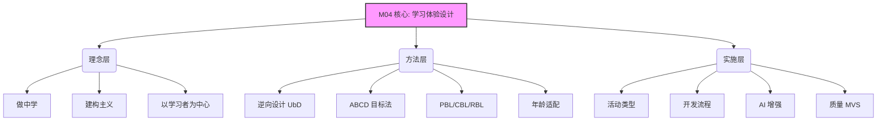

# M04 学习体验与项目

> **一句话定位**: 设计有效的学习体验与项目

## 摘要与核心定位

**M04 学习体验与项目**是 OWL 知识库中关于"如何教与学"的核心模块。本模块提供了从课程设计、活动实施到质量评估的完整方法论，旨在帮助教育者设计出既符合教育规律又能激发学习者创造力的优质内容。

**核心逻辑**：
1.  **理念引领**：以"做中学"和"建构主义"为核心，强调学习是在解决真实问题的过程中发生的。
2.  **科学设计**：采用逆向设计（UbD）和 ABCD 目标法，确保课程目标清晰、评价有效。
3.  **多元体验**：提供从微项目、系列课程到黑客松的多元化学习体验，适应不同场景需求。
4.  **前沿融合**：将研究性学习（PBL）、年龄适配设计和 AI 辅助教学深度融入课程体系。

**阅读指南**：
*   **如果您是课程设计师**，请重点关注 [课程设计框架](#3-课程设计框架) 和 [研究性学习设计](#4-研究性学习设计)。
*   **如果您是一线导师**，请参考 [活动类型详解](#8-活动类型详解) 和 [MVS最小可运行标准](#10-mvs最小可运行标准)。
*   **如果您是管理者**，请关注 [课程开发流程](#7-课程开发流程) 和 [质量管理](#9-课程质量管理)。

---

## 1 核心原则

OWL 的学习体验设计遵循四大核心原则，这些原则贯彻于所有课程和活动之中：

### 1.1 原则概览

| 原则 | 核心内涵 | 传统教育 vs OWL | 理论基础 |
|------|----------|-----------------|----------|
| **做中学** | 实践是最高效的学习方式 | 听讲-练习 vs 探索-制作 | 杜威经验学习 |
| **真实问题** | 解决现实世界的真实挑战 | 抽象习题 vs 社区问题 | 情境认知理论 |
| **开放结果** | 多样化产出 | 标准答案 vs 多元表达 | 多元智能理论 |
| **迭代改进** | 也是设计思维的核心 | 一次交付 vs 版本迭代 | 西摩·帕尔特 |

### 1.2 原则详解

*   **做中学 (Learning by Making)**：不仅是"动手做"，更是"在做的过程中思考"。知识不仅仅是被告知的真理，而是学习者在与物理世界的互动中主动建构的理解。
*   **真实问题 (Authentic Problems)**：学习应该基于真实的生活情境。当学习者在解决对自己或他人有意义的问题时，学习动机最强。
*   **开放结果 (Open-ended Outcomes)**：鼓励多元化的解决方案。同一个挑战，不同的学习者可以产出完全不同的作品，这正是创造力的体现。
*   **迭代改进 (Iterative Design)**：学习是一个螺旋上升的过程。失败不是终点，而是发现问题、改进设计的机会。我们评价的不只是最终作品，更是迭代优化的过程。

---

## 2 学习体验体系架构

### 2.1 学习体验分类矩阵

为了满足不同层次、不同场景的学习需求，OWL 构建了多维度的学习体验矩阵：

| 维度 | **入门级 (Experience)** | **进阶级 (Skill)** | **专家级 (Mastery)** |
|------|-------------------------|--------------------|----------------------|
| **时长** | 1-3小时 | 8-16小时 | 40+小时 |
| **目标** | 激发兴趣、建立信心 | 掌握技能、完成项目 | 深度探究、独立创造 |
| **形式** | 工作坊、微项目 | 系列课、PBL项目 | 独立研究、孵化项目 |
| **示例** | "发光卡片"、"3D打印初体验" | "智能家居设计"、"游戏编程" | "社区服务机器人"、"交互艺术展" |

### 2.2 核心领域 (Domains)

OWL 的课程内容覆盖六大核心领域，简称 **STEAM+**：

*   **数字制造 (Digital Fabrication)**：3D打印、激光切割、CNC等。
*   **电子原型 (Electronics)**：Arduino、Micro:bit、传感器应用。
*   **编程创作 (Coding)**：Scratch、Python、Web开发、AI应用。
*   **设计艺术 (Design & Art)**：设计思维、视觉艺术、数字媒体。
*   **科学探究 (Science)**：实验设计、数据采集、现象探究。
*   **社会创新 (Social Innovation)**：可持续发展(SDGs)、社区服务。

---

## 3 课程设计框架

### 3.1 逆向设计 (UbD)

我们采用 **逆向设计 (Understanding by Design)** 方法，确保课程设计"以终为始"：

1.  **确定预期结果**：学习者学完后应该真正理解什么？能够做什么？
2.  **确定评估证据**：我们如何知道学习者已经达到了预期结果？（通过什么作品、表现？）
3.  **设计学习活动**：什么样的活动能帮助学习者达成目标并完成评估任务？

### 3.2 学习目标设计 (ABCD法)

清晰的学习目标是高质量课程的基础。我们使用 **ABCD 法** 来撰写学习目标：

*   **A - Audience (对象)**：学习者是谁？（如：8-10岁零基础学员）
*   **B - Behavior (行为)**：能做什么？（如：设计并制作一个...）
*   **C - Condition (条件)**：在什么条件下？（如：使用激光切割机和胶合板）
*   **D - Degree (程度)**：达到什么标准？（如：结构稳固且能正常运行）

---

## 4 研究性学习设计

研究性学习（Project-Based Learning, PBL）是 OWL 课程实施的核心模式。它不仅仅是一种教学法，更是一种让学习者像专家一样思考和行动的框架。

我们将探究式学习细分为三种核心模式，以适应不同的学习目标：

1.  **基于挑战的学习 (CBL)**：从全球议题出发（如环保），落实到本地行动。
2.  **基于问题的学习 (PBL)**：从真实问题出发，通过分析和方案设计解决问题。
3.  **基于研究的学习 (RBL)**：从好奇心出发，通过科学探究验证假设。

> **扩展阅读**：详细的设计框架、流程模版和评价量规，请参阅扩展模块 [**研究性学习指南**](/docs/knowledge-base/04-programs/extend/pbl-design)。

---

## 5 年龄适配设计

不同年龄段的学习者具有完全不同的认知特点和发展需求。好的课程设计必须建立在对发展心理学的深刻理解之上。

OWL 将学习者划分为六个发展阶段：
*   **启蒙期 (4-6岁)**：感官体验，游戏化。
*   **萌芽期 (7-9岁)**：具象思维，简单逻辑。
*   **成长期 (10-12岁)**：具体运算，团队协作。
*   **探索期 (13-15岁)**：抽象思维，自主探究。
*   **发展期 (16-18岁)**：独立研究，专业深耕。
*   **成人期 (18+)**：目标导向，实用主义。

> **扩展阅读**：针对各年龄段的详细设计策略、支架建议和避坑指南，请参阅扩展模块 [**年龄分层设计**](/docs/knowledge-base/04-programs/extend/age-differentiation)。

---

## 6 AI 融入课程实践

在 AI 时代，"教什么"和"怎么教"都在发生根本性变化。OWL 倡导 **"人机协作"** 的教育范式。

**核心原则**：
*   **赋能非替代**：AI 是思考的放大器，不是替代者。
*   **批判性思维**：始终保持对 AI 输出的评估和质疑。
*   **伦理意识**：负责任地使用技术。

**应用模式**：
*   **AI 作为导师**：个性化辅导与反馈。
*   **AI 作为工具**：加速创意生成与原型制作。
*   **AI 作为内容**：探究 AI 原理与社会影响。

> **扩展阅读**：关于 AI 工具的具体应用策略、提示词工程教学及伦理指南，请参阅扩展模块 [**AI 融入课程设计**](/docs/knowledge-base/04-programs/extend/ai-in-curriculum)。

---

## 7 课程开发流程

OWL 采用标准化的课程开发流程 (ADDIE 变体)，确保内容的质量和一致性：

1.  **需求分析 (Analyze)**：调研学习者需求，确定各模块定位。
2.  **大纲设计 (Design)**：基于 UbD 制定目标和评价方案。
3.  **内容开发 (Develop)**：编写教案、学员手册、制作演示文稿。
4.  **内部评审 (Review)**：基于评审标准进行内部审核。
5.  **试教迭代 (Implement & Iterate)**：Alpha/Beta 轮次试教，收集反馈优化。
6.  **正式发布 (Publish)**：达到 MVS 标准后上线。

> **扩展阅读**：详细的评审标准和质量量规，请参阅扩展模块 [**课程评审标准**](/docs/knowledge-base/04-programs/extend/course-review)。

---

## 8 活动类型详解

为了适应不同的运营场景，我们将学习活动标准化为以下几种类型：

| 类型 | 时长 | 特点 | 适用场景 |
|------|------|------|----------|
| **开放日 (Open Day)** | 2-3h | 体验式、低门槛、展示性 | 招生、社区宣传 |
| **工作坊 (Workshop)** | 2-4h | 单次闭环、成品导向 | 周末活动、技能入门 |
| **系列课 (Course)** | 8-16h | 系统性、技能进阶 | 长期学员、深度学习 |
| **冬夏令营 (Camp)** | 3-7天 | 沉浸式、高强度 | 假期、集训 |
| **黑客松 (Hackathon)** | 24-48h | 极限挑战、协作创新 | 进阶学员、社区建设 |

---

## 9 课程质量管理

质量是教育产品的生命线。OWL 建立了多维度的质量监控体系：

*   **版本管理**：采用语义化版本号 (v1.0.0)，严谨管理课程迭代。
*   **评价指标**：
    *   **NPS (净推荐值)**：衡量学员忠诚度。
    *   **完成率**：衡量课程难度适配度。
    *   **作品质量**：衡量教学有效性。
*   **生命周期**：建立从"孵化"到"退役"的全生命周期管理机制。

---

## 10 MVS 最小可运行标准

所有发布在 OWL 知识库中的课程，必须满足 **MVS (Minimum Viable Standard)**：

1.  **目标清晰** ✅：必须有明确的 ABCD 格式学习目标。
2.  **流程详尽** ✅：教案时间精确到分钟，包含关键话术。
3.  **清单完整** ✅：包含详细的工具、材料、软件清单。
4.  **安全合规** ✅：所有风险点均有明确的安全提示。
5.  **评价明确** ✅：必须包含学习成果的评价标准或量规。

---

## 11 扩展阅读与资源

<ExtendCards cards={[
  {
    title: "研究性学习指南",
    description: "基于挑战(CBL)、基于问题(PBL)、基于研究(RBL)的三种核心探究方法",
    href: "/docs/knowledge-base/04-programs/extend/pbl-design",
    type: "extend",
    status: "completed"
  },
  {
    title: "年龄分层设计",
    description: "基于发展心理学的年龄适配课程设计指南",
    href: "/docs/knowledge-base/04-programs/extend/age-differentiation",
    type: "extend",
    status: "completed"
  },
  {
    title: "AI 融入课程设计",
    description: "AI 辅助教学的策略、工具与伦理指南",
    href: "/docs/knowledge-base/04-programs/extend/ai-in-curriculum",
    type: "extend",
    status: "completed"
  },
  {
    title: "微项目设计",
    description: "30分钟到2小时的快速创客项目设计指南",
    href: "/docs/knowledge-base/04-programs/extend/micro-projects",
    type: "extend",
    status: "completed"
  },
  {
    title: "家校协作项目",
    description: "家长参与的创客项目设计与家校协作策略",
    href: "/docs/knowledge-base/04-programs/extend/family-collaboration",
    type: "extend",
    status: "completed"
  },
  {
    title: "课程评审标准",
    description: "课程质量评审的量规与流程",
    href: "/docs/knowledge-base/04-programs/extend/course-review",
    type: "extend",
    status: "completed"
  },
  {
    title: "设计思维工具库",
    description: "从经典设计思维到未来导向的设计方法",
    href: "/docs/knowledge-base/04-programs/extend/design-thinking-toolkit",
    type: "extend",
    status: "draft"
  },
  {
    title: "跨学科整合方法",
    description: "STEAM跨学科课程的整合策略与实践案例",
    href: "/docs/knowledge-base/04-programs/extend/interdisciplinary",
    type: "extend",
    status: "planned"
  }
]} />

---

## 参考文献

见 [evidence/refs.json](./evidence/refs.json)。核心引用包括：
*   Wiggins, G. & McTighe, J. (2005). *Understanding by Design*.
*   Buck Institute for Education. *Gold Standard PBL*.
*   Resnick, M. (2017). *Lifelong Kindergarten*.
