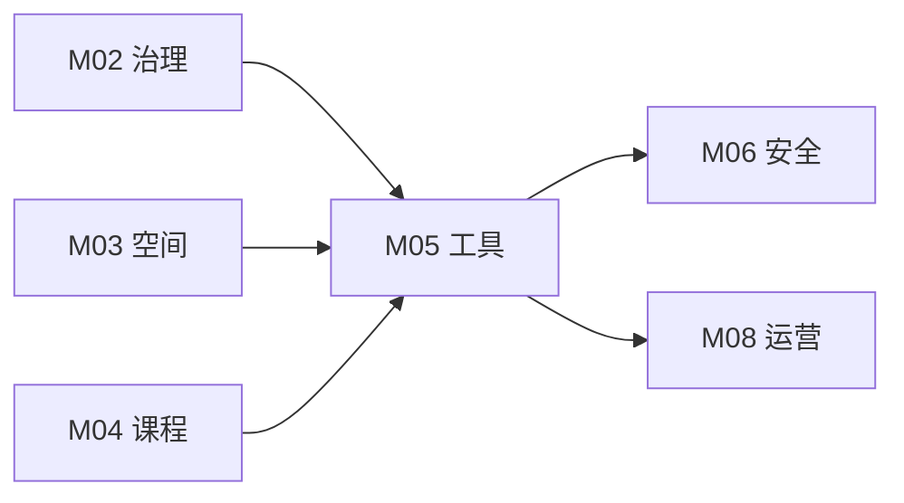

# M05 工具与资产

## 摘要与核心定位

> **一句话定位**: 从"采购清单"到"创造力资产"的全生命周期管理——设备不是摆设，而是把想法变为现实的通道。

本模块提供了 OWL 实验室的设备选型与管理标准。我们不追求最昂贵的工业级设备，而是追求**高可用性 (Availability)**、**低门槛 (Low Floor)** 和 **广阔的可能性 (High Ceiling)**。核心理念是：设备选型应该服务于教育目标，而非为了技术炫耀。

**核心观点**:
1.  **分级配置**: 根据 Lite/Pro/Ultra 不同定位配置设备，拒绝"一步到位"的浪费。
2.  **维护即教育**: 设备的维护过程也是学习过程，鼓励用户参与维护。
3.  **软件定义硬件**: 重视开源工具链与 AI 辅助设计软件的价值，它们决定了硬件的上限。

---

## 模块信息图

```
┌─────────────────────────────────────────────────────────────────────────────┐
│                        OWL 工具与资产架构                                     │
├─────────────────────────────────────────────────────────────────────────────┤
│                                                                               │
│  ┌─────────────────────────────────────────────────────────────────────────┐ │
│  │  核心理念                                                                 │ │
│  │  ┌────────────────┐  ┌────────────────┐  ┌────────────────┐             │ │
│  │  │  分级配置      │  │  维护即教育    │  │ 软件定义硬件   │             │ │
│  │  │  拒绝过度采购  │  │  用户参与维护  │  │ 开源工具链优先 │             │ │
│  │  └────────────────┘  └────────────────┘  └────────────────┘             │ │
│  └─────────────────────────────────────────────────────────────────────────┘ │
│                                    ↓                                          │
│  ┌─────────────────────────────────────────────────────────────────────────┐ │
│  │  分级配置方案                                                             │ │
│  │                                                                           │ │
│  │   Lite 普及型           Pro 标准型            Ultra 专业型               │ │
│  │   ──────────────        ──────────────        ──────────────             │ │
│  │   预算: 5-10万          预算: 20-50万         预算: 100万+               │ │
│  │   3D打印+基础手工       +激光切割+电子制作    +CNC+精密测量              │ │
│  │   教室角/社区空间       学校创客教室          区域创新中心               │ │
│  └─────────────────────────────────────────────────────────────────────────┘ │
│                                    ↓                                          │
│  ┌─────────────────────────────────────────────────────────────────────────┐ │
│  │  四大核心制造能力 (Fab Inventory)                                         │ │
│  │                                                                           │ │
│  │   ┌─────────────┐  ┌─────────────┐  ┌─────────────┐  ┌─────────────┐    │ │
│  │   │  减材制造   │  │  增材制造   │  │  电子工作台 │  │  手工组装   │    │ │
│  │   │ Subtractive │  │  Additive   │  │ Electronics │  │  Assembly   │    │ │
│  │   │             │  │             │  │             │  │             │    │ │
│  │   │ 激光切割    │  │ 3D打印     │  │ 焊接/测试   │  │ 传统工具    │    │ │
│  │   │ CNC铣床     │  │ 光固化      │  │ 开发板      │  │ 钳工套件    │    │ │
│  │   └─────────────┘  └─────────────┘  └─────────────┘  └─────────────┘    │ │
│  └─────────────────────────────────────────────────────────────────────────┘ │
│                                    ↓                                          │
│  ┌─────────────────────────────────────────────────────────────────────────┐ │
│  │  资产全生命周期                                                           │ │
│  │                                                                           │ │
│  │   采购入库 ──→ 日常使用 ──→ 维护保养 ──→ 报废迭代                        │ │
│  │      ↓            ↓            ↓            ↓                            │ │
│  │   验收测试    使用培训     TPM全员     零件再生                          │ │
│  │   资产登记    预约管理     定期点检    尸体库存                          │ │
│  └─────────────────────────────────────────────────────────────────────────┘ │
│                                    ↓                                          │
│  ┌─────────────────────────────────────────────────────────────────────────┐ │
│  │  软件与AI工具链                                                           │ │
│  │  开源优先: Inkscape │ Blender │ KiCad │ VS Code + PlatformIO             │ │
│  │  AI辅助: 代码生成 │ 创意生成 │ 知识检索                                   │ │
│  └─────────────────────────────────────────────────────────────────────────┘ │
└─────────────────────────────────────────────────────────────────────────────┘
```

---

## 1. 核心设备分级策略

OWL 参考 MIT Fab Lab 标准，定义了三个级别的配置方案，以适应不同规模的节点。

### 1.1 分级概览

| 级别 | 定位 | 核心能力 | 典型预算 (RMB) | 适用场景 | 人员配置 |
|-----|-----|---------|--------------|---------|---------|
| **Lite** | 普及型 | 3D打印 + 基础手工 | 5-10万 | 教室角、社区图书室 | 1名兼职导师 |
| **Pro** | 标准型 | + 激光切割 + 电子制作 | 20-50万 | 学校创客教室、社区中心 | 1-2名专职 |
| **Ultra** | 专业型 | + CNC加工 + 精密测量 | 100万+ | 区域创新中心、高校实验室 | 3+名专职 |

### 1.2 分级配置详表

| 设备类别 | Lite | Pro | Ultra |
|---------|------|-----|-------|
| **3D打印机** | 2台 FDM | 4台 FDM + 1台光固化 | 6台 FDM + 2台光固化 |
| **激光切割机** | - | 1台 (80W) | 2台 (80W+130W) |
| **CNC铣床** | - | - | 1台 桌面级 |
| **电子工作台** | 2套基础 | 4套含示波器 | 6套含频谱仪 |
| **手工工具** | 基础套件 | 完整套件 | 专业套件 |
| **测量设备** | 基础 | 标准 | 精密级 |

---

## 2. 四大核心制造能力 (Fab Inventory)

无论哪个级别，我们都要求具备以下四大核心制造能力：

### 2.1 减材制造 (Subtractive)

通过切削、雕刻去除材料的工艺。

| 设备 | Lite | Pro | Ultra | 核心参数 |
|------|------|-----|-------|---------|
| **激光切割机** | - | ✅ 必选 | ✅ 必选 | ≥80W, ≥600×400mm |
| **CNC铣床** | - | 可选 | ✅ 推荐 | ≥300×200mm 行程 |
| **刻字机** | - | 可选 | 可选 | 用于贴膜、模板 |

**选型原则**:
- 激光切割机是利用率最高的设备，应优先保证功率和幅面
- 功率决定切割能力：80W可切8mm亚克力，130W可切15mm木板
- 幅面决定作品尺寸：推荐600×400mm起步

### 2.2 增材制造 (Additive)

通过逐层堆积材料的工艺。

| 设备 | Lite | Pro | Ultra | 核心参数 |
|------|------|-----|-------|---------|
| **FDM 3D打印机** | ✅ 必选 | ✅ 必选 | ✅ 必选 | 稳定性优先 |
| **光固化打印机** | - | 可选 | ✅ 推荐 | 用于精细模型 |
| **多色打印机** | - | - | 可选 | 用于复杂作品 |

**选型原则**:
- **稳定性优于速度**: 推荐 Prusa/Bambu Lab 等社区支持良好的品牌
- **避免封闭生态**: 拒绝只能用专用耗材的工业机
- **考虑维护成本**: 喷头、皮带等易损件要容易获取

**推荐品牌**:
| 品牌 | 定位 | 优点 | 缺点 |
|------|------|------|------|
| Prusa | 标准级 | 开源、稳定、社区强 | 价格较高 |
| Bambu Lab | 高速级 | 速度快、自动化高 | 软件较封闭 |
| Creality | 入门级 | 价格低、配件多 | 需要调校 |

### 2.3 电子工作台 (Electronics)

电路设计、焊接和调试能力。

| 设备 | Lite | Pro | Ultra | 说明 |
|------|------|-----|-------|------|
| **焊台** | ✅ | ✅ | ✅ | 温控焊台，推荐白光/快克 |
| **万用表** | ✅ | ✅ | ✅ | 数字万用表 |
| **示波器** | - | ✅ | ✅ | 双通道，≥100MHz |
| **可调电源** | ✅ | ✅ | ✅ | 0-30V/3A |
| **热风台** | - | 可选 | ✅ | 用于贴片焊接 |
| **频谱仪** | - | - | 可选 | 用于射频调试 |

**耗材库**:
| 类别 | 内容 | 建议库存 |
|------|------|---------|
| **开发板** | Arduino Uno/Nano, ESP32, Micro:bit | 各10+块 |
| **传感器** | 温湿度、光线、超声波、人体红外 | 套件10+套 |
| **执行器** | 舵机、电机、继电器、LED灯带 | 各20+个 |
| **连接件** | 杜邦线、面包板、排针 | 充足备货 |
| **电阻电容** | 常用阻值/容值 | 分类盒收纳 |

**原则**: 耗材应像"自助餐"一样开放，鼓励随时取用。

### 2.4 手工与组装 (Assembly)

传统工具和手工技能。

| 设备 | Lite | Pro | Ultra | 说明 |
|------|------|-----|-------|------|
| **热胶枪** | ✅ | ✅ | ✅ | 高温速干 |
| **电钻** | ✅ | ✅ | ✅ | 充电式+有线各1 |
| **手锯** | ✅ | ✅ | ✅ | 多种锯条 |
| **钳工套件** | 基础 | 完整 | 专业 | 含台钳 |
| **木工工具** | - | 基础 | 完整 | 刨子、凿子等 |

**设计要点**:
- 这一区域通常被低估，却是最繁忙的区域
- 必须配备结实的工作台和台钳
- 工具墙设计：轮廓标记，便于归位

---

## 3. 开源硬件选型

### 3.1 主流开发板对比

| 开发板 | 适用年龄 | 编程方式 | 优势 | 局限 | 推荐场景 |
|--------|---------|---------|------|------|---------|
| **Micro:bit** | 8-12岁 | 图形化/Python | 入门友好、板载传感器 | 扩展性有限 | 入门编程、传感器体验 |
| **Arduino Uno** | 10-16岁 | C/C++ | 生态丰富、资料多 | 无WiFi | 硬件入门、机械控制 |
| **ESP32** | 12岁+ | C/Python | WiFi/蓝牙、高性价比 | 门槛较高 | IoT项目、进阶开发 |
| **Raspberry Pi** | 14岁+ | Python/多种 | 完整Linux系统 | 需要系统知识 | AI项目、服务器应用 |

### 3.2 选型决策树

```
开始
  │
  ├─ 学习者年龄 < 10岁？
  │   └─ 是 → Micro:bit
  │
  ├─ 需要联网功能？
  │   ├─ 是 + 简单项目 → ESP32
  │   └─ 是 + 复杂项目 → Raspberry Pi
  │
  └─ 纯硬件/机器人项目？
      └─ 是 → Arduino
```

---

## 4. 资产全生命周期管理

设备买回来只是开始，管理才是挑战。

### 4.1 采购与入库

| 阶段 | 任务 | 注意事项 |
|------|------|---------|
| **需求分析** | 明确用途和预算 | 避免冲动采购 |
| **选型评估** | 对比品牌和参数 | 优先考虑维护成本 |
| **采购执行** | 走正规渠道 | 保留发票和保修卡 |
| **到货验收** | 开机测试 | 制作标准测试件 |
| **资产登记** | 录入管理系统 | 拍照存档 |

**特别说明**:
- 很多开源硬件（如树莓派）在政府采购流程中较难界定，建议设立"耗材专用金"
- 验收不仅是开机，而是完整制作一个标准测试件（Test Piece）

### 4.2 日常使用管理

| 管理项 | 方式 | 工具 |
|--------|------|------|
| **使用预约** | 在线预约系统 | 日历系统/小程序 |
| **操作培训** | 分级认证 | 培训记录卡 |
| **使用登记** | 扫码签到 | 二维码+表单 |
| **问题报告** | 即时反馈 | 微信群/工单系统 |

### 4.3 维护与保养

我们推行 **TPM (全员生产维护)** 理念：

| 原则 | 说明 | 实践 |
|------|------|------|
| **谁使用谁清洁** | 每次使用后必须清理废料 | 清洁检查表 |
| **维护日** | 每周五下午定为"设备维护日" | 带领学生一起保养 |
| **维护红牌** | 设备故障挂红牌，修好换绿牌 | 可视化管理 |
| **预防性维护** | 定期更换易损件 | 维护日历提醒 |

**设备维护周期表**:

| 设备 | 日常 | 周度 | 月度 | 季度 |
|------|------|------|------|------|
| **3D打印机** | 清理废料 | 检查皮带 | 润滑导轨 | 校准平台 |
| **激光切割机** | 清理碎屑 | 清洁镜片 | 检查光路 | 更换过滤棉 |
| **焊台** | 清洁烙铁头 | - | 检查连接 | 校准温度 |

### 4.4 报废与迭代

| 原则 | 说明 |
|------|------|
| **3年法则** | 消费级 3D 打印机通常寿命为 3 年，应做好折旧预算 |
| **零件再生** | 报废设备应拆解，电机、光轴等零件作为"尸体库" |
| **学习价值** | 拆解过程本身就是学习机会 |
| **环保处理** | 电子废弃物按规定回收 |

---

## 5. 软件与 AI 工具链

硬件只是显露的冰山一角，水面下的软件工具链决定了创造的效率。

### 5.1 开源优先原则

OWL 强烈推荐使用开源或免费的工具链，以保证学生离校后仍能继续创造。

| 领域 | 商业软件 (参考) | OWL 推荐 (免费/开源) | 理由 |
|-----|--------------|-------------------|------|
| **2D 设计** | Adobe Illustrator | **Inkscape** | 矢量图标准工具，插件丰富 |
| **3D 建模** | SolidWorks | **Fusion 360** (Edu) / **Blender** | 涵盖参数化设计与艺术建模 |
| **电子设计** | Altium Designer | **KiCad** | 越来越多开源硬件转向 KiCad |
| **编程环境** | Keil | **VS Code** + **PlatformIO** | 现代化的开发体验 |
| **图形化编程** | - | **Scratch** / **MakeCode** | 入门编程首选 |
| **PCB制作** | - | **EasyEDA** | 在线协作，与嘉立创无缝对接 |

### 5.2 软件工具链分级

| 级别 | 设计工具 | 编程工具 | 其他 |
|------|---------|---------|------|
| **Lite** | Inkscape, Tinkercad | Scratch, MakeCode | 基础办公软件 |
| **Pro** | + Fusion 360, Blender | + Arduino IDE, Python | + KiCad |
| **Ultra** | + FreeCAD, OpenSCAD | + VS Code, Git | + 仿真工具 |

### 5.3 AI 辅助设计

| 应用场景 | 工具示例 | 使用方式 |
|---------|---------|---------|
| **代码生成** | GitHub Copilot, Claude | 辅助编写 Arduino/Python 代码 |
| **创意生成** | Midjourney, DALL-E | 生成产品外观草图 |
| **知识检索** | ChatGPT, 本地 LLM | 回答"为什么打印头堵了"等问题 |
| **调试助手** | Claude, GPT-4 | 分析错误代码，提供修复建议 |

**AI 使用原则**: 见 M01 和 M04 模块关于 AI 赋能的详细规范。

---

## 6. 安全分级与操作规范

设备按风险等级分类管理，详见 M06 安全模块。

| 等级 | 颜色 | 设备示例 | 使用要求 |
|------|------|---------|---------|
| **G** | 绿色 | 3D打印机、热胶枪 | 简单培训即可使用 |
| **Y** | 黄色 | 电烙铁、电钻、手锯 | 需通过专门培训和实操考核 |
| **R** | 红色 | 激光切割机、CNC、台锯 | 必须持有操作证，导师在场监管 |

---

## 7. MVS 最小可运行标准

| 维度 | Lite | Pro | Ultra | 验证方式 |
|------|------|-----|-------|---------|
| **3D打印能力** | ≥1台 | ≥2台 | ≥4台 | 设备清单 |
| **电子制作能力** | 基础套件 | 完整工作台 | 专业级 | 现场核查 |
| **工具完好率** | ≥90% | ≥95% | ≥98% | 巡检记录 |
| **资产台账** | 有登记 | 系统化 | 数字化 | 系统检查 |
| **操作规程** | 张贴 | 规范化 | 标准化 | 文档检查 |
| **维护记录** | 有记录 | 规范化 | 可追溯 | 记录审核 |

---

## 8. 与其他模块的关系



- **M02→M05**: 节点分级决定设备配置标准
- **M03→M05**: 空间布局决定设备摆放位置
- **M04→M05**: 课程内容决定工具需求
- **M05→M06**: 设备分级对接安全管理
- **M05→M08**: 设备管理融入运营流程

---

## 9. 扩展阅读与深度指南

核心模块提供了战略视角，具体执行请参阅：

<ExtendCards cards={[
  {
    title: "Fab Lab 设备目录",
    description: "2025版详细采购清单：从螺丝刀到激光管的推荐品牌与参数。",
    href: "/docs/knowledge-base/05-tools/extend/equipment-catalog",
    type: "extend",
    status: "completed"
  },
  {
    title: "维护指南",
    description: "设备点检表、故障排查树与安全操作 SOP。",
    href: "/docs/knowledge-base/05-tools/extend/maintenance-guide",
    type: "extend",
    status: "completed"
  },
  {
    title: "开源硬件选型",
    description: "Arduino, ESP32, Micro:bit 横向评测与选型策略。",
    href: "/docs/knowledge-base/05-tools/extend/opensource-hardware",
    type: "extend",
    status: "planned"
  },
  {
    title: "数字制造入门",
    description: "激光切割与 3D 打印的基础工艺课程大纲。",
    href: "/docs/knowledge-base/05-tools/extend/digital-fabrication",
    type: "extend",
    status: "planned"
  },
  {
    title: "工具借还系统",
    description: "如何用低成本方案实现校内工具借还管理。",
    href: "/docs/knowledge-base/05-tools/extend/tool-lending",
    type: "extend",
    status: "planned"
  },
  {
    title: "采购与供应商",
    description: "推荐供应商列表与采购流程指南。",
    href: "/docs/knowledge-base/05-tools/extend/procurement-guide",
    type: "extend",
    status: "planned"
  },
  {
    title: "软件工具链配置",
    description: "从零搭建完整的开源软件工具链。",
    href: "/docs/knowledge-base/05-tools/extend/software-toolchain",
    type: "extend",
    status: "planned"
  },
  {
    title: "设备操作认证体系",
    description: "分级操作认证的培训与考核标准。",
    href: "/docs/knowledge-base/05-tools/extend/certification-system",
    type: "extend",
    status: "planned"
  }
]} />

---

## 10. 参考文献

见 [evidence/refs.json](./evidence/refs.json)

**核心引用**:

| 来源 | 作品 | 贡献 | 证据等级 |
|------|------|------|---------|
| Gershenfeld, N. (2005) | *Fab: The Coming Revolution on Your Desktop* | Fab Lab 理念奠基 | E2 |
| Fab Foundation (2024) | *Global Fab Lab Standards* | Fab Lab 设备标准 | E1 |
| Make: Magazine (2024) | *Annual Guide to 3D Printing* | 3D打印机评测 | E2 |
| Arduino Foundation | *Arduino Project Hub* | 开源硬件生态 | E2 |
| 教育部等七部门 (2025) | 《关于加强中小学科技教育的意见》 | 国内政策背景 | E1 |
