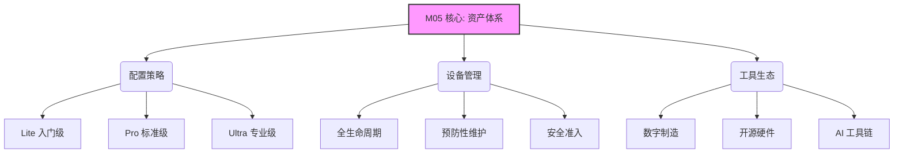

# M05 工具与资产

> **一句话定位**: 管好设备，让创造成为可能

## 摘要与核心定位

**M05 工具与资产** 是 OWL 知识库中关于"硬实力"建设的核心模块。本模块重新定义了实验室资产的概念——不仅仅是物理设备，还包括软件工具、数字资产和维护能力。

**核心逻辑**：
1.  **工具民主化**：致力于降低制造门槛，让每个人都能使用工业级的创造工具。
2.  **分级配置**：提供 Lite/Pro/Ultra 三级配置方案，适配不同规模的实验室节点。
3.  **全生命周期管理**：建立从采购、入库、维护到报废的资产全生命周期管理体系。
4.  **软硬结合**：同等重视物理设备（3D打印机等）与数字工具（AI软件、SaaS服务）的建设。

**阅读指南**：
*   **如果您正在筹建实验室**，请直接查看扩展模块 [核心设备标准](/docs/knowledge-base/05-tools/extend/equipment-catalog) 的配置清单。
*   **如果您负责日常运营**，请下载扩展模块 [设备维护指南](/docs/knowledge-base/05-tools/extend/maintenance-guide) 作为操作手册。
*   **如果您关注降本增效**，请参考扩展模块 [低成本替代方案](/docs/knowledge-base/05-tools/extend/low-cost-alternatives)。

---

## 1 核心原则

OWL 的工具资产管理遵循以下四项原则：

| 原则 | 核心内涵 | 实践体现 |
|------|----------|----------|
| **够用就好** | 不追求最贵，追求最适合 | 优先选择维护成本低、社区支持好的设备 |
| **工具民主化** | 降低使用门槛 | 选择操作简单、界面友好的入门级设备 |
| **软硬并重** | 软件也是生产力 | 投资正版软件和 AI 云服务账号 |
| **共享互通** | 接入全球制造网络 | 优先选择支持通用文件格式（标准G代码等）的设备 |

---

## 2 设备分级体系

为了适应不同类型的 OWL 节点，我们制定了标准化的分级配置方案：

### 2.1 级别定义

*   **Lite (探索级)**：定位入门启蒙。
    *   **核心场景**：手工坊、社区角、小学创客室。
    *   **典型配置**：桌面级 3D 打印机、安全手工工具、入门级微控制器。
    *   **预算区间**：¥5 - 15万。

*   **Pro (标准级)**：定位系统学习与项目实战。
    *   **核心场景**：标准 Fab Lab、中学创客空间、职业院校。
    *   **典型配置**：包含激光切割机、CNC、电子工作台的完整 Fab Lab 清单。
    *   **预算区间**：¥15 - 50万。

*   **Ultra (专业级)**：定位产业孵化与科研。
    *   **核心场景**：大学创新中心、企业研发部、区域中心节点。
    *   **典型配置**：工业级加工设备、精密测量仪器、高性能算力中心。
    *   **预算区间**：¥50 - 200万+。

> **详细配置**：查看各级别的具体设备清单、参数规格及推荐品牌，请参阅扩展模块 [**Fab Lab 核心设备标准**](/docs/knowledge-base/05-tools/extend/equipment-catalog)。

---

## 3 核心设备能力

一个标准的 OWL 实验室应具备以下核心制造能力（Fab Lab 2.0 标准）：

### 3.1 减材制造 (Subtractive)
通过去除材料成型。
*   **激光切割机**：二维高精度加工，处理木板、亚克力、皮革等。
*   **CNC 铣床**：三维精密加工，处理木材、金属、代木等。
*   **乙烯基刻字机**：柔性材料切割，制作贴纸、柔性电路。

### 3.2 增材制造 (Additive)
通过堆叠材料成型。
*   **FDM 3D打印机**：最普及的打印技术，用于功能原型。
*   **SLA/DLP 光固化**：高精度打印，用于精细模型。

### 3.3 电子工作台 (Electronics)
赋予物体"智能"。
*   **焊接与拆焊**：电路板制作。
*   **测试与测量**：示波器、万用表、逻辑分析仪。
*   **微控制器平台**：Arduino, ESP32, Raspberry Pi, Micro:bit。

> **深入了解**：关于数字制造技术的原理与选型，请参阅扩展模块 [**数字制造技术指南**](/docs/knowledge-base/05-tools/extend/digital-fabrication) 和 [**开源硬件选型指南**](/docs/knowledge-base/05-tools/extend/opensource-hardware)。

---

## 4 管理与维护

设备买回来只是开始，良好的管理维护才是持续产出的保障。

### 4.1 全生命周期管理
我们主张对资产进行"从摇篮到坟墓"的管理：
1.  **需求论证**：为什么买？谁在用？
2.  **采购验收**：性能指标是否达标？
3.  **入库登记**：一物一码，建立数字台账。
4.  **日常维护**：清洁、润滑、校准。
5.  **报废处置**：环保回收，残值处理。

### 4.2 预防性维护 (Preventive Maintenance)
不要等设备坏了再修。建立周期性的维护计划（日/周/月/年），可以将设备故障率降低 80% 以上。

> **操作手册**：获取详细的维护检查表、故障排查流程和安全操作规范，请参阅扩展模块 [**设备维护与管理规范**](/docs/knowledge-base/05-tools/extend/maintenance-guide)。

---

## 5 AI 工具链

在物理工具之外，AI 工具正在成为新一代的"思维脚手架"。OWL 将 AI 工具纳入核心资产管理范畴。

**核心类别**：
*   **生成式设计**：Midjourney, Stable Diffusion (灵感生成)。
*   **辅助编程**：GitHub Copilot, Cursor (代码编写)。
*   **知识管理**：Notion AI, Obsidian (知识沉淀)。
*   **数据分析**：ChatGPT Code Interpreter (数据处理)。

> **AI 指南**：查看最新的 AI 工具评测与教育应用案例，请参阅扩展模块 [**AI 工具指南**](/docs/knowledge-base/05-tools/extend/ai-tools-guide)。

---

## 6 MVS 最小可运行标准

M05 模块的 MVS 标准旨在确保实验室具备最基本的创造能力：

1.  **核心能力齐备** ✅：至少具备 3D 打印、简单的 2D 切割（哪怕是手工）和电子制作能力。
2.  **安全合规** ✅：所有设备必须张贴安全警示，配备必要的消防器材（灭火器、烟感）。
3.  **台账清晰** ✅：建立基本的资产清单，明确设备责任人。
4.  **网络畅通** ✅：具备访问开源社区和云端设计工具的网络环境。
5.  **工具可用** ✅：设备完好率不低于 90%，耗材储备充足。

---

## 7 扩展阅读与资源

<ExtendCards cards={[
  {
    title: "Fab Lab 核心设备标准",
    description: "基于 Fab Foundation 标准的数字制造设备配置清单与选型指南",
    href: "/docs/knowledge-base/05-tools/extend/equipment-catalog",
    type: "extend",
    status: "draft"
  },
  {
    title: "设备维护与管理规范",
    description: "日常维护流程、安全操作规程与全生命周期管理",
    href: "/docs/knowledge-base/05-tools/extend/maintenance-guide",
    type: "extend",
    status: "completed"
  },
  {
    title: "低成本替代方案",
    description: "利用消费级与自制工具降低实验室建设成本的方案",
    href: "/docs/knowledge-base/05-tools/extend/low-cost-alternatives",
    type: "extend",
    status: "draft"
  },
  {
    title: "AI 工具指南",
    description: "生成式 AI 工具在创客教育中的应用评测",
    href: "/docs/knowledge-base/05-tools/extend/ai-tools-guide",
    type: "extend",
    status: "draft"
  },
  {
    title: "开源硬件选型",
    description: "Arduino, ESP32, Raspberry Pi 等主流开源硬件对比",
    href: "/docs/knowledge-base/05-tools/extend/opensource-hardware",
    type: "extend",
    status: "draft"
  },
  {
    title: "数字制造技术",
    description: "3D打印、激光切割等核心制造工艺详解",
    href: "/docs/knowledge-base/05-tools/extend/digital-fabrication",
    type: "extend",
    status: "draft"
  },
  {
    title: "工具培训教程",
    description: "核心设备的操作培训课程与认证体系",
    href: "/docs/knowledge-base/05-tools/extend/tool-training",
    type: "extend",
    status: "draft"
  },
  {
    title: "工具借还系统",
    description: "实验室工具借用管理流程与制度",
    href: "/docs/knowledge-base/05-tools/extend/tool-lending",
    type: "extend",
    status: "draft"
  },
  {
    title: "社区工具网络",
    description: "分布式社区工具共享网络建设指南",
    href: "/docs/knowledge-base/05-tools/extend/community-tool-network",
    type: "extend",
    status: "draft"
  }
]} />

---

## 参考文献

见 [evidence/refs.json](./evidence/refs.json)。核心引用包括：
*   **Gershenfeld, N.** (2005). *Fab: The Coming Revolution on Your Desktop*.
*   **Fab Foundation**. *Fab Lab Inventory*.
*   **Make Magazine**. *3D Printer Guide*.
