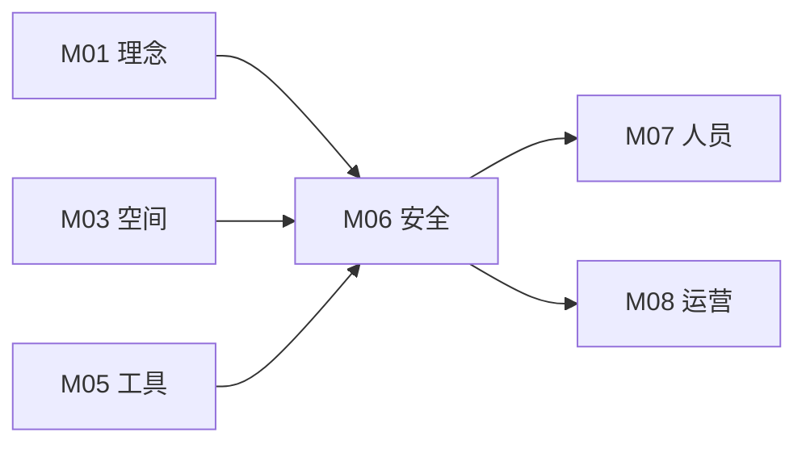

# M06 安全合规与伦理

## 摘要与核心定位

> **一句话定位**: 守住底线，为创造保驾护航——安全不是对创造的限制，而是让创造力敢于释放的前提。

安全不是对创造的限制，而是让创造力敢于释放的前提。本模块构建了"物理-数字-伦理"三层防御体系，旨在通过**系统设计**而非单纯依赖个人警觉来管控风险。对于 OWL 这样一个服务青少年的全球网络，安全合规不仅是运营红线，更是品牌生命线。

**核心观点**:
1.  **瑞士奶酪模型 (Swiss Cheese Model)**: 事故的发生往往是因为多重防御同时失效。安全建立在设备、流程、人员三道防线的叠加之上。
2.  **受控冒险 (Managed Risk)**: 我们不追求绝对零风险（这会扼杀探索），而是创造一个"安全失败"的环境。
3.  **制度性保护**: 针对未成年人，建立背景调查和双人原则等制度性屏障。

---

## 模块信息图

```
┌─────────────────────────────────────────────────────────────────────────────┐
│                      OWL 安全合规与伦理架构                                   │
├─────────────────────────────────────────────────────────────────────────────┤
│                                                                               │
│  ┌─────────────────────────────────────────────────────────────────────────┐ │
│  │  核心原则                                                                 │ │
│  │  ┌──────────┐ ┌──────────┐ ┌──────────┐ ┌──────────┐ ┌──────────┐      │ │
│  │  │安全第一  │ │预防为主  │ │隐私尊重  │ │知情同意  │ │零容忍    │      │ │
│  │  │不可妥协  │ │消除隐患  │ │最小必要  │ │充分告知  │ │对侵害    │      │ │
│  │  └──────────┘ └──────────┘ └──────────┘ └──────────┘ └──────────┘      │ │
│  └─────────────────────────────────────────────────────────────────────────┘ │
│                                    ↓                                          │
│  ┌─────────────────────────────────────────────────────────────────────────┐ │
│  │  三层安全防御体系 (瑞士奶酪模型)                                          │ │
│  │                                                                           │ │
│  │   ┌─────────────────┐  ┌─────────────────┐  ┌─────────────────┐         │ │
│  │   │  物理层         │  │  数字层         │  │  伦理层         │         │ │
│  │   │  Physical       │  │  Digital        │  │  Ethical        │         │ │
│  │   │                 │  │                 │  │                 │         │ │
│  │   │ • 设备分级管控  │  │ • 数据隔离      │  │ • 未成年人保护  │         │ │
│  │   │ • 空间分区      │  │ • 隐私保护      │  │ • AI使用伦理    │         │ │
│  │   │ • 个人防护      │  │ • 内容过滤      │  │ • 防霸凌机制    │         │ │
│  │   │ • 消防安全      │  │ • 网络安全      │  │ • 知识产权      │         │ │
│  │   └─────────────────┘  └─────────────────┘  └─────────────────┘         │ │
│  │                                                                           │ │
│  │   每一层都是一片"奶酪"，漏洞可能被其他层阻挡                              │ │
│  └─────────────────────────────────────────────────────────────────────────┘ │
│                                    ↓                                          │
│  ┌─────────────────────────────────────────────────────────────────────────┐ │
│  │  风险等级与响应                                                           │ │
│  │                                                                           │ │
│  │   R0 微小风险    R1 一般风险    R2 显著风险    R3 极端风险               │ │
│  │   ──────────     ──────────     ──────────     ──────────                │ │
│  │   SOP指引        培训+防护      审批+监管      熔断机制                   │ │
│  │   基础急救       L1认证培训     双人操作       立即疏散                   │ │
│  └─────────────────────────────────────────────────────────────────────────┘ │
│                                    ↓                                          │
│  ┌─────────────────────────────────────────────────────────────────────────┐ │
│  │  设备安全分级                                                             │ │
│  │  G 绿色: 3D打印机, 热胶枪 ──→ 简单培训即可使用                           │ │
│  │  Y 黄色: 电烙铁, 电钻, 手锯 ──→ 专门培训 + 实操考核                      │ │
│  │  R 红色: 激光切割, CNC, 台锯 ──→ 操作证 + 导师在场监管                   │ │
│  └─────────────────────────────────────────────────────────────────────────┘ │
└─────────────────────────────────────────────────────────────────────────────┘
```

---

## 1. 核心原则

| 原则 | 内涵 | 设计体现 | 验证标准 |
|------|------|----------|---------|
| **安全第一** | 不可妥协的底线 | "一票否决"的前置审核 | 任何项目若有重大安全隐患必须叫停 |
| **预防为主** | 消除隐患优于应对事故 | 定期隐患排查（日检/周检） | 预防性维护落实率 |
| **隐私尊重** | 最小必要原则 | 在系统设计之初考虑隐私保护 | 数据收集合规性审查 |
| **知情同意** | 赋予用户选择权 | 清晰的家长同意书与风险告知 | 协议签署率100% |
| **零容忍** | 对侵害零容忍 | 强制报告制度 | 投诉处理响应时间 |

---

## 2. 三层安全防御体系

OWL 采用分层防御架构，从物理空间延伸到数字世界和伦理边界。

### 2.1 物理层 (Physical Safety)

防止人身伤害，关注水、电、火、设备操作。

#### 设备分级管控

| 等级 | 颜色 | 设备示例 | 使用要求 | 培训时长 |
|------|------|---------|---------|---------|
| **G** | 绿色 | 3D打印机、热胶枪、螺丝刀 | 简单培训即可使用 | 10分钟 |
| **Y** | 黄色 | 电烙铁、电钻、手锯、裁纸刀 | 专门培训并通过实操考核 | 30分钟+ |
| **R** | 红色 | 激光切割机、CNC、台锯、角磨机 | 持有操作证，导师在场监管 | 2小时+ |

#### 空间安全分区

| 区域类型 | 要求 | 标识 |
|---------|------|------|
| **开放区** | 所有人可进入 | 绿色地标 |
| **受控区** | 需佩戴护目镜 | 黄色警示线 |
| **限制区** | 需有操作资质 | 红色隔离带 |

#### 个人防护装备 (PPE)

| 场景 | 必须佩戴 | 建议佩戴 |
|------|---------|---------|
| **进入加工区** | 护目镜 | 耳塞 |
| **激光切割** | 护目镜、防护手套 | 口罩 |
| **焊接作业** | 护目镜、隔热垫 | 防护手套 |
| **木工作业** | 护目镜、耳塞 | 防尘口罩 |

**其他物理安全规定**:
- 长发必须盘起
- 严禁佩戴松散饰品
- 禁止穿拖鞋进入加工区
- 动静分离：粉尘区必须有独立排风系统

### 2.2 数字层 (Digital Safety)

保护数据与网络安全。

#### 网络安全

| 项目 | 要求 | 说明 |
|------|------|------|
| **网络隔离** | 访客网络与设备控制网络物理隔离 | 防止黑客通过WiFi控制设备 |
| **内容过滤** | 部署DNS过滤 | 屏蔽不良信息网站 |
| **设备安全** | IoT设备定期更新固件 | 关闭不必要的远程访问 |
| **账户安全** | 强密码策略，启用2FA | 定期更换密码 |

#### 隐私保护

| 场景 | 要求 | 合规依据 |
|------|------|---------|
| **影像采集** | 拍摄前签署肖像权授权书 | 个人信息保护法 |
| **拒绝出镜** | 佩戴特殊颜色手环标识 | 尊重个人选择 |
| **作品数据** | 学生作品归学生所有 | 知识产权保护 |
| **数据保留** | 明确保留期限，到期删除 | 最小必要原则 |
| **数据共享** | 宣传使用需获得授权 | 知情同意 |

#### 数据分类

| 类别 | 示例 | 保护等级 | 访问权限 |
|------|------|---------|---------|
| **公开信息** | 课程介绍、活动公告 | 低 | 所有人 |
| **内部信息** | 运营数据、会员名单 | 中 | 员工 |
| **敏感信息** | 学生个人信息、联系方式 | 高 | 授权人员 |
| **机密信息** | 财务数据、背景调查结果 | 极高 | 核心管理层 |

### 2.3 伦理层 (Ethical Boundaries)

守护价值观，关注人际关系和科技伦理。

#### 未成年人保护

| 制度 | 内容 | 实施方式 |
|------|------|---------|
| **双人原则** | 成年导师不得单独与一名未成年学生在封闭空间独处 | 空间设计、排班制度 |
| **背景调查** | 所有长期工作人员必须通过无犯罪记录背景调查 | 入职前完成 |
| **透明空间** | 任何空间都应有窗户或开放视线 | 建筑设计 |
| **强制报告** | 发现可疑情况必须立即上报 | 培训+流程 |

#### 反霸凌机制

| 类型 | 表现 | 处理方式 |
|------|------|---------|
| **言语霸凌** | 嘲笑、辱骂、威胁 | 警告→停课→开除 |
| **社交霸凌** | 排斥、孤立、散布谣言 | 调解→心理辅导 |
| **网络霸凌** | 网上攻击、隐私泄露 | 证据保存→报警 |
| **身体霸凌** | 推搡、殴打 | 立即隔离→报警 |

#### AI 使用伦理

| 规则 | 内容 |
|------|------|
| **反作弊** | 明确 AI 在创作中的边界，作品说明必须标注"AI生成部分" |
| **反歧视** | 引导学生审视算法偏见，在项目中关注弱势群体 |
| **透明标注** | 使用 AI 生成内容必须明确标注 |
| **批判思维** | 不盲信 AI 输出，培养验证习惯 |

---

## 3. 风险控制矩阵

根据"发生概率"与"后果严重性"，我们将风险分为四个等级。

### 3.1 风险等级定义

| 等级 | 代码 | 发生概率 | 后果严重性 | 典型场景 |
|------|------|---------|-----------|---------|
| **R0** | 微小风险 | 低 | 轻微 | 3D打印机夹手、热胶微烫 |
| **R1** | 一般风险 | 中 | 可控 | 焊接烫伤、刀具割伤 |
| **R2** | 显著风险 | 中 | 严重 | 激光起火、粉尘吸入 |
| **R3** | 极端风险 | 低 | 灾难性 | 严重割伤、电路短路起火 |

### 3.2 风险响应策略

| 等级 | 控制策略 | 具体措施 |
|------|---------|---------|
| **R0** | SOP指引 | 张贴警示标语，配备基础急救包 |
| **R1** | 培训+防护 | 强制佩戴护目镜，必须通过L1认证培训 |
| **R2** | 审批+监管 | 设备需预约，导师全程在场，双人操作 |
| **R3** | 熔断机制 | 立即切断电源，疏散人员，启动应急预案 |

### 3.3 风险评估流程

```
新项目/新设备
      │
      ├─ 识别风险点
      │
      ├─ 评估概率与后果
      │
      ├─ 确定风险等级 (R0-R3)
      │
      ├─ 制定控制措施
      │
      ├─ 实施与培训
      │
      └─ 定期复评
```

---

## 4. 应急响应预案

### 4.1 应急响应流程

| 阶段 | 任务 | 责任人 |
|------|------|--------|
| **发现** | 识别紧急情况 | 第一发现人 |
| **响应** | 启动应急预案 | 值班导师 |
| **控制** | 控制事态发展 | 应急小组 |
| **处置** | 专业处置 | 消防/医疗/警方 |
| **恢复** | 恢复正常运营 | 管理层 |
| **复盘** | 分析原因，改进措施 | 安全委员会 |

### 4.2 常见紧急情况处理

| 情况 | 立即行动 | 后续处理 |
|------|---------|---------|
| **火灾** | 拉响警报，疏散人员，使用灭火器 | 报119，检查是否有伤员 |
| **触电** | 切断电源（勿直接接触伤者） | 报120，进行心肺复苏 |
| **烫伤** | 冷水冲洗15分钟 | 视严重程度送医 |
| **割伤** | 加压止血，清洁伤口 | 视严重程度送医 |
| **中毒** | 通风换气，移至空气新鲜处 | 报120，提供材料信息 |
| **地震** | 就近躲避，远离玻璃窗 | 疏散到开阔地带 |

### 4.3 应急物资清单

| 物资 | 数量 | 存放位置 | 检查周期 |
|------|------|---------|---------|
| **急救箱** | 每区域1个 | 显眼位置 | 每月 |
| **灭火器** | 每50m²≥2具 | 消防柜 | 每月 |
| **AED除颤仪** | Pro级以上1台 | 入口处 | 每周 |
| **应急照明** | 全覆盖 | 天花板 | 每月 |
| **应急通讯录** | 张贴 | 每个房间 | 及时更新 |

---

## 5. 合规与认证

### 5.1 法规遵从

| 法规领域 | 相关法规 | OWL 合规要求 |
|---------|---------|-------------|
| **消防安全** | 《消防法》、GB 50016 | 通过消防验收 |
| **电气安全** | GB 19517 | 漏电保护、接地 |
| **未成年人保护** | 《未成年人保护法》 | 背景调查、双人原则 |
| **个人信息保护** | 《个人信息保护法》 | 知情同意、最小必要 |
| **网络安全** | 《网络安全法》 | 实名制、日志留存 |

### 5.2 认证与培训

| 认证类型 | 对象 | 内容 | 有效期 |
|---------|------|------|--------|
| **安全入门** | 所有人员 | 基本安全意识 | 1年 |
| **急救认证** | 每班至少1人 | 心肺复苏、AED使用 | 2年 |
| **设备操作证** | 红色设备使用者 | 设备操作与应急 | 1年 |
| **导师安全培训** | 全体导师 | 安全管理、应急处理 | 1年 |

---

## 6. MVS 最小可运行标准

作为 OWL 节点，在安全维度必须满足以下 MVS 底线：

| 领域 | 检查项 | 验证标准 | 验证方式 |
|------|-------|---------|---------|
| **消防** | 灭火器与报警 | 每50m²≥2具4kg干粉灭火器；烟感全覆盖 | 现场核查 |
| **急救** | 急救包与人员 | 标准急救箱，≥1名持证急救员在岗 | 证书检查 |
| **用电** | 漏电保护 | 所有插座回路安装RCD | 电气检测 |
| **人员** | 背景调查 | 核心全职员工100%通过背景调查 | 记录审核 |
| **知情** | 协议签署 | 100%学员家长签署《安全知情同意书》 | 文档检查 |
| **培训** | 安全培训 | 所有导师完成安全培训 | 培训记录 |
| **预案** | 应急预案 | 有书面应急预案并每年演练 | 演练记录 |

---

## 7. 与其他模块的关系



- **M01→M06**: "受控冒险"理念指导安全设计
- **M03→M06**: 空间设计内置安全考量
- **M05→M06**: 设备分级对接安全管理
- **M06→M07**: 安全培训是人员能力要求
- **M06→M08**: 安全流程融入日常运营

---

## 8. 扩展阅读与深度指南

<ExtendCards cards={[
  {
    title: "物理安全标准",
    description: "车间布局、电气规范与设备安全操作规程 (SOP) 详表。",
    href: "/docs/knowledge-base/06-safety/extend/physical-safety-standards",
    type: "extend",
    status: "completed"
  },
  {
    title: "未成年人保护政策",
    description: "防欺凌、防性侵与行为准则 (Code of Conduct)。",
    href: "/docs/knowledge-base/06-safety/extend/child-protection-policy",
    type: "extend",
    status: "completed"
  },
  {
    title: "数字安全与隐私",
    description: "网络配置指南与 GDPR/COPPA 合规自查表。",
    href: "/docs/knowledge-base/06-safety/extend/digital-security",
    type: "extend",
    status: "planned"
  },
  {
    title: "应急响应预案",
    description: "火灾、医疗急救与突发事件的流程图与通讯录模板。",
    href: "/docs/knowledge-base/06-safety/extend/emergency-response",
    type: "extend",
    status: "completed"
  },
  {
    title: "安全培训课程",
    description: "针对不同角色的安全培训课程大纲与材料。",
    href: "/docs/knowledge-base/06-safety/extend/safety-training",
    type: "extend",
    status: "planned"
  },
  {
    title: "安全检查清单",
    description: "日检、周检、月检的完整检查表模板。",
    href: "/docs/knowledge-base/06-safety/extend/safety-checklists",
    type: "extend",
    status: "planned"
  },
  {
    title: "事故报告与分析",
    description: "事故报告模板与根因分析方法。",
    href: "/docs/knowledge-base/06-safety/extend/incident-reporting",
    type: "extend",
    status: "planned"
  },
  {
    title: "AI 伦理指南",
    description: "教育场景中 AI 使用的伦理规范与教学建议。",
    href: "/docs/knowledge-base/06-safety/extend/ai-ethics-guide",
    type: "extend",
    status: "planned"
  }
]} />

---

## 9. 参考文献

见 [evidence/refs.json](./evidence/refs.json)

**核心引用**:

| 来源 | 作品 | 贡献 | 证据等级 |
|------|------|------|---------|
| OSHA (2024) | *Small Business Safety and Health Handbook* | 职业安全标准 | E1 |
| Fab Foundation (2024) | *Fab Lab Safety Guidelines* | Fab Lab 安全指南 | E2 |
| COPPA (1998) | Children's Online Privacy Protection Act | 儿童网络隐私保护 | E1 |
| CSforALL (2023) | *Accessibility and Universal Design in CS Education* | 包容性设计 | E2 |
| GB 50016-2014 | 《建筑设计防火规范》 | 消防安全标准 | E1 |
| 《未成年人保护法》 (2020) | - | 未成年人保护 | E1 |
| 《个人信息保护法》 (2021) | - | 数据隐私保护 | E1 |
| 教育部等七部门 (2025) | 《关于加强中小学科技教育的意见》 | 国内政策背景 | E1 |
