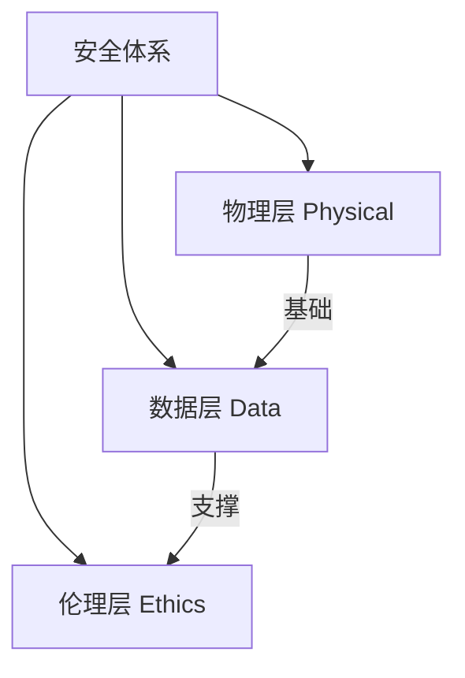

# M06 安全合规与伦理

## 1. 摘要与核心定位
> **一句话定位**: 守住底线，为创造保驾护航。

安全不是对创造的限制，而是让创造力敢于释放的前提。本模块构建了"物理-数据-伦理"三层防御体系，旨在通过系统设计而非单纯依赖个人警觉来管控风险。

**核心观点**:
1.  **瑞士奶酪模型**: 安全建立在多重防线（设备、流程、人员）的叠加之上。
2.  **受控冒险**: 我们不消除所有风险，而是管理风险，允许学习者在R0-R1级风险中通过实践成长。
3.  **制度性保护**: 针对未成年人，建立背景调查和双人原则等制度性屏障。

---

## 2. 核心原则

| 原则 | 内涵 | 设计体现 |
|------|------|----------|
| **安全第一** | 不可妥协的底线 | "一票否决"的前置审核机制 |
| **预防为主** | 消除隐患优于应对事故 | 定期隐患排查与设备维护 |
| **隐私尊重** | 最小必要原则 | 不收集非必须数据，用后即焚 |
| **知情同意** | 赋予用户选择权 | 清晰的家长同意书与风险告知 |
| **零容忍** | 对侵害零容忍 | 强制报告与严肃追责 |

---

## 3. 安全管理体系 (三层架构)

我们采用分层防御架构来应对不同维度的威胁：

1.  **物理安全**: 消防、电气、设备操作人身防护。
    *   *标准*: [物理安全管理标准](./extend/physical-safety-standards)
2.  **数据安全**: 隐私保护、网络分级、账号管理。
    *   *标准*: [数字安全与隐私保护](./extend/digital-security)
3.  **伦理边界**: 未成年人保护、AI使用伦理、知识产权。
    *   *标准*: [未成年人保护政策](./extend/child-protection-policy)

---

## 4. 风险等级与响应 (Risk Levels)

| 等级 | 定义 | 典型场景 | 控制要求 |
|------|------|----------|----------|
| **R0** | 常规风险 | 3D打印、电脑操作 | 标准操作规程(SOP) |
| **R1** | 关注风险 | 焊接、手工锯 | **培训+认证**，佩戴护具 |
| **R2** | 警示风险 | 激光切割、户外活动 | **审批+双人监管**，专项方案 |
| **R3** | 紧急风险 | 火灾、人身伤害 | **立即停机**，启动应急预案 |

---

## 5. MVS 最小可运行标准

所有 OWL 节点必须满足的红线要求：

| 项目 | 要求 | 验证方法 |
|------|------|----------|
| **消防** | ✅ 配备足量灭火器+烟感 | 月度检查记录 |
| **急救** | ✅ 急救箱 + 1名急救员 | 药品有效期检查 |
| **人员** | ✅ 从业者无犯罪记录 | 背景调查报告 |
| **同意** | ✅ 家长知情同意书 | 书面/电子存档 |
| **设备** | ✅ 危险设备张贴警示与SOP | 现场核查 |
| **隐私** | ✅ 公示隐私政策 | 官网/现场可见 |

---

## 6. 扩展阅读与深度指南

### 物理与人身安全
<ExtendCards cards={[
  {
    title: "物理安全管理标准",
    description: "消防配置、PPE穿戴规范与急救配置。",
    href: "/docs/knowledge-base/06-safety/extend/physical-safety-standards",
    type: "extend",
    status: "published"
  },
  {
    title: "设备分级与准入",
    description: "设备A-D分级体系及对应的培训考核制度。",
    href: "/docs/knowledge-base/06-safety/extend/equipment-access",
    type: "extend",
    status: "completed"
  },
  {
    title: "应急响应流程",
    description: "火灾、医疗急救、走失等突发事件处理SOP。",
    href: "/docs/knowledge-base/06-safety/extend/emergency-response",
    type: "extend",
    status: "completed"
  }
]} />

### 数据与伦理
<ExtendCards cards={[
  {
    title: "未成年人保护政策",
    description: "背景调查、双人原则与强制报告机制。",
    href: "/docs/knowledge-base/06-safety/extend/child-protection-policy",
    type: "extend",
    status: "published"
  },
  {
    title: "AI 伦理指南",
    description: "生成式AI在教育中的使用边界与防范。",
    href: "/docs/knowledge-base/06-safety/extend/ai-ethics",
    type: "extend",
    status: "completed"
  },
  {
    title: "数字安全与隐私",
    description: "数据全生命周期管理与网络安全规范。",
    href: "/docs/knowledge-base/06-safety/extend/digital-security",
    type: "extend",
    status: "completed"
  },
  {
    title: "知识产权教育",
    description: "开源协议(CC/MIT)指引与原创保护。",
    href: "/docs/knowledge-base/06-safety/extend/ip-education",
    type: "extend",
    status: "completed"
  }
]} />

---

## 7. 参考文献

1. 《中华人民共和国未成年人保护法》
2. 《中华人民共和国个人信息保护法》
3. UNESCO (2021). *Recommendation on the Ethics of Artificial Intelligence*.
4. *Fab Lab Safety Guidelines*. Fab Foundation.
