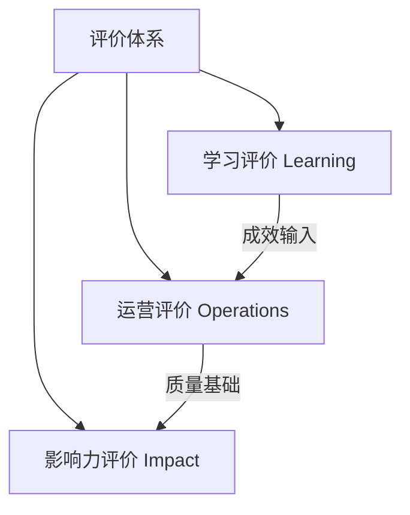

# M09 评价与影响力

## 1. 摘要与核心定位
> **一句话定位**: 看见成长，证明价值。

教育评价的本质不是排名，而是反馈。在创新教育中，我们面临一个永恒的难题：如何衡量“创造力”、“自信心”这些看似不可测量的素养？本模块构建了“学习-运营-影响力”三层评价体系，主张从关注“仅仅测量容易测量的”（如分数），转向“测量真正重要的”。

**核心观点**:
1.  **评价即学习**: 评价过程本身就是反思和成长的机会。当学生参与制定量规（Rubrics）和互评时，他们学到的比直接听讲更多。
2.  **多元证据**: 拒绝单一试卷，采用档案袋 (Portfolio)、数字画像、实物作品、访谈录音等多模态证据。
3.  **影响力逻辑**: 使用“变化理论 (Theory of Change)” 理清从投入到产出的逻辑链条，向资助方和社会证明公益价值。

---

## 2. 核心原则

| 原则 | 英文 | 内涵 | 实践体现 |
|-----|-----|------|---------|
| **评价即学习** | Assessment as Learning | 评价不是“终点”，而是学习的“过程”。 | 学生自评表、每日反思日志、项目复盘会 |
| **三角互证** | Triangulation | 孤证不立，需从多角度交叉验证。 | 作品质量 + 导师观察 + 同伴反馈 |
| **成长导向** | Growth Mindset | 关注“增量”而非“存量”。 | 比较“现在的我”与“过去的我”，而非与他人比 |
| **真实评价** | Authentic Assessment | 在真实情境中解决真实问题。 | 公开展示日 (Public Exhibition)、产品发布会 |

---

## 3. 三层评价体系 (Architecture)

我们从微观个体的成长，到中观实验室的运营，再到宏观的社会影响，构建了立体的评价架构：

### 3.1 学习评价：看见个体的光
针对学生的评价，OWL 废弃了百分制，采用 **[档案袋 + 量规]** 模式。

#### A. 过程性档案袋 (Process Portfolio)
档案袋不应只展示完美的最终作品，更要记录“挣扎的过程”。标准档案袋应包含：
*   **灵感草图**: 最初那个潦草的想法。
*   **失败原型**: 第一次打印失败的模型、烧毁的电路板（并附上“尸检报告”）。
*   **迭代记录**: v1.0 到 v3.0 的进化过程。
*   **最终作品**: 高清照片或演示视频。
*   **反思日志**: “如果重来一次，我会哪里做得不同？”

#### B. 素养量规 (Rubrics) 示例
我们如何评价“创造力”？通过定义行为锚点：

| 维度 | **1. 入门 (Novice)** | **2. 熟练 (Proficient)** | **3. 精通 (Expert)** |
|-----|---------------------|------------------------|---------------------|
| **迭代优化** | 遇到失败就放弃，或等待老师解决。 | 能尝试一种修改方案，即使失败。 | 主动测试多个方案，并能解释为什么选这个。 |
| **工具使用** | 需要全程指导才能安全操作。 | 能独立安全操作，偶尔需要提示。 | 能创造性地组合使用工具，并发明新用法。 |
| **社会意识** | 仅关注作品功能。 | 能意识到作品对用户的潜在影响。 | 设计时主动考虑包容性、环保等伦理问题。 |

### 3.2 运营评价：数据驱动的改进
针对实验室本身的健康度，我们关注两组指标：

*   **北极星指标 (North Star Metric)**: **活跃创客数**（每月至少来访2次且有产出的用户数）。这比单纯的“会员数”更能反映社区活力。
*   **健康度指标**:
    *   **NPS 净推荐值**: “你有多大可能把 OWL 推荐给朋友？”
    *   **设备完好率**: 可用设备数 / 总设备数。（目标 > 95%）
    *   **耗材损耗率**: 实际消耗 / 理论消耗。（监控浪费情况）

### 3.3 影响力评价：讲述改变的故事
针对资助方和社区，我们需要回答“So What?”（那又怎样？）的问题。我们使用 **变化理论 (Theory of Change, ToC)** 来构建逻辑链：

1.  **投入 (Inputs)**: 场地、设备、导师时间、资金...
2.  **活动 (Activities)**: 举办工作坊、开放夜、夏令营...
3.  **产出 (Outputs)**: 培训了多少人？产出了多少个原型？（即时数据）
4.  **成果 (Outcomes)**: 学生的自信心提升了吗？掌握新技能了吗？（短期改变）
5.  **影响 (Impact)**: 社区的创新氛围改变了吗？是否有学生因此改变职业轨迹？（长期改变）

> *案例*: 某社区实验室不仅汇报“服务了500人”，通过追踪发现“其中20位辍学青年重返校园攻读设计专业”，这才是 Impact。

---

## 4. MVS 最小可运行标准

建立评价体系不必等到完美，从第一天即刻启动：

| 维度 | 项目 | MVS要求 | 验证方式 |
|------|------|---------|----------|
| **反馈** | 活动反馈率 | ≥80% 的活动收集了学员反馈（哪怕只是贴笑脸贴纸）。 | 系统数据/照片 |
| **档案** | 档案袋覆盖 | 100% 长期班学员拥有成长档案袋（可以是纸质文件夹）。 | 抽查 |
| **复盘** | 运营复盘 | 至少每季度召开一次团队复盘会，基于数据讨论改进。 | 会议记录 |
| **数据** | 核心指标 | 按月记录 5 个关键运营指标（人流、收入、满意度等）。 | 仪表盘/Excel |
| **合规** | 隐私保护 | 收集数据前签署《知情同意书》，承诺不滥用数据。 | 协议文档 |

---

## 5. 扩展阅读与深度指南

<ExtendCards cards={[
  {
    title: "科技素养数字画像",
    description: "基于六维雷达图的学生能力评估模型与可视化工具。",
    href: "/docs/knowledge-base/09-assessment/extend/tech-literacy-profile",
    type: "extend",
    status: "planned"
  },
  {
    title: "节点评估标准",
    description: "OWL 实验室星级认证体系：从一星到五星的进阶之路。",
    href: "/docs/knowledge-base/09-assessment/extend/node-assessment-criteria",
    type: "extend",
    status: "completed"
  },
  {
    title: "影响力评估方法",
    description: "如何撰写高质量的影响力报告：数据采集与故事讲述。",
    href: "/docs/knowledge-base/09-assessment/extend/impact-evaluation",
    type: "extend",
    status: "planned"
  },
  {
    title: "量规设计指南",
    description: "如何为 PBL 项目设计公平、有效的评价量规 (Rubrics)。",
    href: "/docs/knowledge-base/09-assessment/extend/rubric-design",
    type: "extend",
    status: "completed"
  }
]} />

---

## 6. 参考文献

1.  **OECD**. (2019). *PISA 2021 Creative Thinking Framework*.
2.  **Hattie, J.** (2008). *Visible Learning*. (可见的学习)
3.  **Maker Ed**. (2018). *Open Portfolio Project Research Briefs*.
4.  **W.K. Kellogg Foundation**. (2004). *Logic Model Development Guide*.
