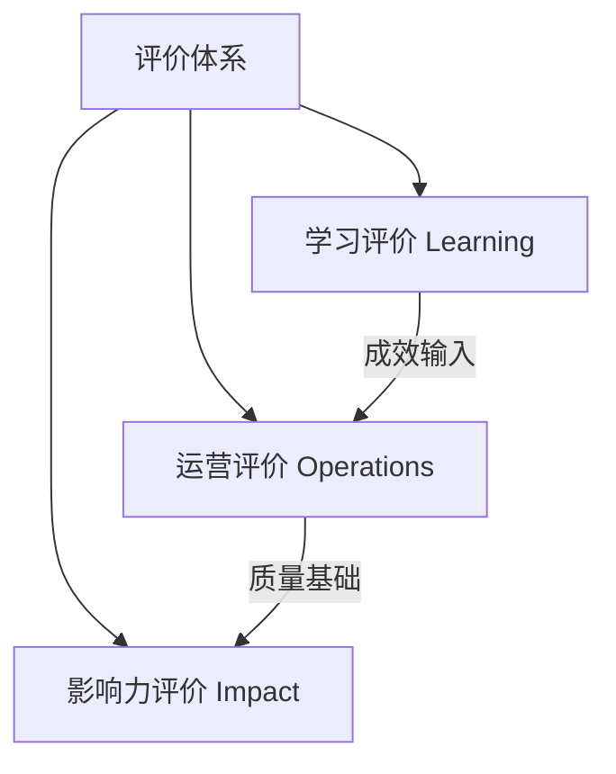

# M09 评价与影响力

## 1. 摘要与核心定位
> **一句话定位**: 看见成长，证明价值。

教育评价的本质不是排名，而是反馈。本模块构建了"学习-运营-影响力"三层评价体系，主张从关注"仅仅测量容易测量的"（如分数），转向"测量真正重要的"（如创造力、协作与社会影响）。

**核心观点**:
1.  **评价即学习**: 评价过程本身就是反思和成长的机会（如答辩、互评）。
2.  **多元证据**: 拒绝单一试卷，采用档案袋、数字画像、实物作品等多模态证据。
3.  **改进导向**: 所有的评价数据最终必须服务于行动改进（PDSA循环）。

---

## 2. 核心原则

| 原则 | 内涵 | 实践体现 |
|------|------|----------|
| **评价即学习** | Assessment as Learning | 自评、互评、反思日志 |
| **多元证据** | Triangulation | 作品+观察+访谈+数据 |
| **成长导向** | Growth Mindset | 关注增量而非存量排名 |
| **真实评价** | Authentic Assessment | 解决真实问题的项目表现 |
| **科学可信** | Validity & Reliability | 基于证据的推断与归因 |

---

## 3. 三层评价体系 (Architecture)

我们从微观到宏观构建了立体的评价架构：

1.  **学习评价**: 关注个体成长。核心工具是**档案袋**与**科技素养数字画像**。
    *   *详见*: [科技素养数字画像](./extend/tech-literacy-profile)
2.  **运营评价**: 关注节点质量。核心工具是**认证标准**与**运营仪表盘**。
    *   *详见*: [节点评估标准](./extend/node-assessment-criteria)
3.  **影响力评价**: 关注社会价值。核心工具是**变化理论(ToC)**。
    *   *详见*: [影响力评估方法](./extend/impact-evaluation)

---

## 4. 关键指引

### 4.1 学习评价：超越分数
我们采用**量规 (Rubrics)** 而非单纯的分数来评估复杂能力。
*   **档案袋**: 收集草图、失败原型、迭代记录，证明过程努力。
*   **数字画像**: 六维雷达图呈现科学探究与工程实践能力的均衡发展。

### 4.2 运营评价：数据驱动
*   **输入**: 空间利用率、设备完好率、安全事故率（0容忍）。
*   **输出**: NPS净推荐值、续课率、项目完成率。

### 4.3 影响力：变化理论
从 Input（投入）到 Impact（长期改变）的逻辑链条必须清晰可见。
*   *逻辑*: 投入资金/设备 → 开展工作坊 → 产出原型 → 提升创新信心 → 培养未来创客。

---

## 5. MVS 最小可运行标准

| 维度 | 项目 | MVS要求 | 验证方式 |
|------|------|---------|----------|
| **反馈** | 活动反馈率 | ≥80% 的活动收集了学员反馈 | 系统数据 |
| **档案** | 档案袋覆盖 | 100% 学员拥有成长档案袋 | 抽查 |
| **复盘** | 运营复盘 | 至少每季度召开团队复盘会 | 会议记录 |
| **数据** | 核心指标 | 按月记录5个关键运营指标 | 仪表盘 |
| **合规** | 隐私保护 | 签署数据授权与隐私协议 | 协议文档 |

---

## 6. 扩展阅读与工具箱

### 学习者评价工具
<ExtendCards cards={[
  {
    title: "科技素养数字画像",
    description: "教育部意见响应：六维创新能力雷达图模型。",
    href: "/docs/knowledge-base/09-assessment/extend/tech-literacy-profile",
    type: "extend",
    status: "published"
  },
  {
    title: "档案袋评价指南",
    description: "如何收集作品、反思与过程记录。",
    href: "/docs/knowledge-base/09-assessment/extend/portfolio-assessment",
    type: "extend",
    status: "completed"
  },
  {
    title: "量规设计指南",
    description: "如何为复杂项目设计清晰的评分标准。",
    href: "/docs/knowledge-base/09-assessment/extend/rubric-design",
    type: "extend",
    status: "completed"
  }
]} />

### 系统与影响力评价
<ExtendCards cards={[
  {
    title: "节点评估标准",
    description: "OWL节点认证与分级体系。",
    href: "/docs/knowledge-base/09-assessment/extend/node-assessment-criteria",
    type: "extend",
    status: "completed"
  },
  {
    title: "运营仪表盘",
    description: "关键运营指标(KPI)定义与可视化。",
    href: "/docs/knowledge-base/09-assessment/extend/operations-dashboard",
    type: "extend",
    status: "completed"
  },
  {
    title: "变化理论 (ToC)",
    description: "从投入到社会影响的逻辑推演框架。",
    href: "/docs/knowledge-base/09-assessment/extend/theory-of-change",
    type: "extend",
    status: "completed"
  },
  {
    title: "影响力评估方法",
    description: "社会价值SROI与长期追踪方法。",
    href: "/docs/knowledge-base/09-assessment/extend/impact-evaluation",
    type: "extend",
    status: "completed"
  }
]} />

### 数据基础
<ExtendCards cards={[
  {
    title: "数据收集指南",
    description: "保证数据准确性、完整性与隐私合规。",
    href: "/docs/knowledge-base/09-assessment/extend/data-collection",
    type: "extend",
    status: "completed"
  }
]} />

---

## 7. 参考文献

1. Black, P. & Wiliam, D. (1998). *Inside the Black Box*.
2. OECD (2019). *PISA 2018 Framework*.
3. 教育部等七部门《关于加强中小学科技教育的意见》(2025.11).
