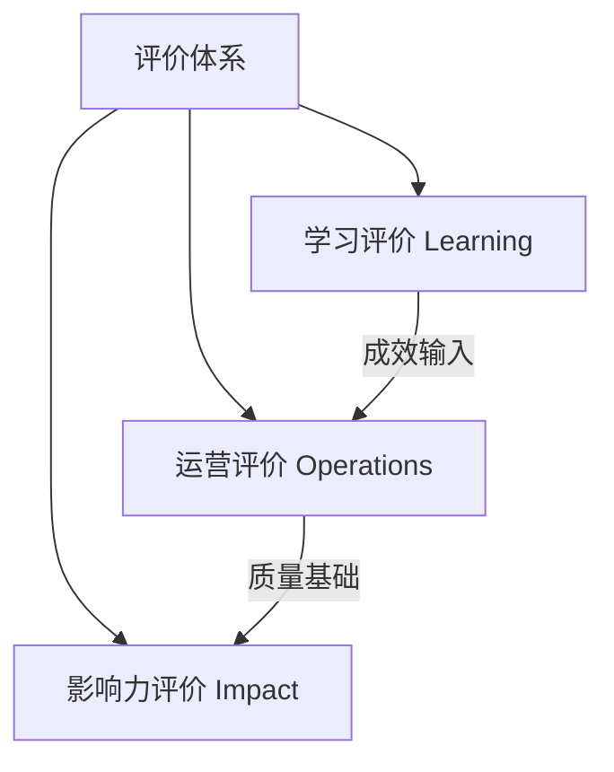
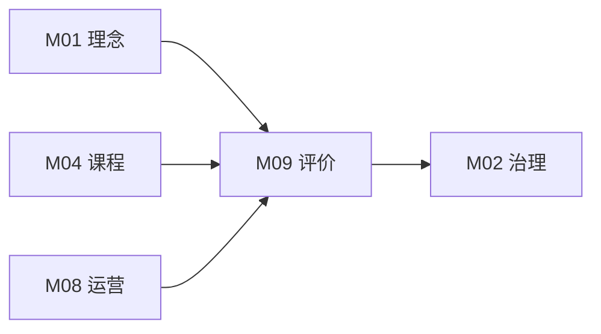

# M09 评价与影响力

## 摘要与核心定位

> **一句话定位**: 看见成长，证明价值——从"测量容易测量的"，到"测量真正重要的"。

教育评价的本质不是排名，而是反馈。在创新教育中，我们面临一个永恒的难题：如何衡量"创造力"、"自信心"这些看似不可测量的素养？本模块构建了"学习-运营-影响力"三层评价体系，主张从关注"仅仅测量容易测量的"（如分数），转向"测量真正重要的"。

**核心观点**:
1.  **评价即学习**: 评价过程本身就是反思和成长的机会。当学生参与制定量规和互评时，他们学到的比直接听讲更多。
2.  **多元证据**: 拒绝单一试卷，采用档案袋、数字画像、实物作品、访谈录音等多模态证据。
3.  **影响力逻辑**: 使用"变化理论 (Theory of Change)" 理清从投入到产出的逻辑链条，向资助方和社会证明公益价值。

---

## 模块信息图

```
┌─────────────────────────────────────────────────────────────────────────────┐
│                       OWL 评价与影响力架构                                    │
├─────────────────────────────────────────────────────────────────────────────┤
│                                                                               │
│  ┌─────────────────────────────────────────────────────────────────────────┐ │
│  │  评价核心原则                                                             │ │
│  │  ┌──────────────┐  ┌──────────────┐  ┌──────────────┐  ┌──────────────┐│ │
│  │  │ 评价即学习   │  │ 三角互证     │  │ 成长导向     │  │ 真实评价     ││ │
│  │  │ Assessment   │  │ Triangulation│  │ Growth       │  │ Authentic    ││ │
│  │  │ as Learning  │  │              │  │ Mindset      │  │ Assessment   ││ │
│  │  └──────────────┘  └──────────────┘  └──────────────┘  └──────────────┘│ │
│  └─────────────────────────────────────────────────────────────────────────┘ │
│                                    ↓                                          │
│  ┌─────────────────────────────────────────────────────────────────────────┐ │
│  │  三层评价体系                                                             │ │
│  │                                                                           │ │
│  │   ┌─────────────────────────────────────────────────────────────────┐   │ │
│  │   │  第三层: 影响力评价 (Impact)                                     │   │ │
│  │   │  回答: So What? → 变化理论 → 长期社会影响                        │   │ │
│  │   └─────────────────────────────────────────────────────────────────┘   │ │
│  │   ┌─────────────────────────────────────────────────────────────────┐   │ │
│  │   │  第二层: 运营评价 (Operations)                                   │   │ │
│  │   │  回答: 我们做得好吗? → 北极星指标 → 健康度仪表盘                 │   │ │
│  │   └─────────────────────────────────────────────────────────────────┘   │ │
│  │   ┌─────────────────────────────────────────────────────────────────┐   │ │
│  │   │  第一层: 学习评价 (Learning)                                     │   │ │
│  │   │  回答: 学生学到了吗? → 档案袋 + 量规 → 素养画像                  │   │ │
│  │   └─────────────────────────────────────────────────────────────────┘   │ │
│  └─────────────────────────────────────────────────────────────────────────┘ │
│                                    ↓                                          │
│  ┌─────────────────────────────────────────────────────────────────────────┐ │
│  │  评价工具矩阵                                                             │ │
│  │                                                                           │ │
│  │   ┌───────────┐  ┌───────────┐  ┌───────────┐  ┌───────────┐           │ │
│  │   │ 档案袋    │  │ 量规表    │  │ 同伴互评  │  │ 反思日志  │           │ │
│  │   │ Portfolio │  │ Rubrics   │  │ Peer      │  │ Reflection│           │ │
│  │   │           │  │           │  │ Review    │  │ Journal   │           │ │
│  │   └───────────┘  └───────────┘  └───────────┘  └───────────┘           │ │
│  │                                                                           │ │
│  │   ┌───────────┐  ┌───────────┐  ┌───────────┐  ┌───────────┐           │ │
│  │   │ 展示日    │  │ 观察记录  │  │ 素养画像  │  │ 影响报告  │           │ │
│  │   │ Demo Day  │  │ Observation│  │ Profile   │  │ Impact    │           │ │
│  │   │           │  │           │  │           │  │ Report    │           │ │
│  │   └───────────┘  └───────────┘  └───────────┘  └───────────┘           │ │
│  └─────────────────────────────────────────────────────────────────────────┘ │
└─────────────────────────────────────────────────────────────────────────────┘
```

---

## 1. 核心原则

| 原则 | 英文 | 内涵 | 实践体现 |
|-----|-----|------|---------|
| **评价即学习** | Assessment as Learning | 评价不是"终点"，而是学习的"过程" | 学生自评表、每日反思日志、项目复盘会 |
| **三角互证** | Triangulation | 孤证不立，需从多角度交叉验证 | 作品质量 + 导师观察 + 同伴反馈 |
| **成长导向** | Growth Mindset | 关注"增量"而非"存量" | 比较"现在的我"与"过去的我"，而非与他人比 |
| **真实评价** | Authentic Assessment | 在真实情境中解决真实问题 | 公开展示日、产品发布会、社区展示 |
| **透明公开** | Transparency | 评价标准事先公开，学生参与制定 | 量规共创、自我评估 |

---

## 2. 三层评价体系

我们从微观个体的成长，到中观实验室的运营，再到宏观的社会影响，构建了立体的评价架构：



### 2.1 学习评价：看见个体的光

针对学生的评价，OWL 废弃了百分制，采用 **[档案袋 + 量规]** 模式。

#### A. 过程性档案袋 (Process Portfolio)

档案袋不应只展示完美的最终作品，更要记录"挣扎的过程"。

| 组成部分 | 内容 | 收集方式 |
|---------|------|---------|
| **灵感草图** | 最初那个潦草的想法 | 拍照/扫描 |
| **失败原型** | 第一次打印失败的模型、烧毁的电路板 | 实物+尸检报告 |
| **迭代记录** | v1.0 到 v3.0 的进化过程 | 照片/视频 |
| **最终作品** | 高清照片或演示视频 | 多角度拍摄 |
| **反思日志** | "如果重来一次，我会哪里做得不同？" | 文字/音频 |

**档案袋管理**:
- **物理档案**: 每位学生一个文件夹，存放草图、照片、反思卡
- **数字档案**: 云端文件夹，按项目和日期组织
- **展示档案**: 精选内容用于展示和分享

#### B. 素养量规 (Rubrics)

我们如何评价"创造力"这样抽象的素养？通过定义行为锚点：

| 维度 | 1. 入门 (Novice) | 2. 熟练 (Proficient) | 3. 精通 (Expert) |
|-----|------------------|---------------------|-----------------|
| **迭代优化** | 遇到失败就放弃，或等待老师解决 | 能尝试一种修改方案，即使失败 | 主动测试多个方案，并能解释选择理由 |
| **工具使用** | 需要全程指导才能安全操作 | 能独立安全操作，偶尔需要提示 | 能创造性地组合使用工具，发明新用法 |
| **协作沟通** | 独自工作，不主动分享 | 能在团队中完成分工任务 | 主动帮助他人，促进团队协作 |
| **社会意识** | 仅关注作品功能 | 能意识到作品对用户的潜在影响 | 设计时主动考虑包容性、环保等伦理问题 |
| **问题定义** | 需要他人明确问题 | 能识别问题，但定义较模糊 | 能清晰定义问题，分析根因 |
| **批判思维** | 接受所有信息 | 能提出疑问 | 能评估信息来源，形成独立判断 |

#### C. 素养数字画像

将量规评估结果可视化为雷达图：

```
            创造力
              │
     批判思维 ─┼─ 协作沟通
             /│\
            / │ \
问题解决 ──┼──┼──┼── 技术素养
            \ │ /
             \│/
     社会责任 ─┼─ 自我管理
              │
           坚韧性
```

### 2.2 运营评价：数据驱动的改进

针对实验室本身的健康度。

#### 北极星指标 (North Star Metric)

> **活跃创客数**: 每月至少来访2次且有产出的用户数

这比单纯的"会员数"更能反映社区活力。

#### 健康度仪表盘

| 指标 | 计算方式 | 目标 | 预警线 |
|------|---------|------|--------|
| **NPS 净推荐值** | "你有多大可能把 OWL 推荐给朋友？" | ≥50 | <30 |
| **设备完好率** | 可用设备数 / 总设备数 | ≥95% | <90% |
| **耗材损耗率** | 实际消耗 / 理论消耗 | ≤1.2 | >1.5 |
| **活动满意度** | 活动后调查平均分 | ≥4.5/5 | <4.0 |
| **复购率** | 续费会员 / 到期会员 | ≥70% | <50% |
| **导师留存率** | 年度导师留任率 | ≥80% | <60% |

#### 数据收集方式

| 数据类型 | 收集方式 | 频率 |
|---------|---------|------|
| **满意度** | 活动后问卷 | 每次活动 |
| **NPS** | 季度调查 | 季度 |
| **设备状态** | 维护日志 | 每周 |
| **财务数据** | 财务系统 | 每月 |
| **人流数据** | 签到系统 | 实时 |

### 2.3 影响力评价：讲述改变的故事

针对资助方和社区，我们需要回答"So What?"（那又怎样？）的问题。

#### 变化理论 (Theory of Change)

| 层次 | 内容 | 指标示例 | 数据来源 |
|------|------|---------|---------|
| **投入 (Inputs)** | 场地、设备、导师时间、资金 | 投入资金额、导师工时 | 财务记录 |
| **活动 (Activities)** | 举办工作坊、开放夜、夏令营 | 活动数量、参与人次 | 活动记录 |
| **产出 (Outputs)** | 培训人数、原型数量 | 500人参与、100个原型 | 即时统计 |
| **成果 (Outcomes)** | 能力提升、态度改变 | 自信心提升、技能习得 | 前后测、访谈 |
| **影响 (Impact)** | 长期改变、系统性变化 | 职业选择、社区文化 | 追踪调查 |

**案例**: 某社区实验室不仅汇报"服务了500人"，通过追踪发现"其中20位辍学青年重返校园攻读设计专业"，这才是 Impact。

#### 影响力报告框架

| 章节 | 内容 |
|------|------|
| **执行摘要** | 关键数字和亮点故事 |
| **背景与目标** | 为什么做这件事 |
| **投入与活动** | 做了什么 |
| **产出数据** | 即时成果 |
| **成果证据** | 改变的证据（量化+质性） |
| **典型故事** | 2-3个深度案例 |
| **挑战与学习** | 遇到的困难和反思 |
| **下一步计划** | 未来方向 |

---

## 3. 评价工具详解

### 3.1 量规设计指南

设计有效量规的步骤：

| 步骤 | 任务 | 注意事项 |
|------|------|---------|
| **1. 明确目标** | 确定要评估的能力维度 | 不超过6个维度 |
| **2. 定义层级** | 通常3-4个层级 | 描述行为而非态度 |
| **3. 撰写描述** | 每个层级的具体表现 | 使用可观察的动词 |
| **4. 学生参与** | 让学生参与量规制定 | 增强理解和认同 |
| **5. 试用迭代** | 在实际中试用并改进 | 收集反馈 |

### 3.2 同伴互评

| 方式 | 描述 | 优点 | 注意事项 |
|------|------|------|---------|
| **画廊漫步** | 作品陈列，学员巡回贴便签评价 | 高效、匿名 | 需要引导语 |
| **结构化互评** | 使用量规表互相评分 | 培训评价能力 | 需要培训 |
| **口头反馈** | 小组内轮流给出反馈 | 即时、深入 | 需要安全氛围 |
| **在线互评** | 通过平台提交评价 | 可追溯 | 需要技术支持 |

**反馈句式模板**:
- "我注意到..."（观察）
- "我好奇的是..."（提问）
- "我建议..."（建议）
- "我欣赏..."（肯定）

### 3.3 展示日 (Demo Day)

| 环节 | 时长 | 内容 |
|------|------|------|
| **开场** | 10分钟 | 主持人介绍、规则说明 |
| **展示** | 每组5分钟 | 项目演示、团队介绍 |
| **问答** | 每组3分钟 | 观众提问、评委点评 |
| **投票** | 5分钟 | 观众投票、评选奖项 |
| **颁奖** | 10分钟 | 颁发奖项、合影留念 |
| **自由交流** | 30分钟 | 观众与团队深入交流 |

---

## 4. 数据收集与分析

### 4.1 数据收集原则

| 原则 | 说明 |
|------|------|
| **最小必要** | 只收集真正需要的数据 |
| **知情同意** | 明确告知收集目的和使用方式 |
| **安全存储** | 妥善保管，防止泄露 |
| **定期清理** | 到期数据及时删除 |

### 4.2 常用评价工具

| 工具 | 用途 | 优点 | 局限 |
|------|------|------|------|
| **问卷调查** | 满意度、NPS | 易于量化 | 可能有偏 |
| **访谈** | 深度了解 | 丰富细节 | 耗时 |
| **观察记录** | 行为证据 | 客观真实 | 需要培训 |
| **作品分析** | 能力评估 | 直接证据 | 评分标准化难 |
| **前后测** | 变化测量 | 可比较 | 设计难度高 |

---

## 5. MVS 最小可运行标准

建立评价体系不必等到完美，从第一天即刻启动：

| 维度 | 项目 | MVS要求 | 验证方式 |
|------|------|---------|----------|
| **反馈** | 活动反馈率 | ≥80% 的活动收集了学员反馈 | 系统数据/照片 |
| **档案** | 档案袋覆盖 | 100% 长期班学员拥有成长档案袋 | 抽查 |
| **复盘** | 运营复盘 | 至少每季度召开一次团队复盘会 | 会议记录 |
| **数据** | 核心指标 | 按月记录5个关键运营指标 | 仪表盘/Excel |
| **合规** | 隐私保护 | 收集数据前签署《知情同意书》 | 协议文档 |
| **报告** | 年度报告 | 每年发布1份影响力报告 | 报告文档 |

---

## 6. 与其他模块的关系



- **M01→M09**: "成长导向"理念指导评价设计
- **M04→M09**: 课程目标决定评价内容
- **M08→M09**: 运营数据支撑运营评价
- **M09→M02**: 评估结果支撑治理决策

---

## 7. 扩展阅读与深度指南

<ExtendCards cards={[
  {
    title: "科技素养数字画像",
    description: "基于六维雷达图的学生能力评估模型与可视化工具。",
    href: "/docs/knowledge-base/09-assessment/extend/tech-literacy-profile",
    type: "extend",
    status: "completed"
  },
  {
    title: "节点评估标准",
    description: "OWL 实验室星级认证体系：从一星到五星的进阶之路。",
    href: "/docs/knowledge-base/09-assessment/extend/node-assessment-criteria",
    type: "extend",
    status: "completed"
  },
  {
    title: "影响力评估方法",
    description: "如何撰写高质量的影响力报告：数据采集与故事讲述。",
    href: "/docs/knowledge-base/09-assessment/extend/impact-evaluation",
    type: "extend",
    status: "planned"
  },
  {
    title: "量规设计指南",
    description: "如何为 PBL 项目设计公平、有效的评价量规 (Rubrics)。",
    href: "/docs/knowledge-base/09-assessment/extend/rubric-design",
    type: "extend",
    status: "completed"
  },
  {
    title: "档案袋系统搭建",
    description: "从纸质到数字：如何建立可持续的学生成长档案系统。",
    href: "/docs/knowledge-base/09-assessment/extend/portfolio-system",
    type: "extend",
    status: "planned"
  },
  {
    title: "展示日操作手册",
    description: "Demo Day 的完整策划与执行指南。",
    href: "/docs/knowledge-base/09-assessment/extend/demo-day-guide",
    type: "extend",
    status: "planned"
  },
  {
    title: "数据仪表盘设计",
    description: "如何用低成本工具搭建运营数据仪表盘。",
    href: "/docs/knowledge-base/09-assessment/extend/dashboard-design",
    type: "extend",
    status: "planned"
  },
  {
    title: "质性研究方法",
    description: "访谈、观察、案例研究在教育评估中的应用。",
    href: "/docs/knowledge-base/09-assessment/extend/qualitative-methods",
    type: "extend",
    status: "planned"
  }
]} />

---

## 8. 参考文献

见 [evidence/refs.json](./evidence/refs.json)

**核心引用**:

| 来源 | 作品 | 贡献 | 证据等级 |
|------|------|------|---------|
| OECD (2019) | *PISA 2021 Creative Thinking Framework* | 创造力评估框架 | E1 |
| Hattie, J. (2008) | *Visible Learning* | 可见的学习 | E2 |
| Maker Ed (2018) | *Open Portfolio Project Research Briefs* | 档案袋评估研究 | E2 |
| W.K. Kellogg Foundation (2004) | *Logic Model Development Guide* | 变化理论逻辑模型 | E2 |
| Wiggins, G. (1998) | *Educative Assessment* | 真实评价理论 | E2 |
| Dweck, C. (2006) | *Mindset* | 成长型心态 | E2 |
| 教育部等七部门 (2025) | 《关于加强中小学科技教育的意见》 | 国内政策背景 | E1 |
