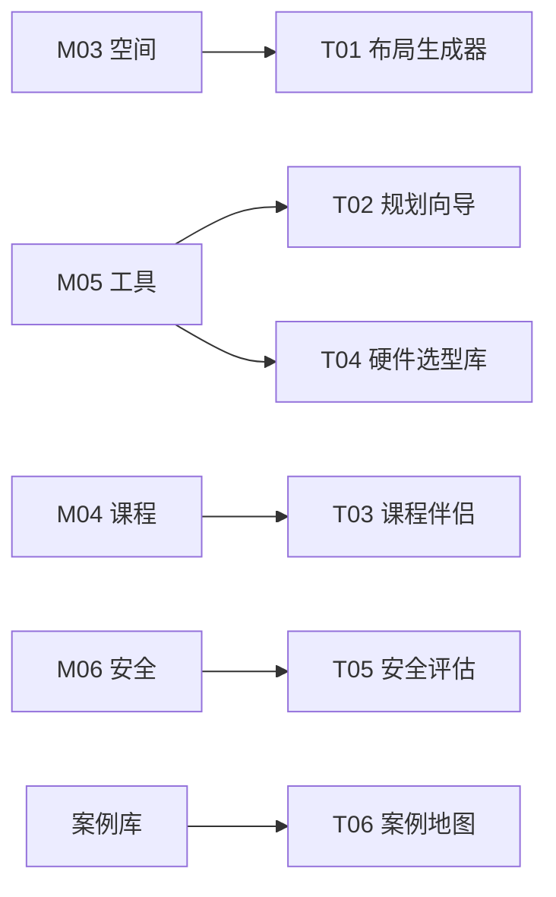

# M11 工具和方法

## 摘要与核心定位

> **一句话定位**: 知识库的"执行引擎" —— 将静态的方法论转化为动态的生产力。

如果说 **Knowledge Base (M01-M09)** 是 OWL 网络的"大脑"，存储着理论与经验；那么 **工具和方法 (M11)** 就是 OWL 的"双手"，通过数字化工具将这些理论落地。本模块定义了 T01-T06 六大核心工具，每个工具都是知识模块的算法化封装。

**核心观点**:
1.  **知行合一**: 每一个工具 (Txx) 都对应一个或多个知识模块 (Mxx)。工具是知识的算法化封装。
2.  **T-Code 索引**: 所有平台级工具统一采用 `T01`, `T02`... 编码，便于检索与版本管理。
3.  **独立层级**: 在架构上，工具层与知识层平行。知识提供规则，工具提供效率。

---

## 模块信息图

```
┌─────────────────────────────────────────────────────────────────────────────┐
│                        OWL 工具和方法架构                                     │
├─────────────────────────────────────────────────────────────────────────────┤
│                                                                               │
│  ┌─────────────────────────────────────────────────────────────────────────┐ │
│  │  知识层 (Knowledge Base)                                                 │ │
│  │  M01 理念 │ M02 治理 │ M03 空间 │ M04 课程 │ M05 工具 │ M06 安全 │ ...   │ │
│  └─────────────────────────────────────────────────────────────────────────┘ │
│                                    ↓                                          │
│                              知识算法化封装                                    │
│                                    ↓                                          │
│  ┌─────────────────────────────────────────────────────────────────────────┐ │
│  │  工具层 (Platform Tools)                                                 │ │
│  │                                                                           │ │
│  │   T01              T02              T03              T04                 │ │
│  │  ┌──────────┐    ┌──────────┐    ┌──────────┐    ┌──────────┐          │ │
│  │  │ AI布局   │    │ 智能规划 │    │ 课程设计 │    │ 硬件选型 │          │ │
│  │  │ 生成器   │    │ 向导     │    │ 伴侣     │    │ 库       │          │ │
│  │  │          │    │          │    │          │    │          │          │ │
│  │  │ ✅ Live  │    │ 🚧 Beta  │    │ 📅 Plan  │    │ ✅ Live  │          │ │
│  │  └──────────┘    └──────────┘    └──────────┘    └──────────┘          │ │
│  │                                                                           │ │
│  │   T05              T06                                                   │ │
│  │  ┌──────────┐    ┌──────────┐                                           │ │
│  │  │ 安全评估 │    │ 全球案例 │                                           │ │
│  │  │ 向导     │    │ 地图     │                                           │ │
│  │  │          │    │          │                                           │ │
│  │  │ 📅 Plan  │    │ 📅 Plan  │                                           │ │
│  │  └──────────┘    └──────────┘                                           │ │
│  └─────────────────────────────────────────────────────────────────────────┘ │
│                                    ↓                                          │
│  ┌─────────────────────────────────────────────────────────────────────────┐ │
│  │  开发理念                                                                 │ │
│  │  Web First │ Open Data │ Local Deploy                                    │ │
│  └─────────────────────────────────────────────────────────────────────────┘ │
└─────────────────────────────────────────────────────────────────────────────┘
```

---

## 工具矩阵 (Tool Matrix)

| ID | 工具名称 | 对应知识模块 | 核心功能 | 输入 | 输出 | 状态 |
|---|---------|-------------|---------|------|------|-----|
| **T01** | [AI 布局生成器](#t01-ai-布局生成器) | M03 空间 | 智能生成实验室平面图 | 面积/形状 | 2D平面图 + 3D渲染 | ✅ Live |
| **T02** | [智能规划向导](#t02-智能规划向导) | M05 资产 / M08 运营 | 快速估算建设与运营成本 | 预算/定位 | 详细BOM表 + 概算书 | 🚧 Beta |
| **T03** | [课程设计伴侣](#t03-课程设计伴侣) | M04 课程 | 生成 PBL 项目大纲 | 选题/年龄 | 课程结构 + 评估量规 | 📅 Plan |
| **T04** | [开源硬件选型库](#t04-开源硬件选型库) | M05 资产 | 交互式对比选型 | 功能需求 | 推荐主板 + 采购链接 | ✅ Live |
| **T05** | [安全评估向导](#t05-安全评估向导) | M06 安全 | 自动化安全风险排查 | 现场照片 | 整改建议报告 | 📅 Plan |
| **T06** | [全球案例地图](#t06-全球案例地图) | M00 案例库 | 可视化浏览全球案例 | 地区/类型 | 交互式地图 | 📅 Plan |

---

## T01 AI 布局生成器

**Lab Layout Generator**

### 定位
解决"不懂设计"的空间规划难题。让没有建筑设计背景的创客空间运营者也能快速设计出专业的空间布局。

### 关联模块
- **M03 空间与环境**: 功能区配比原则、空间设计语法
- **M06 安全合规**: 消防通道宽度、设备安全分区

### 核心功能

| 功能 | 描述 |
|------|------|
| **智能布局** | 基于 M03 空间模块的功能区配比原则自动生成 |
| **合规检查** | 自动检查通道宽度是否符合消防标准 |
| **3D 预览** | 实时渲染 3D 效果图 |
| **导出分享** | 导出 PDF 平面图、3D 模型文件 |

### 使用流程

```
输入空间参数 → AI 生成布局方案 → 人工调整 → 合规检查 → 导出分享
```

### 访问入口
[/lab/floor-plan](/lab/floor-plan)

---

## T02 智能规划向导

**Smart Planner**

### 定位
解决"不知道买什么"的采购难题。帮助运营者快速生成符合预算的设备清单和成本预测。

### 关联模块
- **M05 工具与资产**: 分级配置原则 (Lite/Pro/Ultra)
- **M08 运营手册**: 运营成本结构、TCO 计算

### 核心功能

| 功能 | 描述 |
|------|------|
| **预算匹配** | 输入预算自动生成最匹配的设备清单 |
| **一键生成** | 输入"50万预算，小学"自动配置 |
| **TCO 预测** | 预测未来 3 年的维护耗材成本 |
| **BOM 导出** | 生成可直接用于采购的物料清单 |

### 使用流程

```
输入预算和定位 → 选择配置模板 → 自定义调整 → 生成BOM和概算
```

### 访问入口
[/lab](/lab) (建设计算器入口)

---

## T03 课程设计伴侣

**Curriculum Copilot**

### 定位
解决"备课难"的内容生产难题。帮助导师快速将一个模糊的想法转化为完整的 PBL 项目方案。

### 关联模块
- **M04 学习体验与项目**: 英雄之旅架构、4P 学习法、CBL/PBL/RBL
- **M09 评价与影响力**: 量规设计、评价工具

### 核心功能

| 功能 | 描述 |
|------|------|
| **结构化创意** | 教师提供模糊想法，AI 补全为完整 PBL 流程 |
| **分龄适配** | 根据年龄段自动调整难度和活动设计 |
| **量规生成** | 根据课程目标自动生成评价维度表 |
| **材料清单** | 自动生成项目所需的材料和工具清单 |

### 使用流程

```
输入创意种子 → 选择年龄段和时长 → AI 生成课程框架 → 人工调整 → 导出教案
```

### 访问入口
[/program/ai](/program/ai) (计划中)

---

## T04 开源硬件选型库

**Open Hardware Library**

### 定位
解决"选什么主板"的选型难题。提供交互式的开源硬件对比和选型工具。

### 关联模块
- **M05 工具与资产**: 开源硬件选型原则、分级配置

### 核心功能

| 功能 | 描述 |
|------|------|
| **交互对比** | 多维度对比 Arduino、ESP32、Micro:bit 等 |
| **场景推荐** | 根据项目需求推荐最适合的主板 |
| **采购链接** | 提供可靠的采购渠道链接 |
| **社区评价** | 显示社区使用评价和常见问题 |

### 使用流程

```
描述项目需求 → 查看推荐方案 → 对比不同选项 → 获取采购链接
```

### 访问入口
[/tools/hardware](/tools/hardware)

---

## T05 安全评估向导

**Safety Audit Wizard**

### 定位
解决"不知道哪里有隐患"的安全排查难题。通过 AI 图像识别辅助安全检查。

### 关联模块
- **M06 安全合规与伦理**: 三层安全防御体系、风险控制矩阵

### 核心功能

| 功能 | 描述 |
|------|------|
| **图像识别** | 上传现场照片，AI 识别潜在安全隐患 |
| **检查清单** | 生成结构化的安全检查清单 |
| **整改建议** | 针对发现的问题给出整改建议 |
| **报告生成** | 生成可存档的安全评估报告 |

### 使用流程

```
上传现场照片 → AI 分析识别 → 查看隐患列表 → 获取整改建议 → 导出报告
```

### 访问入口
[/safety/audit](/safety/audit) (计划中)

---

## T06 全球案例地图

**Global Case Map**

### 定位
解决"想看看别人怎么做"的学习需求。可视化浏览全球创客空间案例。

### 关联模块
- **M00 案例库**: 全球创客空间案例数据

### 核心功能

| 功能 | 描述 |
|------|------|
| **地图浏览** | 在地图上浏览全球案例分布 |
| **多维筛选** | 按地区、类型、规模筛选 |
| **案例详情** | 查看详细的案例介绍和图片 |
| **联系方式** | 获取案例负责人的联系方式 |

### 使用流程

```
打开地图 → 筛选条件 → 选择感兴趣的案例 → 查看详情 → 联系交流
```

### 访问入口
[/cases/map](/cases/map) (计划中)

---

## 开发理念

我们如何构建这些工具？

### 核心原则

| 原则 | 说明 | 实践 |
|------|------|------|
| **Web First** | 无需安装，浏览器即用 | 低配置电脑也能访问 |
| **Open Data** | 数据库开放 JSON 格式 | 允许社区贡献 |
| **Local Deploy** | 支持私有化部署 | 确保学校数据安全 |
| **AI Augmented** | AI 增强而非替代 | 人机协作设计 |

### 技术栈

| 层级 | 技术 |
|------|------|
| **前端** | Next.js, React, Tailwind CSS |
| **3D 渲染** | React Three Fiber, Three.js |
| **2D 画布** | Konva (react-konva) |
| **AI 集成** | Vercel AI SDK, LangChain |
| **数据存储** | JSON 文件, PostgreSQL |

---

## 路线图

| 阶段 | 时间 | 目标 |
|------|------|------|
| **Phase 1** | 2025 Q4 | T01, T04 上线 |
| **Phase 2** | 2026 Q1 | T02 Beta 测试 |
| **Phase 3** | 2026 Q2 | T03, T05 开发 |
| **Phase 4** | 2026 Q3 | T06 开发，全面整合 |

---

## 贡献指南

我们欢迎开发者参与 OWL 工具链的建设。

### 参与方式

| 方式 | 说明 |
|------|------|
| **提交 Issue** | 报告 Bug 或提出功能建议 |
| **贡献代码** | Fork 仓库，提交 Pull Request |
| **贡献数据** | 完善设备库、案例库等数据 |
| **翻译本地化** | 帮助翻译界面和文档 |

### 开发资源

- **GitHub**: [github.com/openwisdomlab/tools](https://github.com/openwisdomlab)
- **技术栈**: Next.js, React Three Fiber, LangChain
- **设计规范**: 见项目 README.md

---

## 与其他模块的关系



工具层将知识层的方法论转化为可操作的数字工具，实现知行合一。
