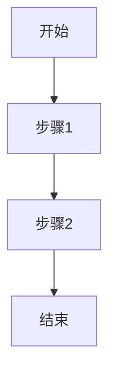

---
# ═══════════════════════════════════════════════════════════════
# OWL 知识库 - 扩展层模板 (Extend Topic Template)
# 篇幅限制: 无限制
# 要求: 独立可读，有概述可快速理解
# ═══════════════════════════════════════════════════════════════

title: "扩展主题名称"
description: "主题描述 (≤100字)"
parent_module: "M0X"
doc_type: "extend"
version: "0.1.0"
status: "draft"
last_updated: "2025-01-01"

# 独立可读性 (重要!)
standalone_readable: true
summary: |
  本文档的核心内容概述 (100-200字)
  AI 可通过此概述快速理解文档主旨
  无需阅读全文即可判断是否需要深入

# 可信性标记
evidence_level: "E1"
sources_verified: false
cross_validated: false
confidence: "unverified"
last_reviewed: null
reviewer: null

# 来源追踪
sources:
  - id: "ref-001"
    verified: false
    note: "来源简述"

# 检索标签
tags:
  - M0X
  - extend
  - 主题标签1
  - 主题标签2
---

# 扩展主题名称

## 概述

<!--
300-500字概述，独立可读
AI 可仅读此部分快速理解主旨
-->

本文档探讨...主要内容包括...

**核心观点**:
1. 观点一
2. 观点二
3. 观点三

---

## 1. 理论基础

<!-- 详细的理论梳理，不限篇幅 -->

### 1.1 子主题

内容...

### 1.2 子主题

内容...

---

## 2. 核心内容

<!-- 主体内容，详细展开 -->

### 2.1 子主题

内容...

### 2.2 子主题

内容...

---

## 3. 实施方法

<!-- 可操作的方法指南 -->

### 步骤一

详细说明...

### 步骤二

详细说明...

---

## 4. 案例分析

<!-- 相关案例，可链接到 cases/ -->

### 案例 A

背景...分析...启示...

### 案例 B

背景...分析...启示...

---

## 5. 可视化

<!-- 图表、示意图等 -->

---

## 常见问题

问题1: 常见问题描述?

答案详细说明...

问题2: 常见问题描述?

答案详细说明...

---

## 参考文献

<!-- 本文引用的文献，链接到证据层 -->

1. Author, A. (Year). *Title*. Publisher. [E1] ✅
2. Author, B. (Year). Article title. *Journal*, vol(issue). [E2] ⚠️

**图例**: ✅ 已验证 | ⚠️ 待验证

---

## 更新记录

| 日期 | 更新内容 | 作者 | 状态 |
|------|----------|------|------|
| 2025-01 | 初稿创建 | AI | draft |
| - | - | - | - |

---

## 贡献指南

如需更新本文档:
1. 确保新增内容有证据支撑
2. 标注证据等级
3. 更新参考文献
4. 提交审核
