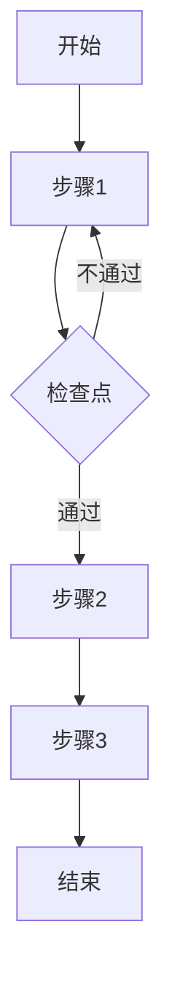

---
# ═══════════════════════════════════════════════════════════════
# OWL 知识库 - SOP 模板 (Standard Operating Procedure)
# 要求: 可直接执行，步骤清晰
# ═══════════════════════════════════════════════════════════════

title: "SOP: 流程名称"
description: "流程简述 (≤30字)"
parent_module: "M0X"
doc_type: "sop"
sop_id: "SOP-M0X-001"
version: "0.1.0"
status: "draft"
last_updated: "2025-01-01"

# SOP 元数据
frequency: "daily/weekly/monthly/as-needed"
duration: "预计耗时"
difficulty: "simple/moderate/complex"
risk_level: "R0/R1/R2/R3"

# 角色要求
roles_required:
  - role: "角色名称"
    permission: "required/optional"

# 独立可读性
standalone_readable: true

# 检索标签
tags:
  - M0X
  - sop
  - 流程标签
---

# SOP: 流程名称

## SOP 卡片

| 属性 | 内容 |
|------|------|
| **SOP 编号** | SOP-M0X-001 |
| **适用场景** | 场景描述 |
| **执行频率** | daily/weekly/as-needed |
| **预计耗时** | XX 分钟 |
| **风险等级** | R0 |
| **最后更新** | 2025-01-01 |

---

## 目的

本 SOP 规范了 [流程名称] 的标准操作步骤，确保...

---

## 适用范围

**适用于**:
- 场景1
- 场景2

**不适用于**:
- 排除场景1
- 排除场景2

---

## 角色与职责

| 角色 | 职责 | 必要性 |
|------|------|--------|
| 执行者 | 执行具体步骤 | 必须 |
| 审批者 | 审批关键节点 | 视情况 |
| 监督者 | 质量监督 | 可选 |

---

## 前置条件

在执行本 SOP 前，请确认:

- [ ] 前置条件1
- [ ] 前置条件2
- [ ] 前置条件3

---

## 所需资源

| 类别 | 资源 | 说明 |
|------|------|------|
| 工具 | 工具名称 | 用途 |
| 文档 | 文档名称 | 链接 |
| 权限 | 权限名称 | 如何获取 |

---

## 操作步骤

### 步骤 1: 步骤名称

**目的**: 本步骤要达成什么

**操作**:
1. 具体动作1
2. 具体动作2
3. 具体动作3

**检查点**: ✅ 确认...已完成

**注意**: ⚠️ 特别提醒事项

---

### 步骤 2: 步骤名称

**目的**: 本步骤要达成什么

**操作**:
1. 具体动作1
2. 具体动作2

**检查点**: ✅ 确认...已完成

---

### 步骤 3: 步骤名称

**目的**: 本步骤要达成什么

**操作**:
1. 具体动作1
2. 具体动作2

**检查点**: ✅ 确认...已完成

---

## 流程图

---

## 异常处理

| 异常情况 | 处理方式 | 升级条件 |
|----------|----------|----------|
| 异常1 | 处理方法 | 何时升级 |
| 异常2 | 处理方法 | 何时升级 |

---

## 完成检查清单

执行完成后，请确认:

- [ ] 检查项1
- [ ] 检查项2
- [ ] 检查项3
- [ ] 记录已填写
- [ ] 相关方已通知

---

## 记录要求

| 记录项 | 记录位置 | 保存期限 |
|--------|----------|----------|
| 执行记录 | 位置 | X年 |
| 异常记录 | 位置 | X年 |

---

## 相关文档

- [相关 SOP](./sop-xxx)
- [相关清单](../checklists/xxx)
- [相关模块](../../module/)

---

## 修订记录

| 版本 | 日期 | 修改内容 | 修改人 |
|------|------|----------|--------|
| 0.1.0 | 2025-01 | 初始版本 | xxx |
