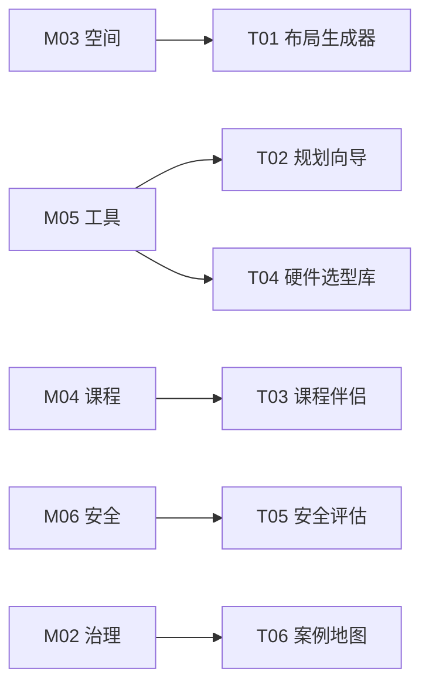

# 资源工具

**From Philosophy to Practice**

---

## 概述

资源工具库是 OWL 体系中**从理念到实践的桥梁**，将知识库的洞见转化为可操作的平台工具。

<Callout type="info">
**核心定位**：知识库的"执行引擎"——将静态的方法论转化为动态的生产力。每个工具 (Txx) 都对应一个或多个知识模块 (Mxx)，是知识的算法化封装。
</Callout>

---

## 架构模型

```
┌─────────────────────────────────────────────────────────────────┐
│                    OWL 知识与工具体系                            │
├─────────────────────────────────────────────────────────────────┤
│                                                                  │
│  ┌────────────────────────────────────────────────────────────┐ │
│  │  知识层 (Knowledge Base)                                    │ │
│  │  M01 理念 │ M02 治理 │ M03 空间 │ M04 课程 │ M05 工具 │ ... │ │
│  └────────────────────────────────────────────────────────────┘ │
│                              ↓                                   │
│                        知识算法化封装                             │
│                              ↓                                   │
│  ┌────────────────────────────────────────────────────────────┐ │
│  │  工具层 (Platform Tools) - 资源工具库                       │ │
│  │                                                              │ │
│  │   T01 布局生成器    T02 规划向导    T03 课程伴侣            │ │
│  │   T04 硬件选型库    T05 安全评估    T06 案例地图            │ │
│  └────────────────────────────────────────────────────────────┘ │
│                                                                  │
└─────────────────────────────────────────────────────────────────┘
```

---

## 工具矩阵

| ID | 工具名称 | 对应知识模块 | 核心功能 | 状态 |
|---|---------|-------------|---------|-----|
| **[T01](/docs/resources/tools/t01-layout-generator)** | AI 布局生成器 | M03 空间 | 智能生成实验室平面图 | ✅ Live |
| **[T02](/docs/resources/tools/t02-planning-wizard)** | 智能规划向导 | M05 资产 / M08 运营 | 快速估算建设与运营成本 | 🚧 Beta |
| **[T03](/docs/resources/tools/t03-curriculum-designer)** | 课程设计伴侣 | M04 课程 | 生成 PBL 项目大纲 | 📅 Plan |
| **[T04](/docs/resources/tools/t04-hardware-selector)** | 开源硬件选型库 | M05 资产 | 交互式对比选型 | ✅ Live |
| **[T05](/docs/resources/tools/t05-safety-assessor)** | 安全评估向导 | M06 安全 | 自动化安全风险排查 | 📅 Plan |
| **[T06](/docs/resources/tools/t06-case-map)** | 全球案例地图 | M02 治理 | 可视化浏览全球案例 | 📅 Plan |

---

## 快速入口

<Cards>
  <Card title="T01 布局生成器" href="/lab/floor-plan">
    智能生成实验室平面图 ✅
  </Card>
  <Card title="T02 规划向导" href="/lab">
    快速估算建设成本 🚧
  </Card>
  <Card title="T04 硬件选型" href="/docs/core/05-tools/extend/opensource-hardware">
    开源硬件对比选型 ✅
  </Card>
</Cards>

---

## 与知识库的关系

### 知行合一

每一个工具 (Txx) 都对应一个或多个知识模块 (Mxx)：



### 差异化定位

| 维度 | 核心标准 (M05 等) | 资源工具 (T01 等) |
|------|------------------|------------------|
| **内容性质** | 原理性、知识性 | 实践性、操作性 |
| **主要对象** | 物理工具（硬件、设备） | 平台工具（AI、软件） |
| **用户场景** | "我想理解工具体系" | "我想立即使用工具" |

---

## 使用原则

### 工具是起点，不是终点

这些工具提供的是**起点**，不是最终答案。

- AI 生成的方案需要人类判断和调整
- 诊断结果需要结合具体情境解读
- 工具建议不能替代对理念的深入理解

### 理念优先于工具

如果工具建议与你对理念的理解相矛盾，优先信任你的理解。

工具是当前技术条件下的实现，理念是长期有效的原则。

### 迭代使用

这些工具支持迭代：

1. 生成初始方案
2. 实施并观察
3. 收集反馈
4. 重新输入工具优化

---

## 开发理念

我们如何构建这些工具？

| 原则 | 说明 | 实践 |
|------|------|------|
| **Web First** | 无需安装，浏览器即用 | 低配置电脑也能访问 |
| **Open Data** | 数据库开放 JSON 格式 | 允许社区贡献 |
| **Local Deploy** | 支持私有化部署 | 确保学校数据安全 |
| **AI Augmented** | AI 增强而非替代 | 人机协作设计 |

---

## 路线图

| 阶段 | 目标 |
|------|------|
| **Phase 1** | T01, T04 上线 ✅ |
| **Phase 2** | T02 Beta 测试 🚧 |
| **Phase 3** | T03, T05 开发 |
| **Phase 4** | T06 开发，全面整合 |

---

## 贡献

我们欢迎以下贡献：

| 方式 | 说明 |
|------|------|
| **提交 Issue** | 报告 Bug 或提出功能建议 |
| **贡献代码** | Fork 仓库，提交 Pull Request |
| **贡献数据** | 完善设备库、案例库等数据 |
| **翻译本地化** | 帮助翻译界面和文档 |

请通过 [GitHub Issues](https://github.com/openwisdomlab/owlab/issues) 提交。

---

*工具库持续建设中，欢迎参与共建。*
