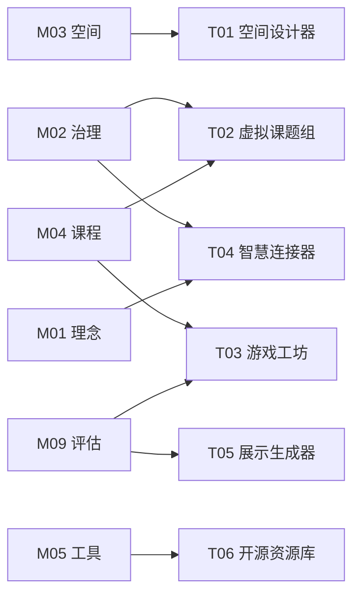

# 资源工具

**From Philosophy to Practice**

---

## 概述

资源工具库是 OWL 体系中**从理念到实践的桥梁**，将知识库的洞见转化为可操作的平台工具。

<Callout type="info">
**核心定位**：知识库的"执行引擎"——将静态的方法论转化为动态的生产力。每个工具都对应一个或多个知识模块 (Mxx)，是知识的算法化封装。
</Callout>

---

## OWL 创意工具箱

六个精选工具，与首页"OWL 创意工具箱"一一对应：

| ID | 工具名称 | 核心功能 | 状态 |
|---|---------|---------|-----|
| **[T01](/docs/resources/tools/t01-space-designer)** | AI 空间设计器 | 智能布局生成、3D可视化、Allen曲线分析 | ✅ Live |
| **[T02](/docs/resources/tools/t02-research-team)** | 虚拟课题组 | 组建跨校际研究小组、协作探究真实科研问题 | 📅 Plan |
| **[T03](/docs/resources/tools/t03-game-workshop)** | 游戏工坊 | 设计游戏化课程活动、生成学习路径地图 | 📅 Plan |
| **[T04](/docs/resources/tools/t04-connector)** | 智慧连接器 | 发现OWL节点网络、探索跨学科意外联系 | 📅 Plan |
| **[T05](/docs/resources/tools/t05-showcase-generator)** | 作品展示生成器 | AI生成项目海报、研究摘要、展示PPT | 📅 Plan |
| **[T06](/docs/resources/tools/t06-opensource-hub)** | 开源资源库 | 精选开源硬件、软件、课程资源导航 | ✅ Live |

---

## 精选工具快速入口

<Cards>
  <Card title="T01 AI 空间设计器" href="/lab/floor-plan">
    智能生成实验室布局 ✅
  </Card>
  <Card title="T06 开源资源库" href="/docs/resources/tools/t06-opensource-hub">
    探索开源资源宝藏 ✅
  </Card>
</Cards>

---

## 其他工具

除了精选工具外，还有以下辅助工具支持实验室建设和运营：

| 工具名称 | 核心功能 | 对应模块 | 状态 |
|---------|---------|---------|-----|
| **[智能规划向导](/docs/resources/tools/planning-wizard)** | 快速估算建设与运营成本 | M05 / M08 | 🚧 Beta |
| **[课程设计伴侣](/docs/resources/tools/curriculum-designer)** | 生成 PBL 项目大纲 | M04 / M09 | 📅 Plan |
| **[开源硬件选型库](/docs/resources/tools/hardware-selector)** | 交互式对比选型 | M05 | ✅ Live |
| **[安全评估向导](/docs/resources/tools/safety-assessor)** | 自动化安全风险排查 | M06 | 📅 Plan |
| **[全球案例地图](/docs/resources/tools/case-map)** | 可视化浏览全球案例 | M02 | 📅 Plan |

<Cards>
  <Card title="智能规划向导" href="/lab">
    快速估算建设成本 🚧
  </Card>
  <Card title="开源硬件选型" href="/docs/core/05-tools/extend/opensource-hardware">
    开源硬件对比选型 ✅
  </Card>
</Cards>

---

## 架构模型

```text
┌─────────────────────────────────────────────────────────────────┐
│                    OWL 知识与工具体系                            │
├─────────────────────────────────────────────────────────────────┤
│                                                                  │
│  ┌────────────────────────────────────────────────────────────┐ │
│  │  知识层 (Knowledge Base)                                    │ │
│  │  M01 理念 │ M02 治理 │ M03 空间 │ M04 课程 │ M05 工具 │ ... │ │
│  └────────────────────────────────────────────────────────────┘ │
│                              ↓                                   │
│                        知识算法化封装                             │
│                              ↓                                   │
│  ┌────────────────────────────────────────────────────────────┐ │
│  │  工具层 (Platform Tools) - OWL 创意工具箱                   │ │
│  │                                                              │ │
│  │   T01 空间设计器  T02 虚拟课题组  T03 游戏工坊              │ │
│  │   T04 智慧连接器  T05 展示生成器  T06 开源资源库            │ │
│  └────────────────────────────────────────────────────────────┘ │
│                                                                  │
└─────────────────────────────────────────────────────────────────┘
```

---

## 工具与知识模块的关系

每一个工具都对应一个或多个知识模块：



---

## 使用原则

### 工具是起点，不是终点

这些工具提供的是**起点**，不是最终答案。

- AI 生成的方案需要人类判断和调整
- 诊断结果需要结合具体情境解读
- 工具建议不能替代对理念的深入理解

### 理念优先于工具

如果工具建议与你对理念的理解相矛盾，优先信任你的理解。

工具是当前技术条件下的实现，理念是长期有效的原则。

### 迭代使用

这些工具支持迭代：

1. 生成初始方案
2. 实施并观察
3. 收集反馈
4. 重新输入工具优化

---

## 开发理念

我们如何构建这些工具？

| 原则 | 说明 | 实践 |
|------|------|------|
| **Web First** | 无需安装，浏览器即用 | 低配置电脑也能访问 |
| **Open Data** | 数据库开放 JSON 格式 | 允许社区贡献 |
| **Local Deploy** | 支持私有化部署 | 确保学校数据安全 |
| **AI Augmented** | AI 增强而非替代 | 人机协作设计 |

---

## 路线图

| 阶段 | 目标 |
|------|------|
| **Phase 1** | T01 空间设计器、T06 开源资源库上线 ✅ |
| **Phase 2** | 智能规划向导 Beta 测试 🚧 |
| **Phase 3** | T02-T05 精选工具开发 |
| **Phase 4** | 全面整合、跨工具联动 |

---

## 贡献

我们欢迎以下贡献：

| 方式 | 说明 |
|------|------|
| **提交 Issue** | 报告 Bug 或提出功能建议 |
| **贡献代码** | Fork 仓库，提交 Pull Request |
| **贡献数据** | 完善设备库、案例库等数据 |
| **翻译本地化** | 帮助翻译界面和文档 |

请通过 [GitHub Issues](https://github.com/openwisdomlab/owlab/issues) 提交。

---

*工具库持续建设中，欢迎参与共建。*
